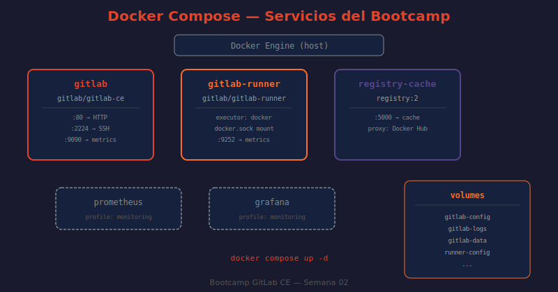
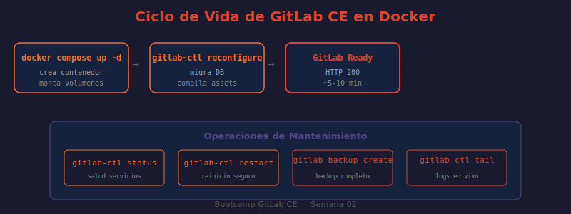

# 📖 02 — Instalación de GitLab CE con Docker Compose

## 🎯 Objetivos de aprendizaje

- ✅ Entender la estructura completa del `docker-compose.yml` del bootcamp
- ✅ Comprender cada sección de la `GITLAB_OMNIBUS_CONFIG`
- ✅ Levantar la instancia y monitorear su arranque inicial
- ✅ Obtener la contraseña root y verificar el acceso web
- ✅ Conocer los comandos de ciclo de vida de la instancia

---

## 🤔 Antes de empezar: ¿qué es GITLAB_OMNIBUS_CONFIG?

La imagen Docker de GitLab CE no tiene un `gitlab.rb` que editar directamente. En su lugar, usa la variable de entorno `GITLAB_OMNIBUS_CONFIG`, que inyecta configuración al vuelo en `/etc/gitlab/gitlab.rb` durante el primer arranque.

**Analogía:** Es como llenar la solicitud de compra de un departamento antes de mudarte. En lugar de ir a cambiarlo después cuarto por cuarto, defines todo de una vez: "quiero 2 habitaciones, internet de fibra, y que el correo llegue a la puerta 4B". GitLab lee esa solicitud y configura todo automáticamente.

---

## 🐳 El docker-compose.yml del bootcamp

El bootcamp usa el `docker-compose.yml` de la raíz del repositorio. No necesitas crear uno nuevo — ya existe con todos los servicios configurados.

Analicémoslo sección por sección:

### Servicio: `gitlab` (el principal)

```yaml
services:
  gitlab:
    image: gitlab/gitlab-ce:${GITLAB_VERSION:-17-latest}
    container_name: gitlab
    hostname: ${GITLAB_HOST:-gitlab.local}
    restart: unless-stopped
```

| Campo | Valor | Explicación |
|-------|-------|-------------|
| `image` | `gitlab/gitlab-ce:17-latest` | Imagen oficial CE, versión 17 (rama estable) |
| `container_name` | `gitlab` | Nombre fijo para poder usar `docker exec gitlab` |
| `hostname` | `gitlab.local` | Nombre interno de Docker (NO es la URL de acceso) |
| `restart` | `unless-stopped` | Reinicia automáticamente, excepto si lo paras tú |

⚠️ **Importante:** `hostname: gitlab.local` es el nombre que GitLab usa internamente entre servicios Docker. La URL de acceso real se configura en `external_url`.

---

### La GITLAB_OMNIBUS_CONFIG explicada línea a línea

```yaml
    environment:
      GITLAB_OMNIBUS_CONFIG: |
        # ── Acceso ──
        external_url '${GITLAB_EXTERNAL_URL:-http://localhost}'
        gitlab_rails['gitlab_shell_ssh_port'] = ${GITLAB_SSH_PORT:-2224}
        gitlab_rails['initial_root_password'] = '${GITLAB_ROOT_PASSWORD:-ChangeMe123!}'
```

- **`external_url`**: La URL pública donde accedes a GitLab. Debe ser `http://localhost` en desarrollo local. Si cambia, todos los enlaces generados (webhooks, emails, clone URLs) cambian con ella.
- **`gitlab_shell_ssh_port`**: Puerto SSH que aparece en la UI al copiar comandos de clonado. Aquí es `2224` porque el host ya usa el puerto 22.
- **`initial_root_password`**: Contraseña que tendrá root en el primer inicio. Se leerá de tu `.env`. Cámbiala inmediatamente después.

```yaml
        # ── Funcionalidad ──
        gitlab_rails['lfs_enabled'] = true
        gitlab_rails['gitlab_default_can_create_group'] = true
```

- **`lfs_enabled`**: Activa Git Large File Storage para archivos binarios grandes (datasets, videos, modelos ML).
- **`gitlab_default_can_create_group`**: Permite que usuarios normales creen grupos (organizaciones) por defecto.

```yaml
        # ── PRIVACIDAD: Telemetría DESHABILITADA ──
        gitlab_rails['usage_ping_enabled'] = false
        gitlab_rails['sentry_enabled'] = false
        gitlab_rails['snowplow_enabled'] = false
        gitlab_rails['google_analytics_id'] = nil
        gitlab_rails['third_party_offers_enabled'] = false
        gitlab_rails['gitlab_environment'] = 'development'
```

💡 **Por qué deshabilitar la telemetría:** GitLab CE, por defecto, envía estadísticas de uso a GitLab Inc. Para un entorno de bootcamp con datos de práctica, deshabilitamos todo para proteger la privacidad. Esto es una buena práctica también en producción si tu empresa tiene políticas de privacidad estrictas.

```yaml
        # ── Datos y respaldo ──
        gitlab_rails['backup_keep_time'] = 604800
```

- **`backup_keep_time`**: Tiempo en segundos que se conservan los backups automáticos. `604800` = 7 días.

```yaml
        # ── Monitoreo LOCAL ──
        prometheus_monitoring['enable'] = true
        node_exporter['enable'] = true
        gitlab_exporter['enable'] = true
        redis_exporter['enable'] = true
        postgres_exporter['enable'] = true
```

Estos exporters exponen métricas internas de GitLab. Prometheus (en el servicio `prometheus`) las recolecta y Grafana las visualiza. Se activan solo con el profile `monitoring`.

---

### Puertos

```yaml
    ports:
      - "${GITLAB_HTTP_PORT:-80}:80"
      - "${GITLAB_HTTPS_PORT:-443}:443"
      - "${GITLAB_SSH_PORT:-2224}:22"
```

```
Host         Contenedor   Protocolo
────────     ──────────   ─────────
:80    ───▶  :80          HTTP (interfaz web)
:443   ───▶  :443         HTTPS (cuando haya certificado)
:2224  ───▶  :22          SSH (Git sobre SSH)
```

⚠️ El puerto `2224` del host se conecta al `22` del contenedor. Cuando clonas con SSH, usas el puerto `2224` del host, no el 22.

---

### Volúmenes

```yaml
    volumes:
      - gitlab-config:/etc/gitlab
      - gitlab-logs:/var/log/gitlab
      - gitlab-data:/var/opt/gitlab
```

Todos los datos de GitLab sobreviven aunque el contenedor se destruya:

| Volumen (alias) | Nombre real | Contenido |
|-----------------|-------------|-----------|
| `gitlab-config` | `bc-gitlab-config` | `gitlab.rb`, `gitlab-secrets.json` |
| `gitlab-logs` | `bc-gitlab-logs` | Logs de todos los servicios internos |
| `gitlab-data` | `bc-gitlab-data` | Repositorios Git, base de datos PostgreSQL, uploads |

---

### shm_size y healthcheck

```yaml
    shm_size: '256m'
    healthcheck:
      test: curl -f http://localhost/-/health || exit 1
      interval: 60s
      timeout: 30s
      retries: 10
      start_period: 300s
```

- **`shm_size: 256m`**: Memoria compartida necesaria para Sidekiq y PostgreSQL. Sin esto, GitLab puede crashear silenciosamente.
- **`start_period: 300s`**: Docker espera 5 minutos antes de empezar a contar reintentos. El primer inicio de GitLab tarda entre 5 y 10 minutos — esto evita que Docker lo declare "unhealthy" prematuramente.

---

### Servicios adicionales

```yaml
  gitlab-runner:
    image: gitlab/gitlab-runner:${RUNNER_VERSION:-alpine-latest}
    depends_on:
      gitlab:
        condition: service_healthy
    volumes:
      - /var/run/docker.sock:/var/run/docker.sock
      - runner-config:/etc/gitlab-runner
```

El runner no arranca hasta que GitLab esté "healthy". Monta el socket de Docker del host para poder ejecutar pipelines que crean contenedores (Docker-in-Docker).

```yaml
  registry-cache:
    image: registry:2
    environment:
      REGISTRY_PROXY_REMOTEURL: https://registry-1.docker.io
```

Actúa como caché de Docker Hub. La primera vez que un pipeline hace `docker pull nginx`, se descarga de internet. La segunda vez, se sirve desde este caché local — mucho más rápido.

```yaml
  prometheus:
    profiles:
      - monitoring

  grafana:
    profiles:
      - monitoring
```

Prometheus y Grafana solo arrancan cuando usas `--profile monitoring`. Esto mantiene el stack base liviano y los activas cuando quieras monitorear métricas.

---

## 🖼️ Arquitectura de servicios



> **Diagrama:** Muestra los 5 servicios del `docker-compose.yml` y cómo se comunican entre sí dentro de la red `bc-gitlab-network`. El runner depende de GitLab (healthcheck), el registry-cache es independiente, y Prometheus/Grafana se activan con el profile `monitoring`.

---

## 🚀 Levantar la instancia

### Paso 1: Preparar el archivo .env

```bash
# ¿QUÉ HACE?: Copia el archivo de ejemplo de variables de entorno
# ¿POR QUÉ?: .env no está en git (está en .gitignore) para no exponer contraseñas
# ¿PARA QUÉ?: Personalizar puertos, contraseñas y versiones sin tocar docker-compose.yml
cp .env.example .env
```

Edita `.env` y cambia al menos `GITLAB_ROOT_PASSWORD` por algo seguro.

### Paso 2: Levantar los servicios base

```bash
# ¿QUÉ HACE?: Levanta todos los servicios sin profile (gitlab, runner, registry-cache)
# ¿POR QUÉ?: El flag -d (detached) corre los contenedores en segundo plano
# ¿PARA QUÉ?: GitLab queda corriendo aunque cierres la terminal
docker compose up -d
```

Output esperado:
```
✔ Network bc-gitlab-network     Created
✔ Volume "bc-gitlab-config"     Created
✔ Volume "bc-gitlab-logs"       Created
✔ Volume "bc-gitlab-data"       Created
✔ Container gitlab              Started
✔ Container registry-cache      Started
```

> El `gitlab-runner` no arranca aún porque espera que `gitlab` esté "healthy".

### Paso 3: Monitorear el primer inicio

```bash
# ¿QUÉ HACE?: Sigue los logs del contenedor gitlab en tiempo real
# ¿POR QUÉ?: El primer inicio ejecuta migraciones de BD, compila assets y configura servicios
# ¿PARA QUÉ?: Ver el progreso y detectar errores si algo falla
docker compose logs -f gitlab
```

**Lo que verás en los logs y qué significa:**

```
==> /var/log/gitlab/gitlab-rails/schema_migrations.log <==
# → Está migrando la base de datos PostgreSQL (normal, toma minutos)

==> /var/log/gitlab/nginx/current <==
# → Nginx ya está corriendo

==> /var/log/gitlab/puma/current <==
started with pid XXXXX
# → Puma (servidor web de Rails) arrancó

gitlab Reconfigured!
# → ✅ Configuración aplicada exitosamente
```

Presiona `Ctrl+C` para dejar de seguir los logs (no detiene GitLab).

### Paso 4: Verificar estado

```bash
# ¿QUÉ HACE?: Muestra el estado de todos los contenedores definidos
# ¿POR QUÉ?: Incluye el estado del healthcheck (starting/healthy/unhealthy)
# ¿PARA QUÉ?: Confirmar que GitLab está sano antes de intentar acceder
docker compose ps
```

Output esperado después de 5-10 minutos:
```
NAME              IMAGE                           STATUS
gitlab            gitlab/gitlab-ce:17-latest      Up 8 minutes (healthy)
gitlab-runner     gitlab/gitlab-runner:alpine     Up 2 minutes
registry-cache    registry:2                      Up 8 minutes
```

> Mientras el estado sea `Up X minutes (health: starting)`, GitLab aún está iniciando. Espera hasta ver `(healthy)`.

---

## 🔄 Ciclo de vida de la instancia



> **Diagrama:** Muestra el ciclo de vida completo: desde `docker compose up` (creación de volúmenes → configuración → inicio de servicios) hasta `docker compose down` (detención ordenada). También ilustra los estados posibles del healthcheck y cuándo el runner se conecta.

### Comandos de ciclo de vida

```bash
# ¿QUÉ HACE?: Detiene los contenedores sin eliminar volúmenes ni redes
# ¿POR QUÉ?: Los datos en volúmenes persisten, solo se detienen los procesos
# ¿PARA QUÉ?: Apagar GitLab para el día sin perder nada
docker compose stop

# ¿QUÉ HACE?: Reinicia todos los contenedores
# ¿POR QUÉ?: Útil después de cambiar variables en .env
# ¿PARA QUÉ?: Aplicar nueva configuración sin perder los volúmenes
docker compose restart

# ¿QUÉ HACE?: Detiene y elimina contenedores Y volúmenes
# ¿POR QUÉ?: El flag -v elimina todos los datos persistidos
# ¿PARA QUÉ?: Empezar completamente desde cero (como una instalación nueva)
docker compose down -v

# ¿QUÉ HACE?: Muestra el consumo de recursos en tiempo real
# ¿POR QUÉ?: GitLab consume bastante RAM; es útil verificar
# ¿PARA QUÉ?: Detectar si se está quedando sin memoria
docker stats gitlab
```

---

## 🔑 Obtener la contraseña root inicial

```bash
# ¿QUÉ HACE?: Ejecuta grep dentro del contenedor para extraer la contraseña
# ¿POR QUÉ?: El archivo initial_root_password se crea en el primer reconfigure
# ¿PARA QUÉ?: Obtener la contraseña para el primer login en http://localhost
docker compose exec gitlab grep 'Password:' /etc/gitlab/initial_root_password
```

Output ejemplo:
```
Password: xK8mP2nQ7vR9sL1t
```

⚠️ **Este archivo se elimina automáticamente después de 24 horas** por seguridad. Si no lo guardas antes, tendrás que resetear la contraseña por la consola de Rails.

---

## ✅ Verificar el acceso web

```bash
# ¿QUÉ HACE?: Hace una petición HTTP y muestra solo el código de respuesta
# ¿POR QUÉ?: Un 200 o 302 confirma que GitLab responde correctamente
# ¿PARA QUÉ?: Verificar acceso desde línea de comandos sin abrir el navegador
curl -s -o /dev/null -w "HTTP %{http_code}\n" http://localhost
```

Output esperado: `HTTP 302` (redirección al login) o `HTTP 200`.

Luego abre el navegador en `http://localhost` e inicia sesión con:
- **Usuario:** `root`
- **Contraseña:** la que obtuviste en el paso anterior

---

## 🛠️ Levantar el perfil de monitoreo (opcional)

```bash
# ¿QUÉ HACE?: Levanta además los servicios con profile "monitoring" (Prometheus + Grafana)
# ¿POR QUÉ?: Los profiles permiten tener servicios opcionales que no arrancan por defecto
# ¿PARA QUÉ?: Ver métricas de GitLab en dashboards de Grafana
docker compose --profile monitoring up -d
```

Una vez activos:
- **Prometheus:** `http://localhost:9090`
- **Grafana:** `http://localhost:3000` (usuario: `admin`, contraseña: la de tu `.env`)

> 💡 **gl-epti:** El bootcamp también incluye `docker-compose.gl-epti.yml`, un entorno avanzado para prácticas de GitLab Pages, CI/CD y Kubernetes. Lo usaremos en semanas posteriores.

---

## 🤔 Preguntas de reflexión

1. El `docker-compose.yml` usa `hostname: gitlab.local` pero `external_url: http://localhost`. ¿Cuándo usaría GitLab el hostname `gitlab.local` y cuándo usaría `http://localhost`?

2. ¿Por qué `gitlab-runner` tiene `depends_on: condition: service_healthy` en lugar de solo `depends_on: gitlab`? ¿Qué problema evita?

3. El `shm_size: 256m` asigna memoria compartida. ¿Qué pasaría si lo reduces a `64m` en una instancia con muchos usuarios concurrentes?

4. ¿Por qué `start_period: 300s` en el healthcheck es importante para el primer inicio pero no sería necesario para los reinicios posteriores?

5. Si cambias `GITLAB_ROOT_PASSWORD` en `.env` después del primer inicio, ¿cambia la contraseña de root automáticamente? ¿Por qué o por qué no?

---

## 📚 Recursos adicionales

- [Imagen oficial gitlab-ce en Docker Hub](https://hub.docker.com/r/gitlab/gitlab-ce)
- [Documentación oficial: GitLab con Docker](https://docs.gitlab.com/ee/install/docker/)
- [Referencia completa de GITLAB_OMNIBUS_CONFIG](https://docs.gitlab.com/omnibus/settings/)
- [Docker Compose Profiles](https://docs.docker.com/compose/profiles/)
- [Docker healthcheck reference](https://docs.docker.com/engine/reference/builder/#healthcheck)

---

➡️ **Siguiente lección:** [03 — Configuración inicial post-instalación](./03-configuracion-inicial.md)
