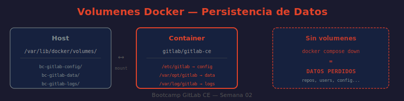
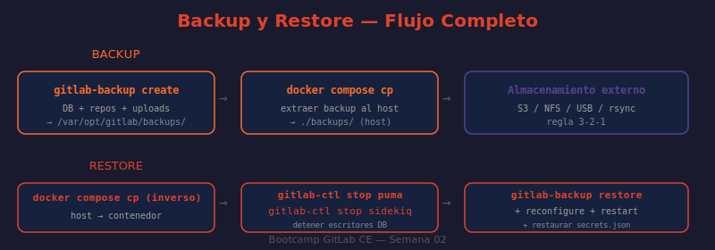

# 📖 04 — Persistencia de Datos y Volúmenes Docker

## 🎯 Objetivos de aprendizaje

- ✅ Entender qué son los volúmenes Docker y por qué son esenciales para GitLab
- ✅ Identificar qué datos se guardan en cada volumen de la instancia
- ✅ Realizar un backup completo con `gitlab-backup create`
- ✅ Entender por qué `gitlab-secrets.json` es el archivo más crítico
- ✅ Ejecutar un restore paso a paso de forma segura
- ✅ Aplicar la regla 3-2-1 de backups

---

## 🤔 La analogía del disco duro externo

**Los volúmenes Docker son como los discos duros externos que conectas al contenedor.**

Imagina que tu contenedor es una computadora de escritorio. Si la computadora se rompe (el contenedor se destruye), los datos del disco duro interno (dentro del contenedor) se pierden para siempre. Pero si tus documentos importantes están en un disco duro externo conectado por USB (el volumen Docker), puedes comprar otra computadora, conectar el mismo disco y continuar exactamente donde lo dejaste.

Eso es exactamente lo que hacen los volúmenes: los datos sobreviven aunque el contenedor muera, se reinicie o se actualice a una versión nueva.

---

## 🐳 Volúmenes en docker-compose.yml

El `docker-compose.yml` del bootcamp define los volúmenes con **nombres explícitos** (named volumes). Esto es importante porque garantiza que Docker no borre los datos accidentalmente y los hace fácilmente identificables.

```yaml
volumes:
  gitlab-config:
    name: bc-gitlab-config    # /etc/gitlab dentro del contenedor
  gitlab-logs:
    name: bc-gitlab-logs      # /var/log/gitlab dentro del contenedor
  gitlab-data:
    name: bc-gitlab-data      # /var/opt/gitlab dentro del contenedor
  runner-config:
    name: bc-gitlab-runner-config
  registry-cache-data:
    name: bc-gitlab-registry-cache
```

---



> **Diagrama:** Muestra la relación entre el contenedor `gitlab`, los tres volúmenes principales (`bc-gitlab-config`, `bc-gitlab-logs`, `bc-gitlab-data`) y el directorio del host donde Docker los almacena (`/var/lib/docker/volumes/`). También ilustra qué tipo de datos vive en cada volumen.

---

## 📊 Qué contiene cada volumen

### `bc-gitlab-config` → `/etc/gitlab`

| Archivo | Descripción | Criticidad |
|---------|-------------|------------|
| `gitlab.rb` | Configuración principal de Omnibus | 🟡 Alta |
| `gitlab-secrets.json` | **Claves de cifrado** (tokens, 2FA seeds, etc.) | 🔴 **CRÍTICO** |
| `ssh_host_*_key` | Claves SSH del servidor GitLab | 🟡 Alta |
| `trusted-certs/` | Certificados SSL de confianza personalizados | 🟢 Media |

### `bc-gitlab-logs` → `/var/log/gitlab`

Logs separados por servicio:

```
/var/log/gitlab/
├── nginx/           # Logs de acceso y errores HTTP
├── gitlab-rails/    # Logs de la aplicación Rails (production.log)
├── puma/            # Logs del servidor web Ruby
├── sidekiq/         # Logs de trabajos en segundo plano
├── postgresql/      # Logs de base de datos
└── gitaly/          # Logs de operaciones Git
```

### `bc-gitlab-data` → `/var/opt/gitlab`

```
/var/opt/gitlab/
├── git-data/              # Repositorios Git (el activo más valioso)
│   └── repositories/      # Un directorio por namespace/proyecto
├── postgresql/data/       # Base de datos PostgreSQL completa
│   ├── issues
│   ├── merge_requests
│   ├── users
│   └── ...
├── gitlab-rails/uploads/  # Archivos subidos (imágenes, attachments)
├── gitlab-rails/artifacts/ # Artifacts de CI/CD
├── gitlab-rails/lfs-objects/ # Git LFS objects
└── backups/               # Backups generados por gitlab-backup
```

---

## 🛠️ Comandos de inspección de volúmenes

```bash
# ¿QUÉ HACE?: Lista todos los volúmenes de Docker en el sistema
# ¿POR QUÉ?: Para confirmar que los volúmenes del bootcamp existen
# ¿PARA QUÉ?: Verificar nombres y detectar si se crearon sin nombre (anónimos)
docker volume ls | grep bc-gitlab

# ¿QUÉ HACE?: Muestra metadatos detallados de un volumen específico
# ¿POR QUÉ?: Incluye la ruta real del volumen en el sistema de archivos del host
# ¿PARA QUÉ?: Saber dónde están físicamente los datos para hacer backups del host
docker volume inspect bc-gitlab-data

# ¿QUÉ HACE?: Muestra el uso de disco dentro del contenedor en /var/opt/gitlab
# ¿POR QUÉ?: El volumen de datos puede crecer muy rápido con repos y artifacts
# ¿PARA QUÉ?: Detectar antes de que se llene el disco del host
docker compose exec gitlab df -h /var/opt/gitlab

# ¿QUÉ HACE?: Lista los repositorios almacenados en el servidor
# ¿POR QUÉ?: Confirma que los repos están persistidos en el volumen correcto
# ¿PARA QUÉ?: Verificar que los datos de git-data existen después de un reinicio
docker compose exec gitlab ls -la /var/opt/gitlab/git-data/repositories/
```

---

## 💾 Backup completo con gitlab-backup

### ¿Qué respalda gitlab-backup?

El comando `gitlab-backup create` respalda:
- ✅ Repositorios Git (código fuente)
- ✅ Base de datos PostgreSQL (issues, MRs, usuarios, configuración)
- ✅ Uploads (imágenes, adjuntos)
- ✅ Artifacts de CI/CD
- ✅ Git LFS objects
- ✅ Container Registry (si está habilitado)
- ✅ GitLab Pages

Lo que **NO** respalda (debes hacerlo por separado):
- ❌ `gitlab-secrets.json` (claves de cifrado)
- ❌ `gitlab.rb` (configuración)
- ❌ Certificados SSL

### Crear el backup

```bash
# ¿QUÉ HACE?: Crea un backup completo de GitLab usando la estrategia de copia
# ¿POR QUÉ?: STRATEGY=copy copia los archivos antes de comprimirlos, evitando corrupción
# ¿PARA QUÉ?: Obtener un archivo .tar con todo el estado de GitLab
docker compose exec gitlab gitlab-backup create STRATEGY=copy
```

**¿Por qué `STRATEGY=copy` y no la estrategia por defecto?**

La estrategia por defecto (`dump`) funciona bien en la mayoría de casos, pero si GitLab recibe escrituras durante el backup (alguien hace push, se cierran issues), puede generar un backup inconsistente. `STRATEGY=copy` primero copia todos los archivos a un directorio temporal y luego los comprime, garantizando consistencia.

Output esperado:
```
2025-06-25 10:30:01 -- Dumping database ...
Dumping PostgreSQL database gitlabhq_production ... [DONE]
2025-06-25 10:30:45 -- Dumping repositories ...
...
2025-06-25 10:32:10 -- Creating backup archive: 1750850001_2025_06_25_17.0.0_gitlab_backup.tar ...
2025-06-25 10:32:15 -- Backup 1750850001_2025_06_25_17.0.0_gitlab_backup.tar is done.
```

El archivo se guarda en `/var/opt/gitlab/backups/` dentro del contenedor (que persiste en el volumen `bc-gitlab-data`).

### Verificar y listar backups

```bash
# ¿QUÉ HACE?: Lista todos los backups disponibles con nombre, tamaño y fecha
# ¿POR QUÉ?: Confirma que el backup se creó correctamente
# ¿PARA QUÉ?: Identificar el timestamp para usarlo en un restore
docker compose exec gitlab gitlab-backup list

# ¿QUÉ HACE?: Muestra los archivos de backup en el directorio con tamaño
# ¿POR QUÉ?: Verificar que el .tar tiene tamaño razonable (no está vacío o corrupto)
# ¿PARA QUÉ?: Detectar backups fallidos antes de necesitar restaurar
docker compose exec gitlab ls -lh /var/opt/gitlab/backups/
```

### Respaldar los secrets (el paso más importante)

```bash
# ¿QUÉ HACE?: Extrae el contenido del archivo de secrets y lo guarda en el host
# ¿POR QUÉ?: gitlab-secrets.json contiene las claves para descifrar datos de la BD
# ¿PARA QUÉ?: Sin este archivo NO puedes restaurar un backup, aunque lo tengas perfectamente
docker compose exec gitlab cat /etc/gitlab/gitlab-secrets.json > ./gitlab-secrets.json

# ¿QUÉ HACE?: Copia el gitlab.rb (configuración) al host
# ¿POR QUÉ?: Para poder recrear la instancia con la misma configuración después de un disaster
# ¿PARA QUÉ?: Documentar cómo estaba configurada la instancia en el momento del backup
docker compose cp gitlab:/etc/gitlab/gitlab.rb ./gitlab.rb.backup
```

⚠️ **`gitlab-secrets.json` es el archivo más crítico de toda la instalación.** Si tienes el backup pero no los secrets, los datos cifrados en la base de datos (tokens de CI, variables de entorno de pipelines, semillas de 2FA) serán ilegibles. Es como tener la caja fuerte pero no la combinación.

### Copiar el backup al host

```bash
# ¿QUÉ HACE?: Copia el directorio de backups del contenedor al host
# ¿POR QUÉ?: Los backups en el volumen Docker desaparecen si borras los volúmenes
# ¿PARA QUÉ?: Tener una copia fuera del contenedor para backup externo
docker compose cp gitlab:/var/opt/gitlab/backups/. ./backups/
```

---

## 🔄 Restaurar desde backup



> **Diagrama:** Ilustra el flujo completo de restore: detener Puma y Sidekiq → copiar el archivo de backup al contenedor → ejecutar `gitlab-backup restore` → reconfigure → restart. También muestra qué sucede si `gitlab-secrets.json` no coincide (error irrecuperable).

### Proceso de restore paso a paso

```bash
# PASO 1: Copiar el archivo de backup al contenedor
# ¿QUÉ HACE?: Transfiere el archivo .tar desde el host al directorio de backups del contenedor
# ¿POR QUÉ?: gitlab-backup restore busca el archivo en /var/opt/gitlab/backups/
# ¿PARA QUÉ?: Hacer disponible el backup para el proceso de restore
docker compose cp ./backups/1750850001_2025_06_25_17.0.0_gitlab_backup.tar \
  gitlab:/var/opt/gitlab/backups/

# PASO 2: Verificar permisos del archivo (GitLab requiere permisos correctos)
docker compose exec gitlab chown git:git \
  /var/opt/gitlab/backups/1750850001_2025_06_25_17.0.0_gitlab_backup.tar

# PASO 3: Detener Puma y Sidekiq (servicios que escriben en la BD)
# ¿QUÉ HACE?: Detiene el servidor web y el procesador de trabajos de GitLab
# ¿POR QUÉ?: Si siguen corriendo durante el restore, corrompen la base de datos
# ¿PARA QUÉ?: Garantizar que nadie escribe en la BD mientras se restaura
docker compose exec gitlab gitlab-ctl stop puma
docker compose exec gitlab gitlab-ctl stop sidekiq

# Verificar que se detuvieron
docker compose exec gitlab gitlab-ctl status puma
# Output esperado: down: puma: 5s, normally up

# PASO 4: Restaurar (reemplaza el TIMESTAMP con el valor real del nombre del archivo)
# ¿QUÉ HACE?: Extrae el backup y restaura BD, repos, uploads y artifacts
# ¿POR QUÉ?: BACKUP= especifica qué archivo usar (sin _gitlab_backup.tar al final)
# ¿PARA QUÉ?: Recuperar el estado completo de GitLab al momento del backup
docker compose exec gitlab gitlab-backup restore \
  BACKUP=1750850001_2025_06_25_17.0.0

# El restore pedirá confirmación:
# "This will delete your existing data and restore the backup. Continue? [yes/no]"
# Escribe: yes

# PASO 5: Reconfigurar GitLab
# ¿QUÉ HACE?: Vuelve a aplicar toda la configuración de gitlab.rb
# ¿POR QUÉ?: El restore puede dejar configuraciones de red/permisos inconsistentes
# ¿PARA QUÉ?: Dejar GitLab en un estado limpio y correcto después del restore
docker compose exec gitlab gitlab-ctl reconfigure

# PASO 6: Reiniciar todos los servicios
# ¿QUÉ HACE?: Reinicia Puma, Sidekiq y todos los servicios detenidos
# ¿POR QUÉ?: Después de reconfigure algunos servicios pueden necesitar reinicio
# ¿PARA QUÉ?: GitLab vuelve a estar completamente operativo
docker compose exec gitlab gitlab-ctl restart

# PASO 7: Verificar la restauración
docker compose exec gitlab gitlab-rake gitlab:check SANITIZE=true
```

### Si el restore falla por secrets incompatibles

Este es el error más temido:

```
Error: The backup you're trying to restore was created with a different secret key
       than the one currently in use.
```

Solución: debes restaurar también el `gitlab-secrets.json` del mismo momento que el backup:

```bash
# ¿QUÉ HACE?: Copia el archivo de secrets respaldado al contenedor
# ¿POR QUÉ?: Los datos cifrados en el backup usan las claves de ese secrets.json
# ¿PARA QUÉ?: Sin esto, todos los tokens y variables cifradas serán ilegibles
docker compose cp ./gitlab-secrets.json gitlab:/etc/gitlab/gitlab-secrets.json

# Vuelve a correr reconfigure y reiniciar
docker compose exec gitlab gitlab-ctl reconfigure
docker compose exec gitlab gitlab-ctl restart
```

---

## 📅 Backup programado con cron

Para automatizar backups diarios, el `docker-compose.yml` ya incluye:

```yaml
gitlab_rails['backup_keep_time'] = 604800  # 7 días en segundos
```

Esto hace que GitLab **elimine automáticamente** los backups de más de 7 días cada vez que se crea uno nuevo.

Para crear un script de backup diario en el host:

```bash
# ¿QUÉ HACE?: Crea un script que ejecuta backup y copia el resultado al host
# ¿POR QUÉ?: Automatizar el proceso para que no dependa de hacerlo manualmente
# ¿PARA QUÉ?: Tener backups diarios sin intervención humana
cat > ~/gitlab-backup-daily.sh << 'EOF'
#!/bin/bash
set -e

REPO_DIR="/ruta/al/repo/bc-gitlab"
BACKUP_HOST_DIR="$HOME/gitlab-backups"
DATE=$(date +%Y%m%d)

mkdir -p "$BACKUP_HOST_DIR"

echo "=== Backup GitLab $DATE ==="
cd "$REPO_DIR"

# Crear backup en el contenedor
docker compose exec -T gitlab gitlab-backup create STRATEGY=copy

# Copiar el backup más reciente al host
LATEST=$(docker compose exec -T gitlab ls -t /var/opt/gitlab/backups/ | head -1 | tr -d '\r')
docker compose cp "gitlab:/var/opt/gitlab/backups/$LATEST" "$BACKUP_HOST_DIR/"

# Backup de secrets
docker compose exec -T gitlab cat /etc/gitlab/gitlab-secrets.json \
  > "$BACKUP_HOST_DIR/gitlab-secrets-$DATE.json"

echo "Backup completado: $BACKUP_HOST_DIR/$LATEST"
EOF

chmod +x ~/gitlab-backup-daily.sh

# Agregar al crontab para ejecutar a las 2 AM cada día
# crontab -e
# 0 2 * * * /home/user/gitlab-backup-daily.sh >> /var/log/gitlab-backup.log 2>&1
```

---

## 📐 La regla 3-2-1 de backups

```
╔══════════════════════════════════════════════════════╗
║            REGLA 3-2-1 DE BACKUPS                  ║
╠══════════════════════════════════════════════════════╣
║                                                      ║
║  3  Copias del backup                                ║
║     └─ Original + 2 copias adicionales               ║
║                                                      ║
║  2  Tipos de almacenamiento diferentes               ║
║     └─ Ej: disco local + almacenamiento en la nube   ║
║                                                      ║
║  1  Copia en ubicación geográfica distinta           ║
║     └─ Ej: diferente ciudad/región cloud             ║
║                                                      ║
╠══════════════════════════════════════════════════════╣
║  Aplicado al bootcamp:                               ║
║  1. Volumen Docker (bc-gitlab-data)                  ║
║  2. Directorio en tu máquina (~/ gitlab-backups)     ║
║  3. Google Drive / S3 / USB externo                  ║
╚══════════════════════════════════════════════════════╝
```

> **Un backup que no se prueba no es un backup.** Ejecuta un restore en un entorno de prueba periódicamente para confirmar que tus backups son recuperables.

---

## 🤔 Preguntas de reflexión

1. ¿Qué diferencia concreta hay entre `docker compose down` y `docker compose down -v`? ¿En qué situación usarías cada uno?

2. ¿Por qué `STRATEGY=copy` es más seguro que la estrategia por defecto para un servidor GitLab que sigue recibiendo pushes durante el backup?

3. Si tienes el archivo `.tar` del backup pero perdiste el `gitlab-secrets.json`, ¿qué datos específicos serán ilegibles después del restore? ¿Cuáles sí serán recuperables?

4. ¿Qué ventaja tiene usar `name: bc-gitlab-config` en la definición del volumen versus dejar que Docker genere el nombre automáticamente?

5. La regla 3-2-1 dice "1 copia en ubicación geográfica distinta". ¿Por qué esto importa incluso para un proyecto de bootcamp?

---

## 📚 Recursos adicionales

- [Documentación oficial: backup y restore de GitLab](https://docs.gitlab.com/ee/administration/backup_restore/)
- [Documentación de volúmenes Docker](https://docs.docker.com/storage/volumes/)
- [gitlab-backup: opciones avanzadas](https://docs.gitlab.com/ee/administration/backup_restore/backup_gitlab.html)
- [Backup de GitLab en S3](https://docs.gitlab.com/ee/administration/backup_restore/backup_gitlab.html#using-amazon-s3)

---

➡️ **Siguiente lección:** [05 — Solución de problemas comunes](./05-solucion-problemas.md)
