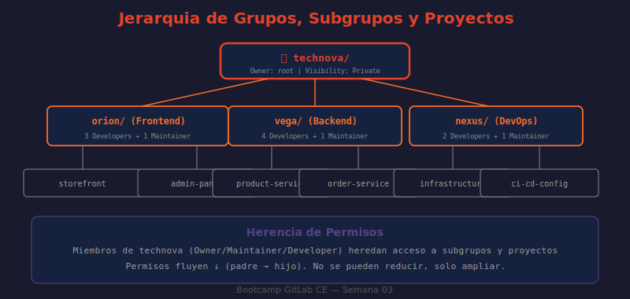

# 📖 01 — Proyectos en GitLab CE

## 🎯 Objetivos de aprendizaje

- ✅ Entender qué es un proyecto en GitLab y qué contiene
- ✅ Crear proyectos usando los tres métodos disponibles: en blanco, desde template, por importación
- ✅ Configurar opciones clave de proyecto (visibilidad, features, namespace)
- ✅ Gestionar el ciclo de vida de un proyecto (archivar, transferir, eliminar)
- ✅ Crear y gestionar proyectos via API REST

---

## 🤔 ¿Qué es un Proyecto en GitLab?

Un proyecto en GitLab es la **unidad fundamental de trabajo**: todo vive dentro de un proyecto. No es simplemente un repositorio Git — es un espacio de trabajo integrado que combina código, planificación, CI/CD, registros y documentación.

**Analogía:** Un proyecto de GitLab es como un taller de carpintería completo. El repositorio Git es la madera y las herramientas (el material de trabajo), pero el taller también tiene un tablero de tareas pendientes (Issues), una sala de revisiones (Merge Requests), una máquina de producción automatizada (CI/CD), un almacén de piezas terminadas (Container Registry) y un manual de instrucciones (Wiki). Todo en un solo lugar.

### Qué contiene un proyecto

| Componente | Descripción | Cuándo se usa |
|-----------|-------------|---------------|
| **Repositorio Git** | Código fuente con todo el historial | Siempre |
| **Issues** | Tareas, bugs, features | Planificación y seguimiento |
| **Merge Requests** | Revisión y merge de código | Code review |
| **CI/CD Pipelines** | Automatización de build/test/deploy | Desde semana 05 |
| **Container Registry** | Imágenes Docker del proyecto | Semana 08 |
| **Package Registry** | npm, Maven, PyPI, etc. | Semana 08 |
| **Wiki** | Documentación interna del proyecto | Documentación |
| **Snippets** | Fragmentos de código reutilizables | Utilidades |
| **Releases** | Versiones publicadas con assets | Distribución |
| **Environments** | Ambientes de deploy (staging, prod) | Desde semana 06 |

---

## 🏗️ Tipos de Proyectos y Cómo Crearlos

### Método 1: Proyecto en blanco

El más común. Crea un repositorio vacío que tú rellenas.

**Via Web UI:**
1. Click en el ícono `+` de la barra superior → **New project**
2. Seleccionar **Create blank project**
3. Completar el formulario:

```
Project name: mi-aplicacion
Project URL:  http://localhost/tu-usuario/mi-aplicacion
              ────────────────┬──────────────────────────
                              └─ El namespace (usuario o grupo)
Project slug: mi-aplicacion   ← URL-safe, auto-generado del nombre
Visibility:   Private
              ✓ Initialize repository with a README
              ✓ Enable Static Application Security Testing (SAST)
```

4. Click **Create project**

**Via API:**
```bash
# ¿QUÉ HACE?: Crea un proyecto vacío via REST API
# ¿POR QUÉ?: Útil para automatizar creación de proyectos en scripts o pipelines
# ¿PARA QUÉ?: Reproducir estructuras organizacionales sin clicks manuales
curl --request POST \
  --header "PRIVATE-TOKEN: $GITLAB_TOKEN" \
  --header "Content-Type: application/json" \
  --data '{
    "name": "mi-aplicacion",
    "description": "Descripción del proyecto",
    "visibility": "private",
    "initialize_with_readme": true,
    "default_branch": "main"
  }' \
  "http://localhost/api/v4/projects"
```

**Via glab CLI:**
```bash
# ¿QUÉ HACE?: Crea proyecto con el CLI oficial de GitLab
# ¿POR QUÉ?: Más rápido que la UI para desarrolladores que viven en la terminal
glab repo create mi-aplicacion --private --description "Mi proyecto"
```

---

### Método 2: Proyecto desde Template

GitLab incluye templates con código base para frameworks populares. Ahorra configuración inicial.

**Templates disponibles en GitLab CE:**

| Categoría | Templates |
|-----------|-----------|
| **Lenguajes** | Ruby on Rails, Node.js Express, Python/Flask, Go |
| **JVM** | Spring, Maven, Gradle |
| **Frontend** | React, Vue.js, Angular |
| **Pages/Static** | Hugo, Jekyll, Middleman, Plain HTML |
| **DevOps** | Android, iOS, Kubernetes |

**Pasos:**
1. **New project → Create from template**
2. Navegar por las pestañas: Built-in / Group / Instance
3. Click **Use template** en el elegido
4. Configurar nombre, namespace y visibilidad
5. Click **Create project**

> 💡 **Truco:** En GitLab CE self-hosted, los administradores pueden crear **Instance templates** — plantillas corporativas disponibles para todos los usuarios. Ideal para estándares de proyecto de la empresa.

---

### Método 3: Importar desde fuente externa

Migra repositorios existentes de otras plataformas.

**Fuentes soportadas en GitLab CE:**

```
Import project
├── GitHub             (requiere token de GitHub)
├── Bitbucket Cloud    (requiere OAuth)
├── Bitbucket Server   (requiere credenciales)
├── Gitea/Forgejo      (requiere token)
├── Repo by URL        ← El más universal
│   └── Funciona con cualquier repo Git público o privado
└── Manifest file      (XML con múltiples repos — Android)
```

**Importar por URL (el más común en este bootcamp):**
```bash
# En la UI: New project → Import project → Repository by URL
# Repository URL: https://github.com/octocat/Hello-World.git
# Username/Password: solo si es repositorio privado
```

⚠️ La importación copia el historial completo de commits, branches y tags, pero **no** copia Issues, MRs ni Pipelines de la plataforma origen.

---

## ⚙️ Configuración de Proyecto

### Namespace: dónde vive el proyecto

El namespace define la URL y la jerarquía del proyecto:

```
http://localhost / namespace / proyecto
                    ───────────────────
                    Puede ser:
                    • Usuario:   /tu-usuario/proyecto
                    • Grupo:     /mi-empresa/proyecto
                    • Subgrupo:  /mi-empresa/frontend/proyecto
```

Cambiar el namespace es equivalente a transferir el proyecto — todos los enlaces existentes se redirigen automáticamente, pero es una operación destructiva a evitar.

---

### Settings → General: opciones clave

Ve a **Project → Settings → General** para acceder a:

**Información básica:**
```
Nombre del proyecto       ← Puede cambiarse (genera redirección de URL)
Descripción              ← Aparece en listados y búsquedas
Topics/Tags              ← Para categorizar y buscar
```

**Visibility, project features, permissions:**

```
Visibility Level:
  ● Private      ← Solo miembros explícitos
  ○ Internal     ← Cualquier usuario autenticado
  ○ Public       ← Todo el mundo (incluso sin cuenta)

Features:
  ✓ Issues          Visibility: Everyone with access / Only project members
  ✓ Repository      Visibility: Everyone with access / Only project members
  ✓ Merge requests
  ✓ Forks          ← Permite que otros hagan fork
  ✓ Git LFS        ← Para archivos binarios grandes
  ✓ Packages
  ✓ Container Registry
  ✓ CI/CD
  ✓ Analytics
  ✓ Wiki
  ✓ Snippets
```

---

### Ciclo de vida del proyecto

**Archivar** — Pone el proyecto en modo lectura:
```
Settings → General → Advanced → Archive project
```
- El código sigue visible y clonable
- No se pueden crear nuevos Issues, MRs, ni commits
- Aparece con la etiqueta "archived" en los listados
- Útil para proyectos terminados que aún necesitas como referencia

**Transferir** — Mueve el proyecto a otro namespace:
```
Settings → General → Advanced → Transfer project
Nuevo namespace: otro-usuario o grupo/subgrupo
```
- La URL anterior redirige automáticamente (por un tiempo)
- Los CI/CD Runners asociados al grupo destino pasan a estar disponibles
- Los webhooks y tokens del proyecto se conservan

**Eliminar** — Operación irreversible:
```
Settings → General → Advanced → Delete project
Confirmación: escribir el nombre exacto del proyecto
```
⚠️ En GitLab CE, la eliminación es **inmediata**. En GitLab EE hay un período de gracia de 7 días.

---

## 🖼️ Diagrama: Anatomía de un Proyecto GitLab



> **Diagrama:** Muestra cómo un proyecto se ubica dentro de la jerarquía namespace → grupo → subgrupo → proyecto, y los componentes internos de un proyecto (Issues, MRs, CI/CD, Registry, Wiki).

---

## 🔑 Tokens de Acceso de Proyecto

Los proyectos pueden tener sus propios tokens de acceso (Project Access Tokens), separados de los tokens personales:

```
Project → Settings → Access Tokens → Add new token

Campos:
  Name:        ci-deploy-token
  Expiration:  2025-12-31        ← Siempre poner fecha límite
  Role:        Developer          ← Mínimo privilegio
  Scopes:
    ✓ api           → Acceso completo a la API del proyecto
    ✓ read_repository
    ✓ write_repository
    □ read_registry
    □ write_registry
```

Usa estos tokens en lugar de tu token personal en scripts y pipelines — así si el token se compromete, solo afecta a ese proyecto.

---

## 🤔 Preguntas de reflexión

1. Un proyecto tiene `visibility: private` pero está dentro de un grupo `internal`. ¿Puede un usuario autenticado que no es miembro del proyecto ver el código? ¿Por qué?

2. Tienes un proyecto con 500 issues y decides transferirlo a otro grupo. ¿Qué pasa con los Issues, el historial de commits y los webhooks configurados?

3. ¿Cuál es la diferencia entre "archivar" y "eliminar" un proyecto? ¿En qué situación usarías cada uno?

4. Un desarrollador tiene acceso de **Developer** al grupo `empresa/frontend`. ¿Automáticamente tiene acceso al proyecto `empresa/backend/api`? ¿Por qué?

5. Si creas un proyecto con `initialize_with_readme: true` via API y luego intentas clonar inmediatamente con SSH, ¿qué necesitas configurar previamente?

---

## 📚 Recursos adicionales

- [GitLab Projects Documentation](https://docs.gitlab.com/ee/user/project/)
- [GitLab API — Projects](https://docs.gitlab.com/ee/api/projects.html)
- [Project Access Tokens](https://docs.gitlab.com/ee/user/project/settings/project_access_tokens.html)
- [Import projects](https://docs.gitlab.com/ee/user/project/import/)
- [glab CLI — Repo commands](https://gitlab.com/gitlab-org/cli/-/blob/main/docs/source/repo/create.md)

---

➡️ **Siguiente lección:** [02 — Grupos y Subgrupos](./02-grupos-y-subgrupos.md)
