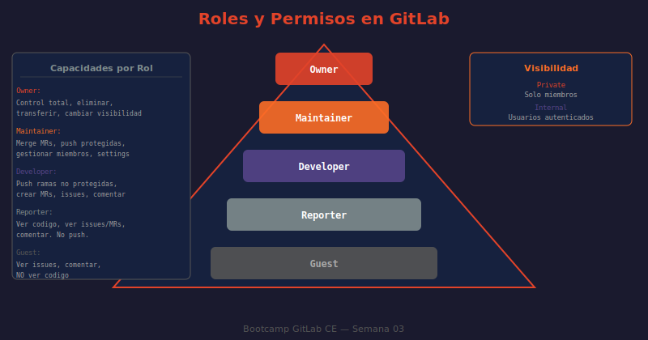

# 📖 03 — Visibilidad y Permisos en GitLab CE

## 🎯 Objetivos de aprendizaje

- ✅ Comprender los tres niveles de visibilidad (Private, Internal, Public)
- ✅ Conocer los cinco roles de miembros y sus capacidades exactas
- ✅ Entender cómo fluye la herencia de permisos en grupos y subgrupos
- ✅ Configurar permisos granulares en proyectos y grupos
- ✅ Compartir proyectos con grupos externos (cross-group access)

---

## 🤔 ¿Por qué importan los permisos?

En un entorno GitLab real, no todos deben poder hacer todo. Un desarrollador junior no debería poder hacer push directo a `main`. Un QA necesita ver el código pero no modificarlo. Un cliente debería poder ver el progreso pero no el código fuente.

**Analogía:** Los permisos en GitLab son como las llaves de acceso de un edificio de oficinas. El visitante (Guest) puede entrar al lobby y ver el tablero de anuncios. El empleado (Developer) tiene llave para su piso y puede usar las impresoras. El gerente (Maintainer) tiene acceso a la sala de servidores. El dueño del edificio (Owner) tiene copia maestra de todas las llaves y puede cambiar las cerraduras.

---

## 👁️ Niveles de Visibilidad

La visibilidad determina **quién puede ver** un proyecto o grupo, independientemente de los roles de miembro.

### Private (Privado) — El default recomendado

```
Acceso:   Solo miembros explícitamente invitados
Clonado:  Requiere autenticación (SSH key o token)
Listado:  No aparece en búsquedas públicas
Uso:      Código propietario, proyectos de empresa, repositorios internos
```

### Internal (Interno)

```
Acceso:   Cualquier usuario autenticado en la instancia GitLab
Clonado:  Requiere autenticación
Listado:  Visible para todos los usuarios logueados
Uso:      Documentación interna, herramientas compartidas entre equipos
          Útil en instancias de empresa donde "autenticado = empleado"
```

> ⚠️ **Importante:** En GitLab CE self-hosted con registro de usuarios habilitado, `Internal` puede ser peligroso si usuarios externos se registran. Desactiva el registro público en `Admin Area → Sign-up restrictions` si usas visibilidad Internal.

### Public (Público)

```
Acceso:   Cualquier persona en internet (sin cuenta)
Clonado:  Sin autenticación (git clone sin credenciales)
Listado:  Aparece en búsquedas, indexable por motores de búsqueda
Uso:      Proyectos open source, documentación pública
Restricción: Solo Owner/Admin puede cambiar un proyecto a Public
```

---

## 👤 Los Cinco Roles de GitLab

GitLab define cinco roles ordenados jerárquicamente, cada uno incluyendo todos los permisos del rol inferior:

### Guest (Invitado) — Nivel 10

El acceso más restringido. Ideal para stakeholders externos o clientes.

```
Puede:
  ✓ Ver el proyecto (si tiene acceso)
  ✓ Crear y comentar Issues
  ✓ Ver la Wiki (si está habilitada)
  ✓ Ver Snippets públicos

No puede:
  ✗ Ver el código fuente
  ✗ Clonar el repositorio
  ✗ Ver Merge Requests
  ✗ Ver CI/CD pipelines
```

### Reporter (Reportador) — Nivel 20

Puede ver todo pero no modificar. Ideal para QA, Project Managers, auditores.

```
Puede (además de Guest):
  ✓ Ver y clonar el repositorio (read-only)
  ✓ Ver Merge Requests y comentar
  ✓ Ver pipelines y jobs de CI/CD
  ✓ Ver el Container Registry
  ✓ Descargar artefactos de pipelines

No puede:
  ✗ Hacer push de ningún tipo
  ✗ Crear Merge Requests
  ✗ Ejecutar pipelines manualmente
```

### Developer (Desarrollador) — Nivel 30

El rol estándar para miembros del equipo de desarrollo.

```
Puede (además de Reporter):
  ✓ Push a ramas NO protegidas
  ✓ Crear y gestionar Merge Requests
  ✓ Crear y eliminar ramas (no protegidas)
  ✓ Crear tags (no protegidos)
  ✓ Ejecutar pipelines manualmente
  ✓ Gestionar Issues y Milestones
  ✓ Push/pull al Container Registry

No puede:
  ✗ Push a ramas protegidas (por defecto)
  ✗ Hacer merge de MRs a ramas protegidas
  ✗ Gestionar miembros del proyecto
  ✗ Cambiar configuración del proyecto
```

### Maintainer (Mantenedor) — Nivel 40

El rol de tech lead o responsable del proyecto.

```
Puede (además de Developer):
  ✓ Push a ramas protegidas
  ✓ Hacer merge de MRs a cualquier rama
  ✓ Gestionar miembros (invitar, cambiar rol, remover)
  ✓ Gestionar Protected Branches y Tags
  ✓ Cambiar la configuración del proyecto
  ✓ Crear y gestionar Deploy Keys
  ✓ Gestionar webhooks e integraciones
  ✓ Administrar el Container Registry (limpiar imágenes)
  ✓ Transferir proyectos a otro grupo (si es Maintainer en destino)

No puede (solo Owner puede):
  ✗ Cambiar la visibilidad del proyecto
  ✗ Eliminar el proyecto
  ✗ Cambiar el namespace (URL base)
```

### Owner (Propietario) — Nivel 50

Control total. **Solo disponible a nivel de grupo**, no de proyecto directamente.

```
Puede (además de Maintainer):
  ✓ Cambiar visibilidad del grupo
  ✓ Eliminar el grupo y todos sus proyectos
  ✓ Transferir el grupo a otro grupo padre
  ✓ Cambiar el namespace (URL del grupo)
  ✓ Gestionar Access Tokens del grupo
```

> 💡 En un proyecto específico, el creador del proyecto es automáticamente Maintainer. Para tener nivel Owner en un proyecto, el usuario debe ser Owner del grupo que contiene ese proyecto.

---

## 📊 Matriz de Permisos (Resumen)

| Acción | Guest | Reporter | Developer | Maintainer | Owner |
|--------|:-----:|:--------:|:---------:|:----------:|:-----:|
| Ver proyecto | ✓ | ✓ | ✓ | ✓ | ✓ |
| Ver código fuente | ✗ | ✓ | ✓ | ✓ | ✓ |
| Clonar repositorio | ✗ | ✓ | ✓ | ✓ | ✓ |
| Crear/comentar issues | ✓ | ✓ | ✓ | ✓ | ✓ |
| Ver Merge Requests | ✗ | ✓ | ✓ | ✓ | ✓ |
| Crear Merge Requests | ✗ | ✗ | ✓ | ✓ | ✓ |
| Push a ramas normales | ✗ | ✗ | ✓ | ✓ | ✓ |
| Push a ramas protegidas | ✗ | ✗ | ✗ | ✓ | ✓ |
| Hacer merge | ✗ | ✗ | ✗ | ✓ | ✓ |
| Gestionar miembros | ✗ | ✗ | ✗ | ✓ | ✓ |
| Cambiar visibilidad | ✗ | ✗ | ✗ | ✗ | ✓ |
| Eliminar grupo/proyecto | ✗ | ✗ | ✗ | ✗ | ✓ |

---

## 🔄 Herencia de Permisos

Los permisos fluyen **hacia abajo** en la jerarquía y **nunca** se pueden reducir:

```
technova/ (grupo raíz)
│
│   root → Owner en technova
│           ↓ Owner heredado en todos los subgrupos y proyectos
│
│   maria → Maintainer en technova
│           ↓ Maintainer heredado en todos los subgrupos
│
├── orion/ (subgrupo)
│   │
│   │   pedro → Developer en orion/
│   │           ↓ Developer heredado en orion/storefront, orion/admin-panel
│   │
│   ├── storefront/
│   │       carlos → Maintainer DIRECTO en este proyecto
│   │                (promovido respecto al Developer que heredaría de orion/)
│   │
│   └── admin-panel/  ← root=Owner, maria=Maintainer, pedro=Developer
│
└── vega/ (subgrupo)
    └── api-gateway/  ← root=Owner, maria=Maintainer (sin miembros propios en vega/)
```

### Regla clave

> El rol **efectivo** de un usuario en un proyecto es el **mayor** entre:
> - Su rol heredado de cualquier grupo ancestro
> - Su rol directo en el proyecto

Nunca puede ser menor que el heredado.

---

## 🤝 Compartir Proyectos con Grupos Externos

Permite dar acceso a un proyecto completo a todos los miembros de otro grupo:

```
Proyecto → Settings → Members → Invite a group

Grupo a invitar:   equipo-consultores
Rol máximo:        Developer        ← Límite de permisos para este grupo
Fecha expiración:  2025-03-31       ← Recomendado para consultores temporales
```

**Cuándo usar:**
- Consultores externos que necesitan acceso a proyectos específicos sin ser parte de la organización
- Colaboración cross-team en proyectos compartidos
- Permitir que el equipo de QA acceda a proyectos de desarrollo para testing

**Restricción importante:** El rol otorgado al grupo externo no puede ser mayor al rol del usuario que hace la invitación.

---

## 🔐 Permisos en la Práctica: Escenario Real

Configuración recomendada para un equipo de desarrollo estándar:

```
empresa/backend/ (subgrupo)

Miembros:
  tech-lead     → Maintainer  (puede mergear a main, gestionar equipo)
  dev-senior-1  → Developer   (crea MRs, no puede mergear a main directamente)
  dev-senior-2  → Developer
  dev-junior-1  → Developer   (mismo rol; la protección de ramas limita el impacto)
  qa-lead       → Reporter    (puede ver todo, no puede modificar código)
  pm-principal  → Reporter    (ve el progreso, comenta issues)
  cliente-abc   → Guest       (ve los issues del cliente, no el código)
```

Esta estructura sola no es suficiente — se complementa con **Protected Branches** (lección 04) para controlar quién puede mergear a ramas críticas.

---

## 🖼️ Diagrama: Roles y Permisos



> **Diagrama:** Visualiza los 5 roles como capas concéntricas (cada capa incluye los permisos de las internas), e ilustra cómo el rol efectivo de un usuario en un proyecto resulta del máximo entre roles heredados y directos.

---

## 🤔 Preguntas de reflexión

1. Un usuario es `Reporter` en el grupo `empresa/frontend` y `Developer` directo en el proyecto `empresa/frontend/web-app`. ¿Cuál es su rol efectivo en `web-app`? ¿Puede hacer push a ramas no protegidas?

2. ¿Por qué el rol `Owner` solo existe a nivel de grupo y no de proyecto? ¿Qué problema de seguridad evita este diseño?

3. Un colaborador externo necesita ver el código de `empresa/backend/auth-service` para una auditoría de seguridad, pero no debe poder modificar nada. ¿Qué rol le asignarías y por qué?

4. Tienes un proyecto `empresa/shared/design-system` que necesitan todos los equipos. ¿Cómo configurarías el acceso para 5 equipos distintos sin agregar a cada miembro individualmente al proyecto?

5. El rol `Maintainer` puede gestionar miembros (invitar, promover, remover). ¿Por qué esto es potencialmente peligroso en términos de seguridad? ¿Qué control adicional pondrías?

---

## 📚 Recursos adicionales

- [GitLab Permissions and Roles](https://docs.gitlab.com/ee/user/permissions.html)
- [Visibility levels](https://docs.gitlab.com/ee/user/public_access.html)
- [Share projects with groups](https://docs.gitlab.com/ee/user/project/members/share_project_with_groups.html)
- [Project members API](https://docs.gitlab.com/ee/api/members.html)

---

⬅️ **Lección anterior:** [02 — Grupos y Subgrupos](./02-grupos-y-subgrupos.md)
➡️ **Siguiente lección:** [04 — Protección de Ramas](./04-proteccion-de-ramas.md)
