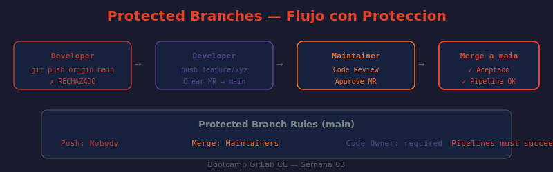

# 📖 04 — Protección de Ramas en GitLab CE

## 🎯 Objetivos de aprendizaje

- ✅ Entender qué son las ramas protegidas y por qué son necesarias
- ✅ Configurar reglas de protección para ramas críticas (main, develop, release/*)
- ✅ Verificar que las reglas se aplican correctamente (push rechazado, flujo via MR)
- ✅ Implementar CODEOWNERS para revisiones de código obligatorias
- ✅ Configurar reglas avanzadas de Merge Request (approvals, pipelines obligatorios)

---

## 🤔 ¿Por qué proteger ramas?

Sin protección de ramas, cualquier Developer puede hacer `git push origin main` directamente, saltándose el proceso de code review. Esto es el equivalente a dejar la puerta de producción abierta.

**Analogía:** Una rama protegida es como la puerta de la sala de control de una central eléctrica. Cualquier técnico (Developer) puede trabajar en los pasillos y cuartos de mantenimiento (ramas de feature). Pero para entrar a la sala de control (main/producción), necesitas que un supervisor (Maintainer) abra la puerta después de revisar que lo que traes es seguro (Merge Request aprobado).

---

## 🛡️ Qué son las Ramas Protegidas

Las Protected Branches en GitLab permiten configurar:

1. **Quién puede hacer merge** a esa rama
2. **Quién puede hacer push directo** a esa rama
3. **Quién puede hacer force push** (sobrescribir historial)
4. **Si se puede eliminar** la rama

Las opciones de rol disponibles para cada restricción:

```
Nobody                     ← Nadie puede (útil para congelar una rama)
Developers + Maintainers
Maintainers
Maintainers + Owners       ← El más restrictivo
```

---

## ⚙️ Configurar Protección de Ramas

### Via Web UI

```
Proyecto → Settings → Repository → Protected branches

Pasos:
1. En "Search for branch" escribir el nombre o wildcard
   (ej: main, develop, release/*)
2. Configurar "Allowed to merge"
3. Configurar "Allowed to push and merge"
4. Click "Protect"
```

### Configuraciones típicas por tipo de rama

```
Rama: main  (producción)
├── Allowed to merge:            Maintainers
└── Allowed to push and merge:   Nobody
    → Nadie puede hacer push directo; todo entra via MR aprobado por Maintainer

Rama: develop  (integración)
├── Allowed to merge:            Developers + Maintainers
└── Allowed to push and merge:   Developers + Maintainers
    → El equipo puede integrar features directamente o via MR

Rama: release/*  (wildcard — aplica a release/1.0, release/2.0, etc.)
├── Allowed to merge:            Maintainers
└── Allowed to push and merge:   Nobody
    → Solo Maintainers pueden preparar releases; nadie toca directamente

Rama: production  (deploy final)
├── Allowed to merge:            Maintainers
└── Allowed to push and merge:   Nobody
    → Igual que main, para ambientes con rama de producción separada
```

### Via API

```bash
# ¿QUÉ HACE?: Protege la rama main del proyecto con ID 42
# ¿POR QUÉ?: push_access_level=0 significa Nobody; merge_access_level=40 = Maintainers
# ¿PARA QUÉ?: Configurar protecciones programáticamente al crear nuevos proyectos
curl --request POST \
  --header "PRIVATE-TOKEN: $GITLAB_TOKEN" \
  --header "Content-Type: application/json" \
  --data '{
    "name": "main",
    "push_access_level": 0,
    "merge_access_level": 40,
    "allow_force_push": false
  }' \
  "http://localhost/api/v4/projects/42/protected_branches"
```

**Tabla de access_level para protected branches:**

| Nivel | Valor |
|-------|-------|
| Nobody | 0 |
| Developers + Maintainers | 30 |
| Maintainers | 40 |
| Owners | 50 |

```bash
# ¿QUÉ HACE?: Lista todas las ramas protegidas del proyecto
# ¿POR QUÉ?: Útil para auditar configuraciones de seguridad
# ¿PARA QUÉ?: Verificar que todos los proyectos tienen main protegido
curl --header "PRIVATE-TOKEN: $GITLAB_TOKEN" \
  "http://localhost/api/v4/projects/42/protected_branches"
```

---

## 🌿 Wildcards en Protección de Ramas

Los wildcards permiten proteger patrones de nombres de rama:

```
Patrón          Aplica a
─────────────── ────────────────────────────────────
release/*       release/1.0, release/2.0, release/hotfix
hotfix/*        hotfix/critical-bug, hotfix/payment-fix
v*              v1.0.0, v2.1.3, v3.0.0-rc1
*-stable        1-0-stable, 2-0-stable
```

**Configurar wildcard via UI:**

```
Protected branches → Search for branch
Escribir: release/*
(GitLab reconoce automáticamente que es un wildcard)
```

---

## 📋 CODEOWNERS: Revisiones Obligatorias por Área

CODEOWNERS permite definir qué usuarios o grupos deben aprobar cambios en archivos específicos.

### Crear el archivo CODEOWNERS

```bash
# ¿QUÉ HACE?: Crea el directorio y archivo CODEOWNERS en el proyecto
# ¿POR QUÉ?: GitLab busca este archivo en .gitlab/, .github/ o la raíz del proyecto
# ¿PARA QUÉ?: Definir quién debe revisar cambios en cada área del código
mkdir -p .gitlab
cat > .gitlab/CODEOWNERS << 'EOF'
# Propietarios por defecto (aplica a todo lo no especificado)
* @tech-lead

# Backend — cualquier archivo .go o .rb requiere revisión del equipo backend
*.go @backend-lead @backend-team
*.rb @backend-lead

# Frontend — archivos TypeScript/React
*.ts @frontend-lead
*.tsx @frontend-lead @frontend-senior

# Infraestructura — archivos Terraform
*.tf @devops-lead
terraform/ @devops-lead @devops-team

# Seguridad — archivos de configuración críticos
.gitlab-ci.yml @devops-lead @security-team
docker-compose*.yml @devops-lead
*.env.example @security-team

# Documentación
docs/ @tech-writer @tech-lead
*.md @tech-writer
EOF
git add .gitlab/CODEOWNERS
git commit -m "chore: add CODEOWNERS for mandatory reviews"
git push origin main
```

### Activar CODEOWNERS en Protected Branches

```
Proyecto → Settings → Repository → Protected branches
→ En la rama main, activar:
  ✓ Require approval from code owners
```

Ahora, cuando un MR modifica `*.tf`, GitLab automáticamente agrega a `@devops-lead` como reviewer requerido. El MR **no puede mergearse** hasta que ese reviewer apruebe.

---

## ✅ Reglas Adicionales de Merge Request

### Requerir que el pipeline pase

```
Proyecto → Settings → Merge requests → Merge checks
✓ Pipelines must succeed

Efecto: Un MR no puede mergearse si el pipeline de CI falla.
Por qué: Previene que código roto entre a main.
```

### Requerir que todos los hilos estén resueltos

```
Proyecto → Settings → Merge requests → Merge checks
✓ All threads must be resolved

Efecto: Los comentarios del code review deben resolverse antes del merge.
Por qué: Previene que observaciones importantes sean ignoradas.
```

### Approvals mínimos

```
Proyecto → Settings → Merge requests → Approval rules
→ Add approval rule

Name:               "Peer Review"
Approvals required: 1
Eligible approvers: Any member with at least Developer access
```

> 💡 **GitLab CE vs EE:** Las Approval Rules avanzadas (grupos de approvers, approvals condicionales por archivos) son principalmente características de GitLab EE. En CE, puedes configurar el número mínimo de approvals pero con menos granularidad.

---

## 🔍 Verificar Que la Protección Funciona

### Intentar push directo (como Developer)

```bash
# Clonar el repo
git clone http://localhost/technova/vega/api-gateway.git
cd api-gateway

# Crear un commit en main
echo "cambio directo" >> README.md
git add README.md
git commit -m "intento de push directo a main"

# Intentar push a main — debe ser RECHAZADO
git push origin main
```

Output esperado (push rechazado):
```
remote: GitLab: You are not allowed to push code to protected branches on this project.
To http://localhost/technova/vega/api-gateway.git
 ! [remote rejected] main -> main (pre-receive hook declined)
error: failed to push some refs to 'http://localhost/technova/vega/api-gateway.git'
```

### El flujo correcto (como Developer)

```bash
# ¿QUÉ HACE?: Crea una rama de feature desde main actualizado
# ¿POR QUÉ?: Las feature branches no están protegidas; el developer puede trabajar libremente
# ¿PARA QUÉ?: Aislar el cambio para revisión antes de integrar
git checkout -b feature/add-health-endpoint
echo "GET /health → 200 OK" >> README.md
git add README.md
git commit -m "feat: add health check endpoint documentation"

# ¿QUÉ HACE?: Sube la rama feature (no protegida) al repositorio remoto
# ¿POR QUÉ?: Los developers pueden push a cualquier rama no protegida
# ¿PARA QUÉ?: Hacer el código disponible para crear el Merge Request en GitLab UI
git push origin feature/add-health-endpoint
```

En la UI aparecerá un banner: **"Create merge request"**. Al crearlo:
- Se asignan reviewers automáticamente (si hay CODEOWNERS)
- Se ejecuta el pipeline de CI
- Un Maintainer revisa y hace merge cuando todo está verde

---

## 🖼️ Diagrama: Flujo con Ramas Protegidas



> **Diagrama:** Ilustra el flujo completo desde que un Developer crea una feature branch hasta que un Maintainer hace merge a main, pasando por CI pipeline y code review. También muestra el push rechazado directo a main.

---

## 🚫 Desproteger una Rama

Solo Maintainers y Owners pueden desproteger:

```
Proyecto → Settings → Repository → Protected branches
→ En la rama que quieres desproteger, click "Unprotect"
→ Confirmar la acción
```

⚠️ Desproteger `main` temporalmente (por ejemplo para una corrección urgente de historial) es una operación de alto riesgo. Documenta el motivo, haz el cambio mínimo y vuelve a proteger inmediatamente.

---

## 🤔 Preguntas de reflexión

1. Tienes la rama `main` protegida con `Allowed to merge: Maintainers`. Un Maintainer quiere hacer `git push --force origin main` para revertir un commit erróneo. ¿Puede hacerlo? ¿Qué opción de protección controla esto?

2. Un proyecto usa Git Flow con ramas `main`, `develop`, `release/*` y `hotfix/*`. ¿Qué configuración de protección aplicarías a cada tipo de rama y por qué?

3. CODEOWNERS define que `*.tf` lo debe aprobar `@devops-lead`. El devops lead está de vacaciones. Un cambio crítico en Terraform necesita mergearse urgentemente. ¿Qué opciones tienes?

4. ¿Por qué es importante tener `Pipelines must succeed` activado en conjunto con la protección de ramas? ¿Qué escenario de riesgo evita esta combinación?

5. Un Developer crea la rama `feature/login` y hace push. Otro Developer quiere contribuir a esa misma rama. ¿Necesita algún permiso especial para hacer push a `feature/login`?

---

## 📚 Recursos adicionales

- [Protected Branches](https://docs.gitlab.com/ee/user/project/protected_branches.html)
- [CODEOWNERS Syntax Reference](https://docs.gitlab.com/ee/user/project/codeowners/reference.html)
- [Merge request approvals](https://docs.gitlab.com/ee/user/project/merge_requests/approvals/)
- [Protected Branches API](https://docs.gitlab.com/ee/api/protected_branches.html)

---

⬅️ **Lección anterior:** [03 — Visibilidad y Permisos](./03-visibilidad-y-permisos.md)
➡️ **Siguiente lección:** [05 — Estrategias de Branching](./05-estrategias-branching.md)
