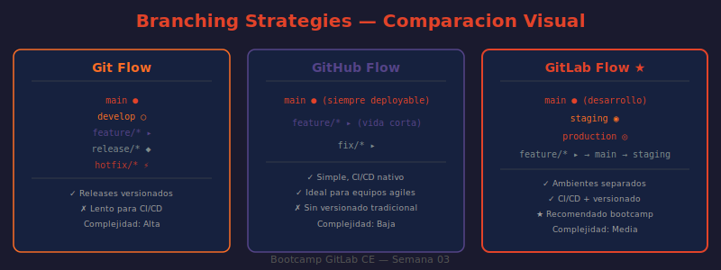

# 📖 05 — Estrategias de Branching

## 🎯 Objetivos de aprendizaje

- ✅ Conocer las cuatro estrategias principales de branching: Git Flow, GitHub Flow, GitLab Flow, Trunk-Based
- ✅ Evaluar cuál se adapta mejor según el contexto del equipo y el producto
- ✅ Configurar GitLab para soportar cada estrategia mediante protected branches
- ✅ Entender el rol de las Merge Requests en cada estrategia
- ✅ Elegir la estrategia correcta para el proyecto del bootcamp

---

## 🤔 ¿Qué es una Estrategia de Branching?

Una estrategia de branching es un conjunto de reglas y convenciones que define cómo el equipo usa las ramas de Git para colaborar: qué ramas existen, cuándo se crean, cómo se integran, y cuándo se eliminan.

**Analogía:** Una estrategia de branching es como el sistema de carreteras de una ciudad. Git Flow es como una ciudad antigua con muchas rotondas y vías paralelas (hay muchas rutas, algunas muy largas). GitHub Flow es como una autopista directa: una sola vía principal y accesos controlados. Trunk-Based Development es como una calle peatonal de una sola mano: todos van juntos, sin desvíos, muy rápido pero necesitas que la gente sea disciplinada.

---

## 🌊 Git Flow

Propuesto por Vincent Driessen en 2010. El modelo más estructurado.

### Ramas permanentes

```
main (o master)
│   └── Código en producción. Cada commit = un release con tag de versión.

develop
    └── Rama de integración. Aquí confluyen todas las features terminadas.
```

### Ramas de soporte (vida corta)

```
feature/<nombre>    ← Se crean desde develop, se mergean a develop
release/<versión>   ← Se crean desde develop, se mergean a main Y develop
hotfix/<descripción>← Se crean desde main, se mergean a main Y develop
```

### El flujo completo

```
develop ──┬── feature/login ──────────────────────────────────┐
          │                                                     │
          ◄─────────────────────────── merge feature/login ────┘
          │
          ├── feature/payments ─────────────────────────────────┐
          │                                                       │
          ◄──────────────────────────── merge feature/payments ──┘
          │
          ├── release/1.0 ──► (testing, bug fixes) ──► merge a main + develop
          │                                                      │
main ◄────┼──────────────────────────────────────────────── tag v1.0
          │
          └── (hotfix/critical-bug desde main) ──► merge a main + develop
```

### Implementación en GitLab

```bash
# Crear rama feature desde develop
git checkout develop
git checkout -b feature/nuevo-login

# Trabajar...
git add .
git commit -m "feat(auth): add OAuth2 login with Google"
git push origin feature/nuevo-login

# Crear MR: feature/nuevo-login → develop
# Cuando develop está listo para release:
git checkout -b release/1.0 develop
# Fix bugs del release...
git push origin release/1.0

# Crear MR: release/1.0 → main
# Crear MR: release/1.0 → develop (para sincronizar los fixes del release)
```

### Configuración de protected branches para Git Flow

```
main:
  Allowed to merge:     Maintainers
  Allowed to push:      Nobody

develop:
  Allowed to merge:     Developers + Maintainers
  Allowed to push:      Nobody  ← Todo via MR para mantener historial limpio

release/*:
  Allowed to merge:     Maintainers
  Allowed to push:      Nobody

hotfix/*:
  Allowed to merge:     Maintainers
  Allowed to push:      Maintainers  ← Permite commits de fix directos en urgencias
```

### Cuándo usar Git Flow

✅ Software con releases versionados (apps móviles, librerías, software empaquetado)
✅ Equipos grandes que trabajan en múltiples versiones simultáneamente
✅ Procesos de QA formales entre desarrollo y producción

❌ No recomendado para servicios web con deploy continuo
❌ Demasiado complejo para equipos pequeños o proyectos simples

---

## 🐙 GitHub Flow

Simplificado. Propuesto por GitHub para sus propios proyectos. Solo hay **una rama permanente: `main`**.

### El flujo

```
1. main es siempre desplegable (cada commit puede ir a producción)
2. Para cualquier trabajo, crear una rama descriptiva desde main
3. Hacer commits frecuentes a la rama
4. Abrir un Merge Request para discutir el cambio
5. Después de code review y CI verde → merge a main
6. Deploy inmediato (o casi inmediato) desde main
7. Eliminar la rama
```

### Tipos de ramas en GitHub Flow

```
feature/nombre-descriptivo    ← Nueva funcionalidad
fix/descripcion-del-bug       ← Corrección de bug
docs/que-se-documenta         ← Solo documentación
chore/tarea-de-mantenimiento  ← Dependencias, configuración
refactor/que-se-refactoriza   ← Sin cambio de funcionalidad
```

### Implementación en GitLab

```bash
# Siempre empezar desde main actualizado
git checkout main
git pull origin main

# Crear rama descriptiva
git checkout -b feature/user-profile-avatar

# Hacer commits frecuentes y descriptivos
git commit -m "feat(profile): add avatar upload component"
git commit -m "feat(profile): add image compression before upload"
git commit -m "test(profile): add unit tests for avatar upload"

# Push y crear MR contra main
git push origin feature/user-profile-avatar
# → En GitLab: "Create merge request" → target: main
```

### Configuración de protected branches para GitHub Flow

```
main:
  Allowed to merge:     Maintainers
  Allowed to push:      Nobody
  ✓ Require pipeline success
  ✓ All threads must be resolved

(ninguna otra rama protegida — las ramas de feature son temporales)
```

### Cuándo usar GitHub Flow

✅ Servicios web con deploy continuo (web apps, APIs, SaaS)
✅ Equipos pequeños a medianos (2-15 personas)
✅ Un solo ambiente de producción activo
✅ Cultura de testing sólida (sin CI verde, no hay merge)

❌ No funciona bien con múltiples versiones activas en producción
❌ Requiere disciplina: si main siempre es desplegable, cada MR debe estar completo

---

## 🦊 GitLab Flow

Extensión de GitHub Flow. Agrega ramas de ambiente y soporte para releases versionados. Propuesto por GitLab Inc.

### Variante 1: Con ramas de ambiente

Para equipos con múltiples ambientes de despliegue:

```
Feature branches → main → pre-production → production

Flujo:
1. feature/* → main (via MR, se despliega a desarrollo automáticamente)
2. main → pre-production (via MR, se despliega a staging/QA)
3. pre-production → production (via MR, se despliega a producción)

Cada MR hacia arriba es el "gatekeeping" del ambiente siguiente.
```

### Variante 2: Con release branches

Para software que mantiene múltiples versiones activas:

```
main (desarrollo activo de la próxima versión)
2-0-stable (rama de soporte de la versión 2.x)
1-0-stable (rama de soporte de la versión 1.x — LTS)

Los backports se hacen con cherry-pick:
  fix en main → cherry-pick a 2-0-stable → cherry-pick a 1-0-stable
```

### Implementación de GitLab Flow (variante amb ambientes)

```bash
# Trabajo normal
git checkout -b feature/order-tracking main
# ... commits ...
git push origin feature/order-tracking
# → MR: feature/order-tracking → main → deploy a desarrollo

# Cuando main está estable y listo para staging:
# → MR: main → pre-production → deploy a staging automáticamente

# Cuando QA aprueba en staging:
# → MR: pre-production → production → deploy a producción
```

### Configuración de protected branches para GitLab Flow

```
main:
  Allowed to merge:     Developers + Maintainers
  Allowed to push:      Nobody

pre-production:
  Allowed to merge:     Maintainers
  Allowed to push:      Nobody

production:
  Allowed to merge:     Maintainers
  Allowed to push:      Nobody
```

### Cuándo usar GitLab Flow

✅ Equipos con múltiples ambientes formales (dev, staging, producción)
✅ Software con versiones LTS que requieren soporte paralelo
✅ Cuando se necesita más control que GitHub Flow pero menos complejidad que Git Flow

---

## 🚀 Trunk-Based Development (TBD)

El modelo más extremo de integración continua. Todos trabajan sobre `main` (el "trunk") con ramas de vida muy corta (menos de 24 horas).

### Características

```
Una sola rama permanente: main (el trunk)
Las feature branches tienen vida < 1 día
Commits frecuentes directamente a main (en equipos de alto nivel)
Feature flags para código incompleto o experimental
Suite de tests obligatoria: sin CI verde, no existe el commit
Deploy continuo: cada commit a main va a producción
```

### Flujo con feature flags

```bash
# El código se escribe con un feature flag que lo deshabilita en producción
if feature_enabled?(:new_checkout_flow)
  # nuevo flujo (aún en desarrollo)
else
  # flujo actual (siempre activo)
end

# El developer puede hacer commits frecuentes a main
# sin que los usuarios vean la feature incompleta
git push origin main  # el flag está en OFF en producción
```

### Configuración para TBD

```
main:
  Allowed to merge:     Developers + Maintainers
  Allowed to push:      Developers + Maintainers  ← Permiten push directo
  ✓ Require pipeline success (obligatorio)
```

### Cuándo usar TBD

✅ Equipos de élite con alta disciplina de testing (Google, Netflix)
✅ Servicios con deployment múltiples veces al día
✅ Cuando la integración continua es un valor cultural del equipo

❌ No apto para equipos juniors o en formación
❌ Requiere feature flags para casi toda funcionalidad nueva
❌ Una suite de tests deficiente hace TBD caótico

---

## 📊 Comparación General

| Criterio | Git Flow | GitHub Flow | GitLab Flow | Trunk-Based |
|----------|----------|-------------|-------------|-------------|
| Complejidad | Alta | Baja | Media | Baja conf., alta disciplina |
| Ramas permanentes | 2 (main, develop) | 1 (main) | 2-3 | 1 (main) |
| Deploy continuo | No | Sí | Opcional | Sí |
| Versiones múltiples | Sí | No | Sí (variante 2) | Con feature flags |
| Velocidad de entrega | Baja-Media | Alta | Media-Alta | Muy alta |
| Riesgo en producción | Bajo | Medio (sin disciplina) | Bajo | Alto (sin tests) |
| Ideal para equipo de | 5-50 personas | 2-15 personas | 5-30 personas | Expertos |

---

## 🖼️ Diagrama: Comparación de Estrategias



> **Diagrama:** Muestra las cuatro estrategias en paralelo, visualizando el flujo de trabajo típico de cada una: el número de ramas activas, cómo fluye el código hacia producción, y el ciclo de vida de una feature.

---

## 🎯 Estrategia del Bootcamp

Usamos **GitHub Flow** como estrategia base:

- **Una sola rama principal:** `main` (siempre en estado desplegable)
- **Feature branches** con nombres descriptivos: `feature/`, `fix/`, `docs/`
- **Todo via Merge Request** — ningún commit directo a `main`
- **Revisión obligatoria** antes de merge

A partir de la **Semana 05 (CI/CD)**, agregaremos la capa de pipelines obligatorios, acercándonos a **GitLab Flow**. En la **Semana 10 (Administración)**, discutiremos cómo elegir la estrategia correcta según el contexto del proyecto.

---

## 🤔 Preguntas de reflexión

1. Tu empresa tiene un app móvil (iOS y Android) que lanza versiones cada 3 semanas y necesita mantener la versión anterior con hotfixes. ¿Qué estrategia elegirías y por qué?

2. Un equipo de 3 personas trabaja en una web app SaaS y despliega a producción varias veces al día. ¿Git Flow les ayudaría o les complicaría la vida? ¿Por qué?

3. ¿Cuál es el papel de las Merge Requests en GitHub Flow vs. Trunk-Based Development? ¿Cambia su importancia entre estrategias?

4. En Git Flow, una rama `release/1.5` recibe fixes. ¿Por qué es necesario mergear esos fixes de vuelta a `develop`? ¿Qué pasa si no se hace?

5. Tu equipo quiere adoptar Trunk-Based Development. ¿Qué tres cosas deberían estar en su lugar antes de hacer la migración para que no sea un desastre?

---

## 📚 Recursos adicionales

- [Git Flow — artículo original de Vincent Driessen](https://nvie.com/posts/a-successful-git-branching-model/)
- [GitHub Flow — GitHub Guide](https://docs.github.com/en/get-started/quickstart/github-flow)
- [GitLab Flow — GitLab Documentation](https://docs.gitlab.com/topics/gitlab_flow.html)
- [Trunk Based Development — trunkbaseddevelopment.com](https://trunkbaseddevelopment.com/)
- [Branching Strategies Explained — Fireship (5 min)](https://www.youtube.com/watch?v=NzjK9beT_CY)

---

⬅️ **Lección anterior:** [04 — Protección de Ramas](./04-proteccion-de-ramas.md)

---
*Fin del bloque de teoría — Semana 03. Continúa con las [Prácticas →](../2-practicas/README.md)*
