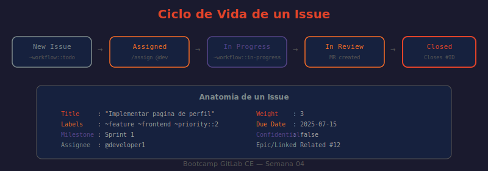

# 📖 01 — Issues y Trackers en GitLab CE

## 🎯 Objetivos de aprendizaje

- ✅ Entender qué es un issue en GitLab y cuándo usarlo
- ✅ Crear issues con descripciones efectivas usando templates
- ✅ Organizar issues con labels, milestones y weights
- ✅ Usar Quick Actions para gestionar issues sin salir del teclado
- ✅ Gestionar issues via API REST

---

## 🤔 ¿Qué es un Issue?

Un issue en GitLab es la **unidad de trabajo rastreable**: cada tarea, bug, feature, deuda técnica o discusión que el equipo necesita gestionar. Los issues son el punto de partida del desarrollo — antes de escribir una línea de código, se crea el issue que describe el trabajo a realizar.

**Analogía:** Un issue es como una orden de trabajo en un taller mecánico. Describe el problema ("el motor hace ruido"), quién lo va a atender (assignee), cuándo debe estar listo (due date), qué tipo de trabajo es (labels: "motor", "urgente"), a qué proyecto pertenece (el coche del cliente) y cuánto esfuerzo requiere (weight). Sin la orden de trabajo, el mecánico no sabe qué hacer ni en qué orden.

---

## 🏗️ Anatomía de un Issue

Cada issue tiene campos que lo contextualizan completamente:

```
╔══════════════════════════════════════════════════════════╗
║  #42  Error 500 al consultar /health                     ║
║  ─────────────────────────────────────────────────────── ║
║  Descripción                                             ║
║  El endpoint /health devuelve 500 cuando la DB no        ║
║  responde, en lugar de 503.                              ║
║                                                          ║
║  Criterios de aceptación:                                ║
║  ☐ /health devuelve 503 cuando DB está caída             ║
║  ☐ /health devuelve 200 cuando todo funciona             ║
║  ─────────────────────────────────────────────────────── ║
║  Assignee:  developer1       Due date:   2025-01-15      ║
║  Labels:    ~bug ~backend    Milestone:  Sprint 1        ║
║             ~priority::1    Weight:     3                ║
║  Status:    Open             Confidential: No            ║
╚══════════════════════════════════════════════════════════╝
```

| Campo | Descripción | Valores típicos |
|-------|-------------|-----------------|
| **Título** | Descripción concisa y accionable | "Implementar X", "Fix: Y falla cuando Z" |
| **Descripción** | Contexto, criterios de aceptación, pasos para reproducir | Markdown completo |
| **Assignee** | Persona responsable de resolverlo | Uno o varios miembros |
| **Labels** | Etiquetas para categorizar y filtrar | ~bug, ~feature, ~priority::1 |
| **Milestone** | Agrupación temporal (sprint, release) | Sprint 1, v1.0.0 |
| **Due date** | Fecha límite | YYYY-MM-DD |
| **Weight** | Estimación de complejidad (1-9) | 1=trivial, 5=medio, 9=muy complejo |
| **Confidential** | Visible solo para Reporters+ | Para bugs de seguridad, info sensible |

---

## ✍️ Template de Issue Recomendado

La descripción marca la diferencia entre un issue útil y uno inútil. Usa este template mental:

### Para Bugs

```markdown
## Descripción del Bug
El endpoint `GET /health` devuelve HTTP 500 cuando la base de datos
no responde, en lugar de devolver 503 Service Unavailable.

## Pasos para Reproducir
1. Detener el contenedor de PostgreSQL: `docker compose stop db`
2. Hacer petición: `curl http://localhost:3000/health`
3. Observar que la respuesta es 500 en lugar de 503

## Comportamiento Esperado
HTTP 503 con body:
```json
{"status": "degraded", "services": {"database": "unhealthy"}}
```

## Comportamiento Actual
HTTP 500 con body: `Internal Server Error`

## Entorno
- Versión: v1.2.0
- Entorno: Staging
- Sistema: Docker Compose en Ubuntu 22.04

## Información Adicional
El problema ocurre porque el catch de la función `checkDatabase()`
no maneja correctamente el error de conexión rechazada.
```

### Para Features

```markdown
## Descripción de la Funcionalidad
Agregar autenticación JWT a todos los endpoints del API Gateway,
de modo que solo requests con token válido sean procesadas.

## Problema que Resuelve
Actualmente cualquier cliente puede acceder a los endpoints sin
autenticación, representando un riesgo de seguridad crítico.

## Criterios de Aceptación
- [ ] Todos los endpoints (excepto /health y /docs) requieren JWT
- [ ] Token inválido o expirado devuelve 401 Unauthorized
- [ ] Token válido permite pasar la request al servicio destino
- [ ] Documentación de cómo obtener y usar tokens actualizada

## Consideraciones Técnicas
- Usar la librería `jsonwebtoken` (ya está como dependencia)
- El secreto JWT debe venir de variable de entorno `JWT_SECRET`
- Implementar como Express middleware para no duplicar lógica
```

---

## 🏷️ Sistema de Labels

Los labels son el sistema de clasificación de issues y MRs. Sin labels bien definidos, el tracker es un caos.

### Tipos recomendados de labels (con colores)

**Por tipo de trabajo:**
```
~bug               #FF0000 (rojo)      ← Error o defecto
~feature           #0075CB (azul)      ← Nueva funcionalidad
~maintenance       #F0AD4E (amarillo)  ← Deuda técnica, actualizaciones
~documentation     #5CB85C (verde)     ← Solo documentación
~security          #D4004B (rojo oscuro) ← Vulnerabilidad de seguridad
```

**Por prioridad (scoped labels — mutuamente excluyentes):**
```
~priority::1       #D9534F (rojo)      ← Crítico, bloquea producción
~priority::2       #F0AD4E (naranja)   ← Alto, debe hacerse este sprint
~priority::3       #5BC0DE (azul)      ← Medio, en el backlog
~priority::4       #5CB85C (verde)     ← Bajo, cuando haya tiempo
```

**Por área (scoped labels):**
```
~area::frontend    #5CB85C
~area::backend     #8E44AD
~area::devops      #2980B9
~area::design      #E74C3C
~area::qa          #F39C12
```

**Por estado de workflow:**
```
~workflow::todo           #CCCCCC (gris)    ← Pendiente, sin empezar
~workflow::in-progress    #428BCA (azul)    ← En desarrollo
~workflow::review         #F0AD4E (amarillo) ← MR creado, en revisión
~workflow::done           #5CB85C (verde)   ← Completado y mergeado
```

### Crear labels via API

```bash
# ¿QUÉ HACE?: Crea un label en el proyecto especificado
# ¿POR QUÉ?: Más rápido que crear todos los labels en la UI uno por uno
# ¿PARA QUÉ?: Setup inicial de un proyecto nuevo con el conjunto estándar de labels
PROJECT_ID=42
curl --request POST \
  --header "PRIVATE-TOKEN: $GITLAB_TOKEN" \
  --header "Content-Type: application/json" \
  --data '{"name": "bug", "color": "#FF0000", "description": "Error o defecto en el software"}' \
  "http://localhost/api/v4/projects/$PROJECT_ID/labels"
```

---

## 🎯 Milestones

Un milestone agrupa issues y MRs bajo un objetivo común con fecha de inicio y fin. Es el equivalente a un sprint o una versión en GitLab CE.

### Crear un Milestone

```
Proyecto → Issues → Milestones → New milestone

Title:       Sprint 1
Start date:  2025-01-06
Due date:    2025-01-17
Description: Primera iteración del API Gateway — autenticación básica
```

### Dos tipos de milestones

| Tipo | Alcance | Cuándo usar |
|------|---------|-------------|
| **Project milestone** | Solo un proyecto | Issues específicos de un proyecto |
| **Group milestone** | Todos los proyectos del grupo | Planificación multi-proyecto (sprints de equipo) |

```bash
# ¿QUÉ HACE?: Crea un group milestone accesible por todos los proyectos del grupo
# ¿POR QUÉ?: Un sprint suele involucrar trabajo en múltiples proyectos
# ¿PARA QUÉ?: Tener una vista unificada del progreso del sprint en todo el grupo
curl --request POST \
  --header "PRIVATE-TOKEN: $GITLAB_TOKEN" \
  --header "Content-Type: application/json" \
  --data '{
    "title": "Sprint 1",
    "description": "Primera iteración del bootcamp",
    "start_date": "2025-01-06",
    "due_date": "2025-01-17"
  }' \
  "http://localhost/api/v4/groups/42/milestones"
```

---

## ⚡ Quick Actions

Las Quick Actions son comandos que se ejecutan al escribirlos en la descripción o en un comentario de un issue o MR. Permiten gestionar campos sin hacer click.

```
Comando                    Efecto
─────────────────────────  ──────────────────────────────────────
/assign @username          Asigna el issue al usuario
/assign @me                Asigna a ti mismo
/unassign @username        Desasigna al usuario
/label ~bug ~backend       Agrega labels
/unlabel ~backend          Quita un label
/relabel ~feature          Reemplaza todos los labels con este
/milestone %"Sprint 1"     Asigna milestone
/remove_milestone          Desvincula del milestone
/due 2025-01-15            Fecha límite (YYYY-MM-DD)
/remove_due_date           Elimina la fecha límite
/weight 5                  Peso/estimación de complejidad
/clear_weight              Elimina el weight
/close                     Cierra el issue
/reopen                    Reabre el issue
/title Nuevo título        Cambia el título
/confidential              Marca el issue como confidencial
/estimate 2h               Estimación de tiempo (requiere TimeTracking)
/spend 30m                 Registrar tiempo invertido
/relate #43                Marcar como relacionado con issue #43
/blocks #44                Este issue bloquea al #44
/blocked_by #45            Este issue está bloqueado por el #45
```

### Uso en comentarios

```
# Ejemplo: el developer escribe un comentario al terminar el trabajo
Implementé los cambios solicitados. Listo para review.

/label ~workflow::review
/assign_reviewer @maintainer1
```

---

## 🔗 Issues Relacionados

GitLab CE permite vincular issues entre sí con tipos de relación:

```
Issue A  →  Related to  →  Issue B     (relacionados, sin bloqueo)
Issue A  →  Blocks      →  Issue B     (A no puede cerrarse hasta que B se resuelva)
Issue A  →  Blocked by  →  Issue B     (A está bloqueado esperando a B)
```

Para vincular: En la sidebar del issue → **Linked issues → Add a related issue**

---

## 🖼️ Diagrama: Ciclo de Vida de un Issue



> **Diagrama:** Muestra el ciclo completo de un issue: desde su creación (Open) hasta su cierre (Closed), pasando por los estados de in-progress y review representados por los labels de workflow. También ilustra los triggers de cierre automático por Merge Request.

---

## 📊 Gestionar Issues via API

```bash
# ¿QUÉ HACE?: Lista todos los issues abiertos del proyecto
# ¿POR QUÉ?: La API permite filtrar por label, assignee, milestone, etc.
# ¿PARA QUÉ?: Generar reportes, dashboards, o integraciones con herramientas externas
curl --silent --header "PRIVATE-TOKEN: $GITLAB_TOKEN" \
  "http://localhost/api/v4/projects/42/issues?state=opened&labels=bug&per_page=20" \
  | python3 -c "
import sys, json
issues = json.load(sys.stdin)
for i in issues:
    print(f'  #{i[\"iid\"]} [{i[\"state\"]}] {i[\"title\"]}')
    print(f'     Labels: {[l[\"name\"] for l in i[\"labels\"]]}')
"

# ¿QUÉ HACE?: Crea un issue via API
# ¿POR QUÉ?: Útil para importar issues desde otras herramientas o scripts de setup
curl --request POST \
  --header "PRIVATE-TOKEN: $GITLAB_TOKEN" \
  --header "Content-Type: application/json" \
  --data '{
    "title": "Fix: endpoint /health devuelve 500 en lugar de 503",
    "description": "Ver reproducción en el canal #incidents",
    "labels": "bug,area::backend,priority::1",
    "assignee_ids": [7],
    "milestone_id": 3
  }' \
  "http://localhost/api/v4/projects/42/issues"
```

---

## 🤔 Preguntas de reflexión

1. Un issue tiene `weight: 8` y el sprint tiene capacidad de `20 puntos`. ¿Incluirías este issue en el sprint? ¿Qué preguntarías primero?

2. ¿Cuándo deberías marcar un issue como `Confidential`? ¿Qué impacto tiene en la visibilidad para diferentes roles?

3. La quick action `/close` en un comentario cierra el issue inmediatamente. ¿En qué situaciones podría ser peligroso darle este permiso a todos los Developers?

4. Un Developer usa `/blocks #43` en un issue. ¿Qué implicaciones tiene esto para el Maintainer que planifica el sprint? ¿Cambia el orden de prioridad?

5. ¿Qué diferencia hay entre cerrar un issue manualmente y cerrarlo con `Closes #42` en el MR? ¿En cuál de los dos casos queda mejor documentada la trazabilidad?

---

## 📚 Recursos adicionales

- [GitLab Issues Documentation](https://docs.gitlab.com/ee/user/project/issues/)
- [Labels — Scoped labels](https://docs.gitlab.com/ee/user/project/labels.html)
- [Milestones](https://docs.gitlab.com/ee/user/project/milestones/)
- [Quick Actions Reference](https://docs.gitlab.com/ee/user/project/quick_actions.html)
- [Issues API](https://docs.gitlab.com/ee/api/issues.html)

---

➡️ **Siguiente lección:** [02 — Merge Requests](./02-merge-requests.md)
