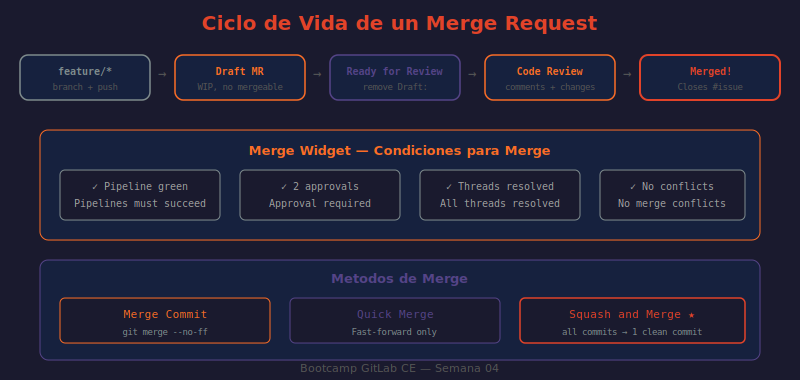

# 📖 02 — Merge Requests en GitLab CE

## 🎯 Objetivos de aprendizaje

- ✅ Entender el ciclo de vida completo de un Merge Request
- ✅ Crear MRs con descripciones efectivas y correctamente configurados
- ✅ Usar Draft MRs para trabajo en progreso y feedback temprano
- ✅ Conocer las cuatro estrategias de merge y cuándo usar cada una
- ✅ Configurar opciones del proyecto para enforcer buenas prácticas

---

## 🤔 ¿Qué es un Merge Request?

Un Merge Request (MR) es la **unidad de integración de código**: la propuesta formal de fusionar los cambios de una rama hacia otra, pasando por revisión, CI/CD y aprobación. Es el equivalente al Pull Request de GitHub/Bitbucket.

**Analogía:** Un MR es como presentar un informe para revisión antes de publicarlo. El autor escribe el informe (desarrolla código), lo entrega al editor (crea el MR), el editor revisa y anota correcciones (code review), el autor corrige (commits de fix), y finalmente el editor aprueba y publica (merge). Sin este proceso, errores llegan a producción sin revisión.

---

## 🔄 Ciclo de Vida de un MR

```
[Crear]                [Revisar]                [Integrar]

Feature branch  →   Draft MR         →   Ready for Review
push                (feedback temprano)        ↓
                         ↓             Changes Requested
                    CI Pipeline                ↓
                    (tests, lint)       Author fixes  →  Updated
                         ↓                              ↓
                    Code Review    ←──────────── Re-review
                         ↓
                      Approved
                         ↓
                   [Merge Options]
                   ├── Merge Commit
                   ├── Squash and Merge
                   ├── Fast-forward
                   └── Rebase and Merge
                         ↓
                   Issue auto-closed (si "Closes #N")
                   Source branch deleted (si configurado)
```

---

## ➕ Crear un Merge Request

### Desde la UI

```
Proyecto → Merge Requests → New merge request

1. Source branch:   feature/42-jwt-auth     ← Tu rama de trabajo
2. Target branch:   main                    ← Dónde quieres integrar
3. Click "Compare branches and continue"
4. Completar el formulario:
   Title:           feat: Implementar autenticación JWT (#42)
   Description:     [Ver template abajo]
   Assignee:        developer1 (autor del MR)
   Reviewers:       maintainer1 (quien revisa)
   Labels:          ~feature ~area::backend ~workflow::review
   Milestone:       Sprint 1
   ✓ Delete source branch when merge request is accepted
   ✓ Squash commits when merge request is accepted
5. Click "Create merge request"
```

### Desde la terminal (el flujo más común)

```bash
# ¿QUÉ HACE?: Hace push de la rama y GitLab muestra el link para crear el MR
# ¿POR QUÉ?: GitLab detecta el push de una rama nueva y ofrece crear el MR en el output
# ¿PARA QUÉ?: Flujo de trabajo fluido sin alternar entre terminal y UI
git push origin feature/42-jwt-auth
```

Output del push:
```
remote:
remote: To create a merge request for feature/42-jwt-auth, visit:
remote:   http://localhost/technova/vega/api-gateway/-/merge_requests/new?...
remote:
```

Click en el link del output → pre-rellena el formulario con la rama correcta.

### Via API

```bash
# ¿QUÉ HACE?: Crea un MR programáticamente
# ¿POR QUÉ?: Útil en pipelines o scripts de automatización
# ¿PARA QUÉ?: Crear MRs de ambiente (main→staging) automáticamente cuando el CI pasa
curl --request POST \
  --header "PRIVATE-TOKEN: $GITLAB_TOKEN" \
  --header "Content-Type: application/json" \
  --data '{
    "source_branch": "feature/42-jwt-auth",
    "target_branch": "main",
    "title": "Draft: feat: Implementar autenticación JWT",
    "description": "Closes #42\n\nImplementa JWT auth en todos los endpoints del API.",
    "assignee_id": 7,
    "reviewer_ids": [5],
    "squash": true,
    "remove_source_branch": true
  }' \
  "http://localhost/api/v4/projects/42/merge_requests"
```

---

## 📝 Template de MR Efectivo

La descripción del MR es lo primero que lee el reviewer. Una buena descripción hace el code review más rápido y efectivo:

```markdown
## ¿Qué hace este MR?
Implementa autenticación JWT en el API Gateway usando middleware Express.
Todos los endpoints (excepto `/health` y `/docs`) ahora requieren un
Bearer token válido en el header `Authorization`.

## Issue relacionado
Closes #42

## Tipo de cambio
- [ ] Bug fix
- [x] Nueva funcionalidad
- [ ] Mejora de rendimiento
- [ ] Refactorización
- [ ] Documentación

## Cambios realizados
- `src/middleware/auth.js`: Nuevo middleware de validación JWT
- `src/app.js`: Aplicar middleware a todas las rutas excepto /health y /docs
- `tests/auth.test.js`: 12 tests unitarios para el middleware
- `README.md`: Sección de autenticación con ejemplos de uso

## Cómo probar
1. Obtener token: `curl -X POST http://localhost:3000/auth/token -d '{"user":"test"}'`
2. Llamada sin token (debe dar 401): `curl http://localhost:3000/users`
3. Llamada con token (debe dar 200): `curl -H "Authorization: Bearer <token>" http://localhost:3000/users`
4. Health check sin token (debe dar 200): `curl http://localhost:3000/health`

## Screenshots
N/A (cambio de backend, sin UI)

## Checklist
- [x] Tests pasan (`npm test` → 24/24 passed)
- [x] Sin `console.log` de debug
- [x] Documentación actualizada
- [x] No hay credenciales hardcodeadas
- [x] Pipeline en verde
```

---

## ⏳ Draft Merge Requests

Un MR marcado como **Draft** no puede ser mergeado. Úsalo para compartir trabajo en progreso, obtener feedback temprano, o ejecutar el CI antes de que el código esté listo.

### Cómo crear un Draft MR

```
Opción 1 — En el título: "Draft: feat: Implementar autenticación JWT"
Opción 2 — Checkbox en el formulario de creación: ✓ Mark as draft
Opción 3 — Quick action en descripción: /draft
```

### Cuándo usar Draft MR

```
✅ Empezar pronto el CI pipeline (detectar errores antes de terminar)
✅ Pedir opinión temprana sobre el enfoque ("¿voy bien?")
✅ Bloquear el merge mientras el autor termina
✅ Mantener visibilidad del trabajo en curso sin riesgo de merge accidental
✅ Coordinar con reviewers sobre cuándo estará listo
```

### Quitar estado Draft

```
Opción 1 — Editar título: quitar "Draft:" del prefijo
Opción 2 — Click en "Mark as ready" en la página del MR
Opción 3 — Quick action en comentario: /ready
```

---

## 🔀 Estrategias de Merge

Al hacer merge de un MR, GitLab ofrece cuatro métodos. Cada uno genera un historial de commits diferente en la rama target:

### Merge Commit (default)

```
Antes:        main:    A─B─C
              feature: A─B─D─E─F

Después:      main:    A─B─C─────────M
                                 D─E─F─┘
                       (M = merge commit)
```

- Preserva el historial completo de la feature branch
- Genera un commit de merge adicional
- Facilita el rollback de la feature completa (revert del merge commit)

### Squash and Merge (recomendado para GitHub/GitLab Flow)

```
Antes:        main:    A─B─C
              feature: A─B─D─E─F (3 commits: D, E, F)

Después:      main:    A─B─C─S
                       (S = squash commit con los cambios de D+E+F)
```

- Combina todos los commits de la feature en uno solo
- Historial de `main` queda limpio y lineal
- Se pierde la granularidad de commits individuales (visible en el MR)

### Fast-forward Merge

```
Antes:        main:    A─B
              feature: A─B─C─D

Después:      main:    A─B─C─D  (main simplemente avanza)
```

- Solo funciona si `main` no avanzó desde que se creó la feature branch
- No crea merge commit
- Historial perfectamente lineal

### Rebase and Merge

```
Antes:        main:    A─B─C
              feature: A─B─D─E  (creado antes de C)

Después:      main:    A─B─C─D'─E'  (commits de feature rebased)
```

- Reaplica los commits de la feature sobre `main` actualizado
- Historial lineal sin merge commit
- Los commits conservan su identidad (diferente de squash)

### ¿Cuál usar?

| Estrategia | Historial | Rollback | Recomendado cuando |
|-----------|-----------|----------|--------------------|
| Merge Commit | Ramificado | Fácil | Necesitas preservar historial de feature |
| Squash and Merge | Lineal | Por commit | GitHub/GitLab Flow, feature pequeñas-medianas |
| Fast-forward | Lineal | Por commit | Solo si nadie más toca main |
| Rebase and Merge | Lineal | Por commit | Quieres historial limpio con granularidad |

---

## ⚙️ Configuración de MR en el Proyecto

```
Proyecto → Settings → Merge requests

Merge method:
  ● Merge commit (default — preserva historial)
  ○ Merge commit with semi-linear history
  ○ Fast-forward merge

Squash commits:
  ● Allow          ← El autor decide al mergear
  ○ Encourage      ← Recomendado pero no forzado
  ○ Require        ← Siempre squash
  ○ Do not allow   ← Nunca squash

Merge checks:
  ✓ Pipelines must succeed            ← CI verde obligatorio
  ✓ All threads must be resolved      ← No dejar comentarios pendientes
  □ Status checks must succeed

After merge:
  ✓ Enable "Delete source branch" option by default
```

---

## 🔗 Cierre Automático de Issues

GitLab cierra automáticamente el issue referenciado cuando el MR se mergea a la rama default (`main`). Palabras clave en la descripción del MR:

```
Closes #42         ← Cierra el issue #42
Fixes #42          ← Equivalente
Resolves #42       ← Equivalente
Implements #42     ← Equivalente (para features)

Close #42, #43     ← Cierra múltiples issues
Closes group/project#42  ← Issue en otro proyecto del grupo
```

También funciona en mensajes de commit:
```bash
git commit -m "feat: implementar JWT auth — Closes #42"
```

---

## 🖼️ Diagrama: Flujo de Merge Request



> **Diagrama:** Muestra el ciclo completo de un MR desde la creación de la feature branch hasta el merge, incluyendo los estados Draft/Ready, el pipeline de CI, el code review con ciclos de feedback, y las opciones de merge disponibles.

---

## 🤔 Preguntas de reflexión

1. Un MR tiene 50 commits de "fix typo", "oops", "test again". ¿Usarías Squash and Merge o Merge Commit? ¿Por qué?

2. El CI de tu proyecto tarda 20 minutos. ¿En qué momento del desarrollo crearías el Draft MR para maximizar el tiempo de feedback?

3. Un reviewer deja 15 comentarios en un MR. ¿Cómo priorizas cuáles resolver primero? ¿Hay alguno que podrías rechazar razonablemente?

4. ¿Por qué es importante "Delete source branch after merge"? ¿Qué problema evita acumular ramas ya mergeadas?

5. La opción "Pipelines must succeed" bloquea el merge si el CI falla. ¿En qué situación de emergencia querrías poder desactivar esto temporalmente? ¿Quién debería poder hacerlo?

---

## 📚 Recursos adicionales

- [GitLab Merge Requests](https://docs.gitlab.com/ee/user/project/merge_requests/)
- [Draft Merge Requests](https://docs.gitlab.com/ee/user/project/merge_requests/drafts.html)
- [Merge methods](https://docs.gitlab.com/ee/user/project/merge_requests/methods/)
- [Merge Requests API](https://docs.gitlab.com/ee/api/merge_requests.html)
- [Auto-closing issues](https://docs.gitlab.com/ee/user/project/issues/managing_issues.html#closing-issues-automatically)

---

⬅️ **Lección anterior:** [01 — Issues y Trackers](./01-issues-y-trackers.md)
➡️ **Siguiente lección:** [03 — Code Review Efectivo](./03-code-review.md)
