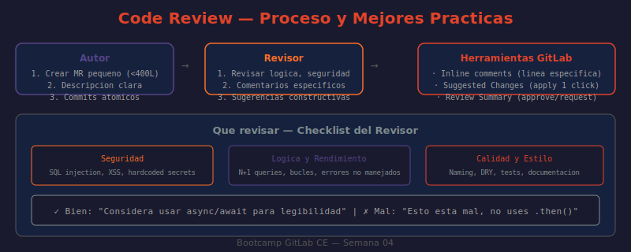

# 📖 03 — Code Review Efectivo en GitLab CE

## 🎯 Objetivos de aprendizaje

- ✅ Entender el propósito del code review más allá de encontrar bugs
- ✅ Usar las herramientas de revisión de GitLab (diffs, comentarios en línea, sugerencias)
- ✅ Dar feedback constructivo que mejora el código y el equipo
- ✅ Ser un buen autor: facilitar el trabajo del reviewer
- ✅ Gestionar el flujo de aprobaciones y resolución de threads

---

## 🤔 ¿Por qué Code Review?

El code review es uno de los procesos que más valor añade al software, pero uno de los menos entendidos. No es simplemente un filtro de calidad — es una práctica de equipo con múltiples beneficios:

**Analogía:** El code review es como el ensayo general de una obra de teatro. El actor (autor) sabe sus líneas perfectamente, pero hay cosas que solo se ven desde el exterior: que el micrófono no funciona, que dos actores se bloquean en escena, que el ritmo es demasiado lento. El director (reviewer) no está ahí para humillar al actor — está ahí para que la obra sea mejor.

| Beneficio | Descripción |
|-----------|-------------|
| **Detección de bugs** | Un segundo par de ojos encuentra errores que el autor no ve |
| **Compartir conocimiento** | Todo el equipo entiende el código que escribe cada miembro |
| **Consistencia** | Se mantienen estándares de código en todo el proyecto |
| **Seguridad** | Se detectan vulnerabilidades antes de llegar a producción |
| **Mentoring** | Developers junior aprenden de seniors a través de feedback |
| **Responsabilidad** | El código es del equipo, no de una persona |

---

## 🛠️ Herramientas de Revisión en GitLab

### Vista de Cambios (Diff)

En el MR, la pestaña **Changes** muestra todos los archivos modificados:

```
Changes (14 files)   ←── Número de archivos modificados

▼ src/middleware/auth.js              +52 −0   ← Solo adiciones (archivo nuevo)
▼ src/app.js                          +3 −1    ← 3 líneas agregadas, 1 eliminada
▼ tests/auth.test.js                 +45 −0
▼ README.md                           +23 −5
▶ package.json                         +1 −0   ← Click para expandir
```

**Opciones de visualización:**
- **Side-by-side:** Original a la izquierda, cambios a la derecha (mejor para entender contexto)
- **Inline:** Cambios mezclados con el código original (mejor en pantallas pequeñas)
- **Whitespace:** Ignorar cambios de espacios en blanco (útil en reformateos)

### Comentarios en Línea

Para comentar en una línea específica del código:

```
1. Abrir la pestaña "Changes" del MR
2. Hovear sobre el número de línea que quieres comentar
3. Click en el ícono de burbuja de comentario (●)
4. Escribir el comentario
5. Elegir:
   ● "Add comment now"      → Comentario inmediato, visible al instante
   ○ "Start a review"       → Agrupa comentarios, los envía todos juntos al finalizar
```

**Diferencia entre "Add comment now" y "Start a review":**
- `Add comment now`: El autor recibe notificación por cada comentario
- `Start a review`: Redactas todos los comentarios y los publicas de una vez al hacer "Submit review"

Usa `Start a review` para reviews largas — así el autor recibe todo el feedback de una vez en lugar de notificaciones fragmentadas.

### Suggested Changes (Cambios Sugeridos)

La herramienta más poderosa del code review en GitLab. Permite proponer el código exacto que debería estar:

**El reviewer escribe:**
```markdown
Hoveas sobre la línea:
  const user = await db.query('SELECT * FROM users WHERE id = ' + id);

Click en el ícono de burbuja → "Insert suggestion"

````suggestion
const user = await db.query('SELECT * FROM users WHERE id = $1', [id]);
````

Concatenar el id directamente es vulnerable a SQL injection.
Usa query parameters ($1) en su lugar.
```

**El autor ve:**

```
  - const user = await db.query('SELECT * FROM users WHERE id = ' + id);
  + const user = await db.query('SELECT * FROM users WHERE id = $1', [id]);

[Apply suggestion]  ← Un click aplica el cambio como commit
```

### Batch Suggestions

Si el reviewer tiene múltiples sugerencias pequeñas, el autor puede aplicarlas todas de una vez:

```
Marcar cada sugerencia: ☑ Add to batch
→ Click "Apply all suggestions"
→ Se crea un único commit con todos los cambios
```

---

## 🔍 Qué Buscar en un Code Review

### El checklist de revisión

```
CORRECCIÓN (¿El código hace lo que debe?)
  □ ¿La lógica implementada es correcta?
  □ ¿Los edge cases están cubiertos?
  □ ¿Los errores se manejan apropiadamente?
  □ ¿Las condiciones de borde están probadas?

SEGURIDAD (¿El código es seguro?)
  □ ¿Hay SQL injection, XSS, command injection?
  □ ¿Se exponen datos sensibles en logs o responses?
  □ ¿La autenticación/autorización es correcta?
  □ ¿Los inputs del usuario están validados y sanitizados?

RENDIMIENTO (¿El código es eficiente?)
  □ ¿Hay N+1 queries (consultas dentro de loops)?
  □ ¿Hay cálculos repetidos que podrían cachearse?
  □ ¿El código escala con el volumen de datos esperado?

LEGIBILIDAD (¿El código se entiende?)
  □ ¿Los nombres de variables y funciones son claros?
  □ ¿Las funciones hacen una sola cosa?
  □ ¿El código necesita comentarios para entenderse?
  □ ¿La estructura es consistente con el resto del proyecto?

PRUEBAS (¿El código está bien probado?)
  □ ¿Hay tests para la lógica nueva?
  □ ¿Los tests prueban comportamiento, no implementación?
  □ ¿Los casos de error están probados?
  □ ¿Los edge cases tienen cobertura?
```

---

## 💬 Cómo Dar Feedback Efectivo

La diferencia entre un equipo de alto rendimiento y uno disfuncional a menudo está en cómo se da el feedback de code review.

### El principio fundamental

> Critica el código, no al autor. "Este enfoque tiene un problema" no "hiciste esto mal".

### Niveles de feedback (Conventional Comments)

Clasifica tus comentarios para que el autor sepa cómo responder:

```
[blocker]   → El MR NO puede mergearse hasta resolver esto
[concern]   → Algo preocupante, pero no necesariamente bloqueante
[nit]       → Detalle menor de estilo/preferencia (no bloquea)
[question]  → Pregunta genuina, no solicitud de cambio
[praise]    → Reconocimiento de algo bien hecho
[suggestion]→ Idea opcional, el autor decide
```

### Ejemplos comparativos

**Revisión de vulnerabilidad de seguridad:**

❌ Mal:
> "Esto es vulnerable. Arréglalo."

✅ Bien:
> **[blocker]** Esta query concatena el `id` directamente en el SQL, lo que es vulnerable a SQL injection. Si un atacante envía `id=1 OR 1=1`, obtendría todos los usuarios. Usa parámetros preparados: `db.query('SELECT * FROM users WHERE id = $1', [id])`.

**Revisión de estilo:**

❌ Mal:
> "No me gusta esto, usa otra cosa."

✅ Bien:
> **[nit]** Considera usar `const` en lugar de `let` aquí, ya que `user` no se reasigna. La guía de estilo del proyecto prefiere `const` cuando es posible (ver `CONTRIBUTING.md` línea 42).

**Pregunta genuina:**

✅ Bien:
> **[question]** ¿Por qué usamos `setTimeout(0)` aquí? Entiendo que es para diferir la ejecución, pero no estoy seguro del contexto. ¿Hay un comment que explique la razón?

**Feedback positivo:**

✅ Bien:
> **[praise]** Muy buena decisión de separar la lógica de validación en su propio middleware. Hace que los tests sean mucho más simples y el código mucho más reutilizable.

---

## 📝 El Proceso Completo de Review

```
1. Autor crea MR y asigna Reviewer(s)
        ↓
2. Reviewer abre "Changes" y lee el MR completo primero
   (entender el contexto antes de comentar línea por línea)
        ↓
3. Reviewer usa "Start a review" para acumular comentarios
        ↓
4. Reviewer agrega comentarios en línea con Suggested Changes
   donde aplique
        ↓
5. Reviewer hace "Submit review" con uno de:
   ● Approve          → "LGTM, puedes mergear"
   ○ Request changes  → "Hay cosas que deben corregirse antes"
   ○ Comment          → "Tengo observaciones pero no bloqueo"
        ↓
6. Autor recibe notificación y responde a cada thread:
   - Aplica Suggested Changes
   - Hace commits de fix
   - Responde preguntas
   - Marca threads como resueltos
        ↓
7. Reviewer vuelve, verifica fixes, Aprueba
        ↓
8. Maintainer hace merge (o el autor, si tiene permisos)
```

---

## 🖼️ Diagrama: Flujo de Code Review



> **Diagrama:** Visualiza el ciclo completo de revisión: de autor a reviewer y de vuelta, mostrando los estados (Draft, In Review, Changes Requested, Approved) y las herramientas usadas en cada etapa (comentarios, sugerencias, CI, aprobaciones).

---

## ⚡ Buenas Prácticas para el Autor

El mejor reviewer es aquel que tiene poco que revisar — porque el autor hizo bien su trabajo:

```
MRs pequeños (< 400 líneas)        → Más rápidos de revisar, menos errores escapan
Descripción clara (qué, por qué)   → El reviewer no pierde tiempo adivinando contexto
Commits atómicos y descriptivos    → Fácil de entender la secuencia de cambios
Self-review antes de asignar       → Leer tu propio diff elimina errores obvios
Responder TODOS los comentarios    → "Done" o "Fixed in <commit>" es suficiente
No tomar el feedback personal      → Es el código, no el autor, lo que se critica
```

## ⚡ Buenas Prácticas para el Reviewer

```
Revisar en < 24 horas              → El autor está bloqueado esperando tu feedback
Limitar sesión a ~1 hora           → Después de 1h baja la calidad de la revisión
Ser específico y accionable        → "Considera usar X porque Y" > "Esto está mal"
Distinguir blocker vs nit          → No todo merece bloquear el merge
Aprobar cuando sea bueno suficiente → No busques la perfección, busca el "merge safe"
Reconocer lo bueno también         → El feedback solo negativo desmotiva al equipo
```

---

## 🤔 Preguntas de reflexión

1. Un reviewer deja 20 comentarios en un MR de 100 líneas. El autor se siente atacado. ¿Qué podría hacer el reviewer diferente en la próxima revisión para que el mismo feedback sea mejor recibido?

2. Encuentras en el code review que el código no sigue la guía de estilo del proyecto. Sin embargo, el autor es el CTO. ¿Señalas el problema igual? ¿Cómo lo formulas?

3. ¿Cuál es la diferencia entre hacer "Approve" y hacer "Comment" en un review? ¿Cuándo usarías cada uno?

4. Un MR tiene 1,200 líneas de cambios. ¿Qué harías como reviewer antes de empezar a revisar línea por línea? ¿Qué conversación tendrías con el autor?

5. El reviewer solicita 5 cambios. El autor considera que 3 son válidos y 2 son preferencias personales del reviewer, no errores. ¿Cómo negocia esto sin que se convierta en un conflicto?

---

## 📚 Recursos adicionales

- [GitLab Code Review](https://docs.gitlab.com/ee/user/project/merge_requests/reviews/)
- [Suggested Changes](https://docs.gitlab.com/ee/user/project/merge_requests/reviews/suggestions.html)
- [Conventional Comments](https://conventionalcomments.org/) — Estándar de formato de feedback
- [The Anatomy of a Perfect Pull Request](https://medium.com/@hugooodias/the-anatomy-of-a-perfect-pull-request-567382bb6067)
- [How to Do Code Reviews Like a Human](https://mtlynch.io/human-code-reviews-1/)

---

⬅️ **Lección anterior:** [02 — Merge Requests](./02-merge-requests.md)
➡️ **Siguiente lección:** [04 — GitLab Flow](./04-gitlab-flow.md)
