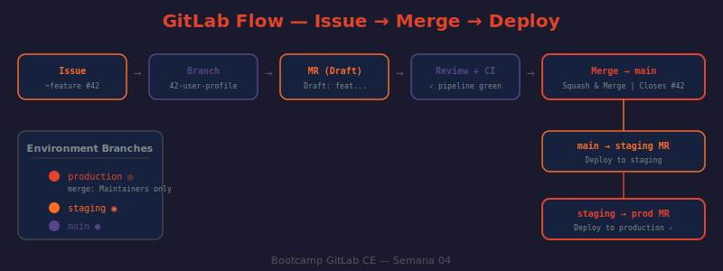

# 📖 04 — GitLab Flow: El Ciclo Completo de Desarrollo

## 🎯 Objetivos de aprendizaje

- ✅ Entender cómo Issue, Branch, MR y Review forman un ciclo integrado
- ✅ Ejecutar el flujo completo: Issue → Rama → Code → Draft MR → Review → Merge
- ✅ Implementar ramas de ambiente (staging, production) para el flujo de deploy
- ✅ Usar la vinculación issue-rama-MR que ofrece GitLab nativamente
- ✅ Nombrar ramas y commits siguiendo convenciones que maximizan la trazabilidad

---

## 🤔 ¿Qué es GitLab Flow?

GitLab Flow integra el sistema de issues, las branches y los merge requests en un proceso cohesivo. No es solo una estrategia de branching — es un flujo de trabajo completo que conecta **planificación → desarrollo → revisión → deploy**.

**Analogía:** GitLab Flow es como la cadena de producción de un periódico. Una historia (issue) se asigna a un periodista (developer). El periodista escribe un borrador (feature branch). El editor lee el borrador y da feedback (code review). El periodista corrige. El editor aprueba y el artículo pasa a maquetación (staging). Finalmente se publica (production). Cada etapa tiene una responsabilidad clara y ninguna etapa puede saltarse.

---

## 🔄 El Ciclo Completo

```
┌─────────────────────────────────────────────────────────────────┐
│                        GITLAB FLOW                              │
│                                                                 │
│   1. PLANIFICACIÓN          2. DESARROLLO          3. REVISIÓN  │
│                                                                 │
│   Issue creado         →    Feature branch    →    Draft MR     │
│   (labels, milestone)       (desde issue)          (CI pipeline) │
│   Assignee asignado         Commits atómicos       Code Review  │
│                             Push frecuente         Sugerencias  │
│                                                   Fixes         │
│                                                                 │
│   4. INTEGRACIÓN           5. AMBIENTES         6. PRODUCCIÓN   │
│                                                                 │
│   Approve + Merge     →    main→staging    →   staging→prod     │
│   Issue auto-closed        (MR + deploy)        (MR + deploy)   │
│   Branch deleted           QA en staging        Release tag     │
└─────────────────────────────────────────────────────────────────┘
```

---

## 📋 Paso 1: Crear el Issue

Todo empieza con un issue bien definido. Sin issue, no hay rama. Sin rama, no hay MR.

```
Proyecto → Issues → New issue

Title:       [feature] Implementar endpoint /health con verificación de dependencias
Labels:      ~feature ~area::backend ~priority::2 ~workflow::todo
Milestone:   Sprint 1
Assignee:    developer1
Description:
  ## Descripción
  El endpoint GET /health debe verificar el estado de PostgreSQL y Redis
  y devolver el estado agregado del servicio.

  ## Criterios de aceptación
  - [ ] GET /health devuelve 200 cuando todo funciona
  - [ ] GET /health devuelve 503 cuando alguna dependencia falla
  - [ ] Response incluye latencia de cada dependencia
  - [ ] Endpoint NO requiere autenticación

  ## Respuesta esperada
  {"status": "healthy", "services": {"db": "healthy", "redis": "healthy"}}
```

El issue recibe automáticamente el ID numérico (ej: `#6`).

---

## 🌿 Paso 2: Crear la Rama desde el Issue

GitLab permite crear la rama directamente desde la página del issue — esto vincula automáticamente la rama con el issue.

### Via UI (recomendado)

```
Issue #6 → Sidebar derecha → "Create merge request" dropdown → "Create branch"

Branch name: 6-health-check-endpoint   ← GitLab sugiere <id>-<title-slug>
Source:      main                       ← Siempre desde main
```

### Via terminal

```bash
# ¿QUÉ HACE?: Actualiza main local y crea la rama feature con la convención de nombre
# ¿POR QUÉ?: El ID del issue en el nombre de rama crea la trazabilidad issue → branch → MR
# ¿PARA QUÉ?: Cualquiera que vea la rama sabe a qué issue corresponde sin buscarla
git checkout main
git pull origin main
git checkout -b 6-health-check-endpoint
```

### Convención de nombres de rama

```
<issue-id>-<descripcion-en-kebab-case>

Ejemplos:
  6-health-check-endpoint        ← feature
  42-fix-sql-injection-users     ← bugfix
  15-update-dependencies         ← maintenance
  99-docs-deployment-guide       ← documentation
```

---

## 💻 Paso 3: Desarrollar con Commits Atómicos

Cada commit debe hacer **una sola cosa** y tener un mensaje descriptivo en formato Conventional Commits:

```bash
# ¿QUÉ HACE?: Crea el archivo de ruta del health check
# ¿POR QUÉ?: Commit separado para "estructura" vs "lógica" facilita el rollback granular
# ¿PARA QUÉ?: Si "la verificación de Redis" da problemas, puedes revertir solo ese commit
git add src/routes/health.js
git commit -m "feat(health): add health check route structure"

git add src/services/health-checker.js
git commit -m "feat(health): implement database connectivity check"

git add src/services/health-checker.js
git commit -m "feat(health): implement redis connectivity check"

git add tests/health.test.js
git commit -m "test(health): add unit tests for health check service"

git add README.md
git commit -m "docs: document health check endpoint usage"
```

**Formato Conventional Commits:**
```
<tipo>(<scope>): <descripción breve>

Tipos:
  feat      → Nueva funcionalidad
  fix       → Corrección de bug
  docs      → Solo documentación
  test      → Agregar o corregir tests
  chore     → Mantenimiento, dependencias
  refactor  → Refactorización sin cambio funcional
  perf      → Mejora de rendimiento
  ci        → Cambios en CI/CD
```

---

## 📬 Paso 4: Crear el Draft MR

Crea el MR **inmediatamente** después del primer push — no esperes a terminar. Esto inicia el CI y permite feedback temprano.

```bash
# ¿QUÉ HACE?: Hace push de la rama al servidor
# ¿POR QUÉ?: GitLab necesita la rama en el servidor para poder crear el MR
# ¿PARA QUÉ?: El output incluye el link para crear el MR directamente
git push origin 6-health-check-endpoint
```

En la UI, usar el link del output o ir a Merge Requests → New:

```
Title:         Draft: feat(health): implementar endpoint /health
Source branch: 6-health-check-endpoint
Target branch: main
Description:   [Completar con el template de MR]
               Closes #6      ← Vincula y cerrará el issue al mergear
Reviewers:     maintainer1
Labels:        ~feature ~area::backend ~workflow::review
✓ Delete source branch when merge request is accepted
✓ Squash commits when merge request is accepted
```

### El Draft MR durante el desarrollo

Mientras sigues trabajando:
- El CI se ejecuta en cada push nuevo
- Los reviewers pueden empezar a revisar partes terminadas
- Puedes recibir feedback temprano de arquitectura sin esperar a terminar

---

## 👀 Paso 5: Code Review

Cuando el MR está listo (CI verde, desarrollo completo):

```
1. Quitar el prefijo "Draft:" del título
   (o click en "Mark as ready")

2. El reviewer recibe notificación
   → Revisa la pestaña "Changes"
   → Deja comentarios en línea
   → Usa "Suggested changes" donde corresponda
   → Hace "Submit review" → Request changes o Approve

3. El autor responde:
   → Aplica sugerencias con un click
   → Hace commits de fix para otros cambios
   → Responde preguntas con comentarios
   → Marca threads como resueltos

4. El reviewer verifica fixes y aprueba
```

---

## ✅ Paso 6: Merge a main

Con CI verde y al menos una aprobación:

```
Click "Merge" en el MR

Opciones al mergear:
  ✓ Squash commits  → Limpia el historial
  ✓ Delete source branch  → Elimina 6-health-check-endpoint

Resultado:
  → main recibe un único commit limpio
  → Issue #6 se cierra automáticamente (por "Closes #6")
  → Rama feature se elimina
  → MR queda en estado "Merged"
```

---

## 🌐 Paso 7: Flujo de Ambientes (GitLab Flow Completo)

Para proyectos con staging y producción, el flujo continúa:

```
main (después del merge del feature)
    ↓
MR: main → staging
    Title: "Release: health check endpoint v1.1.0"
    Quién puede mergear: Maintainer
    Trigger: Deploy automático a staging (via CI/CD - semana 05)
    ↓
QA valida en staging
    ↓
MR: staging → production
    Title: "Deploy: health check endpoint to production"
    Quién puede mergear: Solo senior maintainer u owner
    Trigger: Deploy a producción
```

### Configurar las ramas de ambiente

```bash
# ¿QUÉ HACE?: Crea la rama staging desde main y la sube al servidor
# ¿POR QUÉ?: La rama staging representa el estado del ambiente de staging
# ¿PARA QUÉ?: Los deploys a staging se hacen mergeando main → staging via MR
git checkout main
git checkout -b staging
git push origin staging

git checkout main
git checkout -b production
git push origin production
```

Proteger ambas ramas (push=Nobody, merge=Maintainers):
```bash
for branch in staging production; do
  curl --request POST \
    --header "PRIVATE-TOKEN: $GITLAB_TOKEN" \
    --data "name=$branch&push_access_level=0&merge_access_level=40" \
    "http://localhost/api/v4/projects/42/protected_branches"
done
```

---

## 🖼️ Diagrama: GitLab Flow con Ambientes



> **Diagrama:** Muestra el ciclo completo de GitLab Flow: desde el issue hasta el deploy en producción, pasando por feature branches, code review en main, y las ramas de ambiente staging/production. También ilustra el cierre automático del issue al mergear.

---

## 🏷️ Trazabilidad: Issue → Branch → Commit → MR

GitLab crea automáticamente estas conexiones cuando usas las convenciones:

```
Issue #6  ←→  Branch 6-health-check-endpoint  ←→  MR !15
              commits: "feat(health): ... #6"

En la UI:
  Issue #6    → sidebar: "Related merge requests: !15"
  MR !15      → header: "Closes #6"
  Branch      → lista de branches: muestra el MR asociado
  Commit      → página del commit: referencia al issue y MR
```

---

## 🤔 Preguntas de reflexión

1. Un developer crea la rama `fix-bug` sin número de issue. Semanas después, nadie recuerda para qué servía. ¿Qué convención habría evitado este problema?

2. ¿Por qué se recomienda crear el Draft MR al primer push y no al final del desarrollo? ¿Qué ventajas concretas tiene?

3. El CI tarda 15 minutos. El developer hace push 10 veces al día. ¿Qué estrategia usarías para no desperdiciar recursos y tiempo de CI innecesariamente?

4. La rama `staging` tiene un bug crítico. El bug NO está en `main`. ¿Cómo lo solucionas sin romper el flujo staging → production?

5. Un desarrollador mergeó directamente a `main` sin pasar por staging (accidente, tenía permisos de Maintainer). ¿Qué pasos sigues para mitigar el riesgo y prevenir que vuelva a ocurrir?

---

## 📚 Recursos adicionales

- [GitLab Flow — Documentación oficial](https://docs.gitlab.com/topics/gitlab_flow.html)
- [Conventional Commits Specification](https://www.conventionalcommits.org/en/v1.0.0/)
- [Create a branch from an issue](https://docs.gitlab.com/ee/user/project/repository/branches/#create-a-branch-from-an-issue)
- [Auto-closing issues with MRs](https://docs.gitlab.com/ee/user/project/issues/managing_issues.html#closing-issues-automatically)

---

⬅️ **Lección anterior:** [03 — Code Review Efectivo](./03-code-review.md)
➡️ **Siguiente lección:** [05 — Templates y Automatización](./05-templates-y-automatizacion.md)
