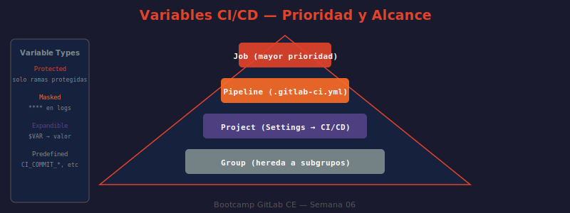

# 📖 01 — Variables CI/CD

## 🎯 Objetivos de aprendizaje

- ✅ Distinguir los cuatro ámbitos de variables: pipeline, proyecto, grupo e instancia
- ✅ Comprender la tabla de precedencia y predecir cuál valor prevalece
- ✅ Proteger secretos con variables enmascaradas y protegidas
- ✅ Usar correctamente las variables predefinidas de GitLab más comunes
- ✅ Evitar los errores más frecuentes: variables en logs, expansión no deseada

---

## 🤔 ¿Por Qué Variables CI/CD?

Un pipeline sin variables es como una receta de cocina donde cada paso lleva la temperatura exacta hardcodeada — `horno: 180°C`, `horno: 180°C`, `horno: 180°C`. Si cambia el horno, hay que editar cada línea.

Las variables CI/CD permiten:

Sin variables:
```yaml
image: node:18-alpine
docker push registry.gl/app:1.0.0
curl https://api.staging.com
TOKEN=abc123xyz
```

Con variables:
```yaml
image: node:${NODE_VERSION}-alpine
docker push ${CI_REGISTRY_IMAGE}:${CI_COMMIT_SHORT_SHA}
curl ${API_URL}
TOKEN=${DEPLOY_TOKEN}  # ← valor en Settings
```

**Resultado:** un solo cambio en Settings → CI/CD → Variables actualiza todos los jobs sin tocar el `.gitlab-ci.yml`.

---

## 📐 Tipos de Variables

### 1. Variables de pipeline (definidas en `.gitlab-ci.yml`)

```yaml
# Globales — disponibles en todos los jobs
variables:
  NODE_VERSION: "18"
  APP_NAME: "bootcamp-api"
  DOCKER_DRIVER: overlay2       # necesario para DinD

build:
  stage: build
  variables:
    # Job-level — sobreescribe el global para este job únicamente
    NODE_VERSION: "20"          # este job usa Node 20
  script:
    - echo "Node: ${NODE_VERSION}"      # imprime: Node: 20
    - echo "App: ${APP_NAME}"           # imprime: App: bootcamp-api
```

**Cuándo usar:** valores no sensibles que son parte de la configuración del proyecto y pueden vivir en el repositorio.

---

### 2. Variables de proyecto (Settings → CI/CD → Variables)

Configuradas en la UI de GitLab. Tres opciones importantes:

| Opción | Efecto | Cuándo usar |
|--------|--------|-------------|
| **Protected** | Solo disponible en ramas/tags protegidos | Tokens de producción |
| **Masked** | Valor reemplazado por `****` en logs | Contraseñas, tokens API |
| **Expanded** | Permite referencias `$OTRA_VAR` dentro del valor | Variables compuestas |

```bash
# Variables típicas en Settings → CI/CD → Variables:
# Nombre                Valor             Masked  Protected
# ─────────────────────────────────────────────────────────
# DEPLOY_TOKEN          glpat-abc123...   ✓       ✓
# DOCKER_HUB_PASS       mysecretpass      ✓       ✗
# STAGING_DB_URL        postgres://...    ✗       ✗
# SLACK_WEBHOOK         https://hooks...  ✓       ✗
```

**Requisito de enmascaramiento:** el valor debe tener al menos 8 caracteres y no contener espacios, saltos de línea, ni los caracteres `"`, `'`, `` ` ``, `\`.

---

### 3. Variables de grupo

Definidas en Group → Settings → CI/CD → Variables. Se heredan automáticamente a todos los proyectos del grupo y subgrupos.

```
mi-organizacion (Group)
├── Variables de grupo: DOCKER_REGISTRY, NPM_TOKEN
│
├── frontend/ (Subgroup)
│   ├── Variables de subgroup: CDN_URL
│   ├── webapp/ (Project)   ← hereda DOCKER_REGISTRY + NPM_TOKEN + CDN_URL
│   └── mobile/ (Project)   ← hereda DOCKER_REGISTRY + NPM_TOKEN + CDN_URL
│
└── backend/ (Subgroup)
    └── api/ (Project)      ← hereda DOCKER_REGISTRY + NPM_TOKEN
```

---

### 4. Variables de instancia (Admin Area)

Disponibles para todos los proyectos de la instancia GitLab. Solo administradores pueden configurarlas. Útiles para credenciales compartidas de infraestructura.

---

## 🔢 Variables Predefinidas de GitLab

GitLab inyecta automáticamente decenas de variables en cada job. Las más usadas:

### Variables del Commit

| Variable | Ejemplo | Descripción |
|----------|---------|-------------|
| `CI_COMMIT_SHA` | `a1b2c3d4e5f6...` | SHA completo del commit |
| `CI_COMMIT_SHORT_SHA` | `a1b2c3d4` | Primeros 8 caracteres del SHA |
| `CI_COMMIT_BRANCH` | `feature/login` | Rama del commit |
| `CI_COMMIT_REF_NAME` | `feature/login` | Rama o tag (más genérico) |
| `CI_COMMIT_REF_SLUG` | `feature-login` | Rama sanitizada (segura para URLs) |
| `CI_COMMIT_TAG` | `v1.2.3` | Tag (solo disponible en pipelines de tag) |
| `CI_COMMIT_MESSAGE` | `feat: add auth` | Mensaje del commit |
| `CI_COMMIT_AUTHOR` | `Ana García` | Autor del commit |

### Variables del Pipeline

| Variable | Ejemplo | Descripción |
|----------|---------|-------------|
| `CI_PIPELINE_ID` | `42` | ID único del pipeline |
| `CI_PIPELINE_SOURCE` | `push` | Qué disparó el pipeline |
| `CI_JOB_ID` | `123` | ID único del job |
| `CI_JOB_NAME` | `unit-tests` | Nombre del job |
| `CI_JOB_TOKEN` | `glcbt-...` | Token temporal del job (acceso a API) |
| `CI_RUNNER_DESCRIPTION` | `docker-runner-01` | Descripción del runner |

### Variables del Proyecto

| Variable | Ejemplo | Descripción |
|----------|---------|-------------|
| `CI_PROJECT_ID` | `7` | ID numérico del proyecto |
| `CI_PROJECT_NAME` | `api-gateway` | Nombre del proyecto |
| `CI_PROJECT_PATH` | `backend/api-gateway` | Ruta completa |
| `CI_PROJECT_URL` | `http://localhost/backend/api-gateway` | URL del proyecto |
| `CI_PROJECT_DIR` | `/builds/backend/api-gateway` | Directorio de trabajo en el runner |

### Variables del Registry

| Variable | Ejemplo | Descripción |
|----------|---------|-------------|
| `CI_REGISTRY` | `registry.gitlab.example.com` | URL del Container Registry |
| `CI_REGISTRY_IMAGE` | `registry.gitlab.example.com/backend/api-gateway` | Imagen del proyecto |
| `CI_REGISTRY_USER` | `gitlab-ci-token` | Usuario para login al registry |
| `CI_REGISTRY_PASSWORD` | `(token)` | Token de acceso al registry |

```yaml
# Ejemplo completo usando variables predefinidas:
docker-build:
  stage: build
  script:
    # ¿QUÉ HACE?: Hace login al registry interno de GitLab
    # ¿POR QUÉ?: CI_REGISTRY_USER/PASSWORD son tokens temporales del job (no secretos hardcodeados)
    # ¿PARA QUÉ?: Permite push/pull sin configurar credenciales manuales
    - docker login -u $CI_REGISTRY_USER -p $CI_REGISTRY_PASSWORD $CI_REGISTRY
    - docker build -t $CI_REGISTRY_IMAGE:$CI_COMMIT_SHORT_SHA .
    - docker push $CI_REGISTRY_IMAGE:$CI_COMMIT_SHORT_SHA
    # Tags semánticos para identificar la imagen
    - docker tag $CI_REGISTRY_IMAGE:$CI_COMMIT_SHORT_SHA $CI_REGISTRY_IMAGE:latest
    - docker push $CI_REGISTRY_IMAGE:latest
```

---

## 📊 Tabla de Precedencia

Cuando una misma variable está definida en múltiples lugares, **gana la de mayor prioridad** (menor número = mayor prioridad):

| Prioridad | Origen |
|-----------|--------|
| **1** (mayor) | Variables del job (definidas en el job mismo) |
| **2** | Variables de trigger (pasadas via `trigger:variables`) |
| **3** | Variables globales del `.gitlab-ci.yml` |
| **4** | Variables del proyecto (Settings → CI/CD) |
| **5** | Variables del grupo padre |
| **6** | Variables del grupo abuelo (herencia) |
| **7** | Variables de instancia (Admin Area) |
| **8** (menor) | Variables predefinidas de GitLab |

**Ejemplo práctico:**

```yaml
# En Settings → CI/CD → Variables:
#   NODE_VERSION = "16"  (prioridad 4)

variables:
  NODE_VERSION: "18"   # prioridad 3 — gana sobre Settings

build:
  variables:
    NODE_VERSION: "20"  # prioridad 1 — gana sobre todo
  script:
    - node --version    # imprimirá v20.x.x
```

---

## 🔒 Variables de Tipo Archivo

GitLab soporta variables de tipo `File`. En lugar de inyectar el valor como string, crea un archivo temporal en el runner con ese contenido y expone la ruta del archivo.

```yaml
# Settings → CI/CD → Variables:
#   Nombre: KUBECONFIG_CONTENT
#   Tipo: File
#   Valor: (contenido del kubeconfig YAML)

deploy-k8s:
  script:
    # $KUBECONFIG_CONTENT contiene la RUTA al archivo, no el contenido
    - kubectl --kubeconfig=$KUBECONFIG_CONTENT get pods

# Útil también para:
#   - Certificados SSL (pem, crt, key)
#   - Archivos .npmrc o .yarnrc con tokens
#   - Claves SSH privadas
```

---

## 🖼️ Diagrama: Alcance y Prioridad de Variables



> **Diagrama:** Muestra los cuatro niveles de alcance (job → pipeline → proyecto → grupo → instancia) como capas concéntricas. La flecha de prioridad apunta hacia adentro: las capas internas sobreescriben las externas. También muestra el flujo de herencia de grupos a proyectos.

---

## ⚠️ Errores Comunes

### Error 1: Secreto en logs

```yaml
# ❌ MAL — el token aparece en texto plano en los logs
deploy:
  script:
    - curl -H "Authorization: Bearer $DEPLOY_TOKEN" https://api.example.com
    - echo "Token: $DEPLOY_TOKEN"  # ← NUNCA hacer echo de un secreto

# ✅ BIEN — verificar que la variable existe sin revelar su valor
deploy:
  script:
    - '[[ -n "$DEPLOY_TOKEN" ]] || (echo "ERROR: DEPLOY_TOKEN no definido" && exit 1)'
    - curl -H "Authorization: Bearer $DEPLOY_TOKEN" https://api.example.com
    # GitLab reemplaza automáticamente $DEPLOY_TOKEN por **** en los logs (si está enmascarada)
```

### Error 2: Variable protegida en rama no protegida

```yaml
# Escenario: DEPLOY_TOKEN está definida como "Protected"
# Esto significa que SOLO está disponible en ramas protegidas (main, develop)

deploy:
  stage: deploy
  script:
    - echo "Deploying with token..."
    - curl -H "Token: $DEPLOY_TOKEN" ...
  # Si este job corre desde feature/login → $DEPLOY_TOKEN estará VACÍA
  # El job puede fallar o usar credenciales vacías silenciosamente
```

### Error 3: Expansión no deseada

```yaml
variables:
  GREP_PATTERN: "error|warn"  # ← el | puede ser interpretado como pipe en algunos shells

# ✅ BIEN: escapar o usar comillas
variables:
  GREP_PATTERN: 'error\|warn'   # escape del pipe
```

---

## 💡 Buenas Prácticas

```
✅ Secretos en Settings → CI/CD → Variables, nunca en .gitlab-ci.yml
✅ Marcar Masked para cualquier valor que no debería verse en logs
✅ Marcar Protected para tokens de producción (solo rama main/tags)
✅ Documentar las variables requeridas en el README del proyecto
✅ Prefixar con el nombre del servicio: POSTGRES_USER, REDIS_URL, AWS_ACCESS_KEY
✅ Usar CI_REGISTRY_USER/PASSWORD para el registry interno (no hardcodear)
❌ Nunca hacer echo de variables mascaradas (aunque estén mascaradas, es mala práctica)
❌ Nunca commitear archivos .env con secretos reales
❌ Nunca hardcodear URLs, versiones o IDs que puedan cambiar
```

---

## 🤔 Preguntas de reflexión

1. Tienes un token de base de datos que debe usarse tanto en `staging` como en `production`. ¿Lo defines como variable de pipeline, de proyecto, o de grupo? ¿Protegida? ¿Enmascarada?

2. Un job imprime `DEPLOY_TOKEN: ****` en los logs. ¿Eso significa que el secreto está protegido? ¿Qué pasaría si el developer hiciera `echo $DEPLOY_TOKEN > /tmp/token.txt` y luego lo guardara como artifact?

3. La variable `CI_COMMIT_REF_SLUG` convierte `feature/JIRA-123-new-login` en `feature-jira-123-new-login`. ¿Para qué casos de uso sería útil esta versión "sanitizada" frente a `CI_COMMIT_REF_NAME`?

4. Si defines `NODE_VERSION: "18"` en el `.gitlab-ci.yml` global y también `NODE_VERSION: "16"` en Settings → CI/CD, ¿cuál gana? ¿Cómo podrías verificarlo sin leer la documentación?

5. Un job de CD necesita el mismo token que usa el equipo de DevOps para deployar manualmente. ¿Qué tipo de variable usarías? ¿Qué riesgos tiene compartir el mismo token entre el pipeline y los deploys manuales?

---

## 📚 Recursos adicionales

- [GitLab CI/CD Variables — Documentación oficial](https://docs.gitlab.com/ee/ci/variables/)
- [Predefined CI/CD Variables (lista completa)](https://docs.gitlab.com/ee/ci/variables/predefined_variables.html)
- [Variable Types: String vs File](https://docs.gitlab.com/ee/ci/variables/#use-file-type-cicd-variables)
- [Masked Variables — requisitos de formato](https://docs.gitlab.com/ee/ci/variables/#mask-a-cicd-variable)
- [Variable Inheritance and Precedence](https://docs.gitlab.com/ee/ci/variables/#cicd-variable-precedence)

---

➡️ **Siguiente lección:** [02 — Rules y Ejecución Condicional](./02-rules-y-condicionales.md)
