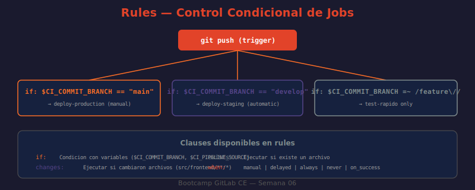

# 📖 02 — Rules y Ejecución Condicional

## 🎯 Objetivos de aprendizaje

- ✅ Entender por qué `rules` reemplaza a `only`/`except` y cuándo aplicar cada uno
- ✅ Construir condiciones con `if`, `changes`, `exists` y combinarlas correctamente
- ✅ Predecir el comportamiento de evaluación "primer match gana"
- ✅ Implementar jobs manuales, diferidos y condicionales según rama, tag y variable
- ✅ Usar `rules:variables` para modificar el comportamiento del job según el contexto

---

## 🤔 ¿Por Qué Ejecución Condicional?

Un pipeline que ejecuta todo en todos los contextos es como un empleado que hace exactamente lo mismo sin importar el día, la semana o el proyecto:

```
Sin reglas:
  Push a feature/login → build ✓ + tests ✓ + deploy-production ✓  ← ¿por qué?
  Push a main          → build ✓ + tests ✓ + deploy-production ✓
  MR abierto           → build ✓ + tests ✓ + deploy-production ✓  ← ¡peligroso!

Con rules:
  Push a feature/login → build ✓ + tests-rapidos ✓
  Push a main          → build ✓ + tests-completos ✓ + deploy-staging ✓
  Tag v1.2.3           → build ✓ + tests-completos ✓ + deploy-produccion (manual)
  MR abierto           → build ✓ + tests ✓ (sin deploy)
```

El resultado es un pipeline **más seguro**, **más rápido** (no ejecuta lo que no corresponde) y **más claro** para el equipo.

---

## 📐 `rules` vs `only`/`except`

`only`/`except` son **keywords legacy** (deprecadas en la práctica, aunque aún soportadas). Se recomienda migrar a `rules`.

| Característica | `only`/`except` | `rules` |
|---------------|-----------------|---------|
| Condiciones `if` con variables | ✗ | ✓ |
| Condiciones `changes` | ✓ (limitado) | ✓ (completo) |
| Condiciones `exists` | ✗ | ✓ |
| Múltiples condiciones combinadas | Difícil | Natural |
| `when` por condición | ✗ | ✓ |
| `allow_failure` por condición | ✗ | ✓ |
| `variables` por condición | ✗ | ✓ |
| Expresiones regulares | ✓ | ✓ |

```yaml
# ❌ Estilo legacy — only/except (evitar en código nuevo)
deploy-staging:
  only:
    - develop
  except:
    - tags

# ✅ Estilo moderno — rules
deploy-staging:
  rules:
    - if: $CI_COMMIT_BRANCH == "develop" && $CI_COMMIT_TAG == null
      when: on_success
    - when: never
```

---

## 🔑 Anatomía de `rules`

```yaml
job-name:
  stage: deploy
  script: ./deploy.sh
  rules:
    - if: $CI_COMMIT_BRANCH == "main"       # ← condición
      when: on_success                       # ← qué hacer si la condición es true
      allow_failure: false                   # ← si falla, bloquea el pipeline
      variables:                             # ← sobreescribir variables
        DEPLOY_ENV: "production"

    - if: $CI_COMMIT_BRANCH == "develop"
      when: on_success
      variables:
        DEPLOY_ENV: "staging"

    - when: never                            # ← regla por defecto: nunca
```

### Valores de `when`

| Valor | Comportamiento |
|-------|----------------|
| `on_success` | Ejecuta si el stage anterior pasó (default) |
| `on_failure` | Ejecuta si el stage anterior falló |
| `always` | Ejecuta siempre, independientemente del estado |
| `manual` | Requiere click manual en la UI para ejecutar |
| `delayed` | Espera `start_in` antes de ejecutar |
| `never` | No ejecuta (saltear el job) |

---

## 🔍 Cláusula `if`

Evalúa una expresión con variables CI/CD. Soporta:

### Operadores de comparación

```yaml
rules:
  - if: $CI_COMMIT_BRANCH == "main"        # igualdad
  - if: $CI_COMMIT_BRANCH != "main"        # desigualdad
  - if: $CI_COMMIT_TAG                     # existe y no vacía
  - if: $CI_COMMIT_TAG == null             # no existe o vacía
  - if: $CI_COMMIT_TAG =~ /^v\d+\.\d+\.\d+$/    # regex match
  - if: $CI_COMMIT_TAG !~ /^v\d+/         # regex no-match
  - if: $CI_PIPELINE_SOURCE == "push"      # igualdad de string
```

### Operadores lógicos

```yaml
rules:
  - if: $CI_COMMIT_BRANCH == "main" && $CI_PIPELINE_SOURCE == "push"
  - if: $CI_COMMIT_BRANCH == "main" || $CI_COMMIT_BRANCH == "develop"
  - if: $CI_COMMIT_BRANCH == "main" && $DEPLOY_TOKEN != null
```

### Variables predefinidas más usadas en `if`

| Variable | Valores comunes | Uso |
|----------|----------------|-----|
| `$CI_COMMIT_BRANCH` | `main`, `develop`, `feature/login` | Condicionar por rama |
| `$CI_COMMIT_TAG` | `v1.2.3`, `null` | Condicionar por tag |
| `$CI_PIPELINE_SOURCE` | `push`, `merge_request_event`, `schedule`, `api`, `trigger` | Condicionar por origen |
| `$CI_MERGE_REQUEST_IID` | `42`, `null` | Condicionar si es MR |
| `$CI_MERGE_REQUEST_TARGET_BRANCH_NAME` | `main`, `develop` | Target branch del MR |

---

## 📂 Cláusula `changes`

Ejecuta el job solo si alguno de los archivos especificados cambió en el commit:

```yaml
# Solo ejecutar si cambiaron archivos de frontend
frontend-lint:
  stage: test
  image: node:18-alpine
  script:
    - npm run lint:frontend
  rules:
    - if: $CI_PIPELINE_SOURCE == "merge_request_event"
      changes:
        - src/frontend/**/*
        - package.json
        - .eslintrc.*

# Solo ejecutar si cambiaron archivos de backend
backend-tests:
  stage: test
  script:
    - pytest tests/
  rules:
    - if: $CI_PIPELINE_SOURCE == "merge_request_event"
      changes:
        - src/backend/**/*
        - requirements.txt
        - pytest.ini
```

> **Importante:** `changes` solo funciona correctamente en pipelines de `merge_request_event`. En pipelines de push normal, compara contra el commit anterior.

---

## 📁 Cláusula `exists`

Ejecuta el job solo si ciertos archivos existen en el repositorio:

```yaml
# Solo ejecutar tests de Docker si existe Dockerfile
docker-build:
  stage: build
  script:
    - docker build .
  rules:
    - exists:
        - Dockerfile
        - docker/Dockerfile.*

# Solo ejecutar si existe configuración de Helm
helm-deploy:
  stage: deploy
  script:
    - helm upgrade --install my-app ./charts/
  rules:
    - exists:
        - charts/Chart.yaml
```

---

## 🎯 Ejemplos Prácticos Completos

### Patrón 1: Pipeline por rama

```yaml
stages:
  - test
  - deploy

test:
  stage: test
  script: npm test
  rules:
    - when: always    # test siempre

deploy-staging:
  stage: deploy
  script: echo "deploy staging"
  environment: staging
  rules:
    # Solo desde rama develop, automático
    - if: $CI_COMMIT_BRANCH == "develop"
      when: on_success
    - when: never

deploy-production:
  stage: deploy
  script: echo "deploy production"
  environment: production
  rules:
    # Solo tags semánticos, requiere click manual
    - if: $CI_COMMIT_TAG =~ /^v\d+\.\d+\.\d+$/
      when: manual
      allow_failure: false
    - when: never
```

### Patrón 2: MR vs push directo

```yaml
# Tests rápidos en MRs (feedback inmediato)
test-pr:
  script: npm run test:unit
  rules:
    - if: $CI_PIPELINE_SOURCE == "merge_request_event"

# Tests completos solo en main (más lentos, más cobertura)
test-full:
  script: npm run test:all
  rules:
    - if: $CI_COMMIT_BRANCH == "main"

# Security scan: siempre en MRs y en main
security-scan:
  script: ./run-sast.sh
  rules:
    - if: $CI_PIPELINE_SOURCE == "merge_request_event"
    - if: $CI_COMMIT_BRANCH == "main"
```

### Patrón 3: Variables por contexto con `rules:variables`

```yaml
deploy:
  stage: deploy
  script:
    - echo "Deploying to ${ENVIRONMENT} at ${API_ENDPOINT}"
    - ./deploy.sh ${ENVIRONMENT}
  rules:
    - if: $CI_COMMIT_BRANCH == "main"
      variables:
        ENVIRONMENT: "production"
        API_ENDPOINT: "https://api.example.com"
    - if: $CI_COMMIT_BRANCH == "develop"
      variables:
        ENVIRONMENT: "staging"
        API_ENDPOINT: "https://staging.api.example.com"
    - when: never
```

### Patrón 4: Job retrasado (canary deploy)

```yaml
# Despliega al 10% de usuarios, luego espera 30 min antes del 100%
canary-deploy:
  stage: deploy
  script:
    - ./deploy.sh --percentage 10
  rules:
    - if: $CI_COMMIT_BRANCH == "main"
      when: on_success

full-deploy:
  stage: deploy
  script:
    - ./deploy.sh --percentage 100
  rules:
    - if: $CI_COMMIT_BRANCH == "main"
      when: delayed
      start_in: 30 minutes
```

---

## ⚡ Regla "Primer Match Gana"

`rules` evalúa las condiciones **en orden, de arriba hacia abajo**. La primera que hace match se aplica y las demás se ignoran.

```yaml
deploy:
  rules:
    - if: $CI_COMMIT_TAG =~ /^v\d+/     # ① ¿Es un tag vX.X.X?
      when: manual                        #   → sí: pide confirmación manual
    - if: $CI_COMMIT_BRANCH == "main"    # ② ¿Es rama main?
      when: on_success                    #   → sí: ejecutar automático
    - if: $CI_COMMIT_BRANCH =~ /^dev/   # ③ ¿Empieza por "dev..."?
      when: on_success                    #   → sí: ejecutar automático
    - when: never                        # ④ Ninguna anterior: saltar
```

**Trampa común:**

```yaml
# ❌ MAL — orden incorrecto, nunca llega a la regla del tag
deploy:
  rules:
    - if: $CI_COMMIT_BRANCH == "main"    # los tags también pasan por aquí
      when: on_success
    - if: $CI_COMMIT_TAG =~ /^v\d+/     # nunca se evalúa para tags de main
      when: manual

# ✅ BIEN — reglas más específicas primero
deploy:
  rules:
    - if: $CI_COMMIT_TAG =~ /^v\d+/     # tags primero (más específico)
      when: manual
    - if: $CI_COMMIT_BRANCH == "main"   # luego ramas
      when: on_success
    - when: never
```

---

## 🖼️ Diagrama: Flujo de Evaluación de Rules



> **Diagrama:** Muestra el árbol de decisión para un pipeline típico. Nodos de decisión: ¿es un tag semántico? → ¿es rama main? → ¿es rama develop? → ¿es MR? → nunca. Cada rama del árbol lleva a `when: manual`, `when: on_success`, o `when: never`.

---

## 🤔 Preguntas de reflexión

1. Tienes este job con dos `rules`: primero `if: $CI_COMMIT_BRANCH == "main"` (when: manual) y luego `when: always`. ¿Qué pasa cuando haces push a main? ¿Y cuando haces push a feature/login?

2. La cláusula `changes` solo funciona bien en MRs. Si tienes un monorepo con frontend y backend, ¿cómo estructurarías las `rules` para que cada equipo solo vea los tests relevantes a sus cambios en el MR?

3. Un job tiene `when: manual` y `allow_failure: false`. Otro tiene `when: manual` y `allow_failure: true`. ¿Cuál es la diferencia desde el punto de vista del pipeline? ¿Cuál usarías para un "gate de aprobación" antes de producción?

4. ¿Puedes usar `rules` y `only` en el mismo job? ¿Qué pasa si lo intentas?

5. Un equipo tiene un job `security-scan` que tarda 15 minutos. Lo quieren ejecutar en todos los MRs pero solo si los MRs tocan archivos de código fuente (no documentación). ¿Cómo configurarías las `rules` con `changes`?

---

## 📚 Recursos adicionales

- [Rules Keyword Reference](https://docs.gitlab.com/ee/ci/yaml/#rules)
- [rules:if Expressions](https://docs.gitlab.com/ee/ci/jobs/job_rules.html#cicd-variable-expressions)
- [rules:changes](https://docs.gitlab.com/ee/ci/yaml/#ruleschanges)
- [Migrating from only/except to rules](https://docs.gitlab.com/ee/ci/jobs/job_rules.html#avoid-duplicate-pipelines)
- [Predefined Variables for rules](https://docs.gitlab.com/ee/ci/variables/predefined_variables.html)

---

⬅️ **Lección anterior:** [01 — Variables CI/CD](./01-variables-ci-cd.md)
➡️ **Siguiente lección:** [03 — Include y Modularización](./03-include-y-modularizacion.md)
