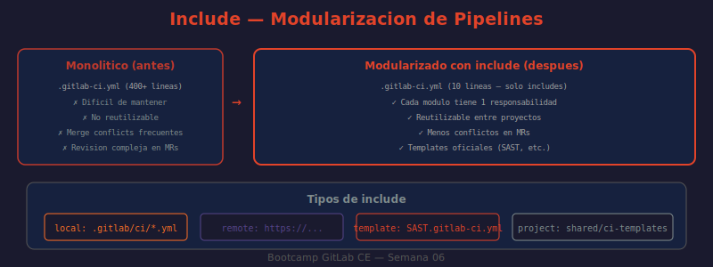

# 📖 03 — Include y Modularización de Pipelines

## 🎯 Objetivos de aprendizaje

- ✅ Entender por qué un `.gitlab-ci.yml` monolítico es problemático a largo plazo
- ✅ Usar `include:local`, `include:remote`, `include:template` e `include:project`
- ✅ Diseñar una estructura de directorios para pipelines modulares
- ✅ Reutilizar configuración con `extends` y anclas YAML (`&`, `*`, `<<`)
- ✅ Aplicar el tag `!reference` para composición avanzada de configuración

---

## 🤔 ¿Por Qué Modularizar?

Un `.gitlab-ci.yml` monolítico comienza siendo manejable y termina siendo un obstáculo:

```
Mes 1:  .gitlab-ci.yml = 50 líneas   → fácil de leer
Mes 3:  .gitlab-ci.yml = 200 líneas  → aceptable
Mes 6:  .gitlab-ci.yml = 600 líneas  → 3 equipos editando simultáneamente → conflictos
Año 1:  .gitlab-ci.yml = 1200 líneas → nadie entiende qué hace cada parte
```

**Analogía:** Igual que en código fuente, un archivo con 1200 líneas debería dividirse en módulos. El `include` de GitLab es el equivalente a `import` en Python, `require` en Node.js, o `#include` en C.

**Beneficios de modularizar:**

```
Equipos separados editan archivos separados → menos conflictos de merge
Templates reutilizables entre proyectos    → cambiar un template, actualiza N proyectos
Separación de responsabilidades             → el equipo de infra mantiene deploy.yml
Testing del pipeline más sencillo           → se puede validar cada módulo por separado
```

---

## 📐 Tipos de `include`

### `include:local`

Importa un archivo del **mismo repositorio**, en el mismo commit:

```yaml
# .gitlab-ci.yml
include:
  - local: .gitlab/ci/stages.yml
  - local: .gitlab/ci/build.yml
  - local: .gitlab/ci/test.yml
  - local: .gitlab/ci/deploy.yml
  - local: .gitlab/ci/security.yml
```

**Características:**
- Ruta relativa a la raíz del repositorio
- El archivo incluido debe existir en el mismo commit (no en otra rama)
- Puede usar `ref:` para incluir de otra rama del mismo repo

```yaml
# Incluir de otra rama del mismo repo
include:
  - local: .gitlab/ci/shared-jobs.yml
    ref: ci-templates-stable
```

---

### `include:remote`

Importa un archivo via URL HTTP/HTTPS. El archivo debe ser **accesible sin autenticación**:

```yaml
include:
  - remote: 'https://raw.githubusercontent.com/mi-org/shared-ci/main/node-template.yml'
  - remote: 'https://cdn.example.com/ci-templates/security-scan.yml'
```

**Cuándo usar:**
- Templates en repositorios externos (GitHub, Bitbucket, CDN propio)
- Cuando el repositorio de templates no está en la misma instancia GitLab

**Precaución:** el contenido se descarga en cada ejecución del pipeline. Si la URL no está disponible, el pipeline falla. Considerar versionar la URL (usar un tag o SHA del repositorio fuente).

---

### `include:template`

Usa plantillas **oficiales de GitLab** mantenidas por el equipo de GitLab:

```yaml
include:
  # Análisis estático de seguridad (SAST)
  - template: Security/SAST.gitlab-ci.yml

  # Escaneo de dependencias vulnerables
  - template: Security/Dependency-Scanning.gitlab-ci.yml

  # Escaneo de secretos en el código
  - template: Security/Secret-Detection.gitlab-ci.yml

  # Template de build para Node.js
  - template: Jobs/Build.gitlab-ci.yml

  # Auto DevOps completo
  - template: Auto-DevOps.gitlab-ci.yml
```

**Ver todos los templates disponibles:**
```
GitLab UI → Proyecto → CI/CD → Editor → Browse templates
```

O en el código fuente de GitLab:
```
https://gitlab.com/gitlab-org/gitlab/-/tree/master/lib/gitlab/ci/templates
```

---

### `include:project`

Importa un archivo de **otro proyecto** en la misma instancia GitLab:

```yaml
include:
  - project: 'devops/ci-templates'
    ref: v2.1.0          # tag, rama o SHA — recomendado usar tag para estabilidad
    file:
      - '/templates/docker-build.yml'
      - '/templates/helm-deploy.yml'
```

**Caso de uso típico:** un equipo de Platform Engineering mantiene un repositorio `devops/ci-templates` con jobs reutilizables. Todos los proyectos de la empresa incluyen desde ahí.

```
devops/ci-templates (repositorio de templates)
├── templates/
│   ├── docker-build.yml      ← build y push de imágenes Docker
│   ├── helm-deploy.yml       ← deploy a Kubernetes con Helm
│   ├── node-test.yml         ← tests para proyectos Node.js
│   ├── python-test.yml       ← tests para proyectos Python
│   └── security-basic.yml    ← SAST + dependency scanning
└── .gitlab-ci.yml            ← CI del propio repositorio de templates
```

---

## 🏗️ Estructura Recomendada

```
proyecto/
├── .gitlab-ci.yml          ← Archivo principal: solo includes + variables globales
├── .gitlab/
│   └── ci/
│       ├── stages.yml      ← Definición de stages
│       ├── build.yml       ← Jobs de compilación/build
│       ├── test.yml        ← Jobs de tests (unit, integration, e2e)
│       ├── security.yml    ← Jobs de seguridad (SAST, dependency scan)
│       └── deploy.yml      ← Jobs de deploy (staging, production)
└── src/
    └── ...
```

**`.gitlab-ci.yml` principal (archivo orquestador):**

```yaml
# ============================================
# Pipeline principal — solo orquesta includes
# ============================================

include:
  - local: .gitlab/ci/stages.yml
  - local: .gitlab/ci/build.yml
  - local: .gitlab/ci/test.yml
  - local: .gitlab/ci/security.yml
  - local: .gitlab/ci/deploy.yml

# Variables globales compartidas por todos los módulos
variables:
  APP_NAME: "bootcamp-api"
  DOCKER_DRIVER: overlay2
  NODE_VERSION: "18"
```

**`.gitlab/ci/stages.yml`:**

```yaml
stages:
  - validate
  - build
  - test
  - security
  - deploy
```

**`.gitlab/ci/build.yml`:**

```yaml
.build-base:
  image: node:${NODE_VERSION}-alpine
  before_script:
    - npm ci --cache .npm --prefer-offline
  cache:
    key:
      files:
        - package-lock.json
    paths:
      - .npm/

install-dependencies:
  extends: .build-base
  stage: build
  script:
    - echo "Dependencies installed"
  artifacts:
    paths:
      - node_modules/
    expire_in: 1 hour

build-app:
  extends: .build-base
  stage: build
  needs: [install-dependencies]
  script:
    - npm run build
  artifacts:
    paths:
      - dist/
    expire_in: 1 day
```

---

## 🔄 Cómo GitLab Fusiona los Archivos Incluidos

GitLab combina todos los archivos incluidos en una **configuración única** antes de ejecutar el pipeline. El orden de merge sigue estas reglas:

```
1. El archivo local (.gitlab-ci.yml) tiene MAYOR prioridad
2. Los includes se procesan en orden de declaración
3. Si hay conflictos de claves, el archivo de menor profundidad gana
4. Las secciones se fusionan (no reemplazan) — un job incluido puede extenderse
```

**Ejemplo de fusión:**

```yaml
# .gitlab/ci/test.yml
unit-tests:
  stage: test
  image: node:18-alpine
  script:
    - npm test

# .gitlab-ci.yml
include:
  - local: .gitlab/ci/test.yml

# Sobreescribir una propiedad del job incluido:
unit-tests:
  image: node:20-alpine    # ← Sobreescribe solo la imagen; el resto se hereda
```

---

## 🧩 Reutilización con `extends`

`extends` permite que un job **herede** la configuración de otro job (o un job template):

```yaml
# Jobs template — el prefijo "." evita que se ejecuten directamente
.base-test:
  image: node:18-alpine
  before_script:
    - npm ci
  artifacts:
    reports:
      junit: test-results.xml
    when: always

# Jobs reales que extienden el template
unit-tests:
  extends: .base-test
  stage: test
  script:
    - npm run test:unit

integration-tests:
  extends: .base-test
  stage: test
  script:
    - npm run test:integration
  services:
    - postgres:15-alpine   # solo este job necesita la DB
```

**La herencia es profunda:** si `.base-test` define `artifacts` y `unit-tests` también define `artifacts`, los campos se **fusionan** (no se reemplazan).

---

## ⚓ Anclas YAML (`&` y `*`)

Las anclas son una característica de YAML (no específica de GitLab) que permite reutilizar fragmentos:

```yaml
# Definir el ancla con &nombre
.before-script-template: &before-script-definition
  - npm ci
  - export NODE_ENV=test

# Usar el ancla con *nombre (inserta el valor)
unit-tests:
  before_script: *before-script-definition
  script:
    - npm run test:unit

# Extender un hash con <<: *nombre
.default-config: &default
  image: node:18-alpine
  tags:
    - docker

build:
  <<: *default           # hereda image y tags
  stage: build
  script: npm run build

test:
  <<: *default           # hereda image y tags
  stage: test
  script: npm test
```

**Limitación:** Las anclas solo funcionan dentro del **mismo archivo**. Para compartir entre archivos, usar `extends` o `!reference`.

---

## 🏷️ Tag `!reference`

`!reference` permite reutilizar secciones específicas de un job (no todo el job):

```yaml
# jobs template
.setup-node:
  before_script:
    - npm ci
    - export PATH=$PATH:./node_modules/.bin

.setup-docker:
  before_script:
    - docker login -u $CI_REGISTRY_USER -p $CI_REGISTRY_PASSWORD $CI_REGISTRY

# Job que necesita AMBOS setups
build-and-push:
  before_script:
    - !reference [.setup-node, before_script]
    - !reference [.setup-docker, before_script]
  script:
    - npm run build
    - docker build -t $CI_REGISTRY_IMAGE .
    - docker push $CI_REGISTRY_IMAGE
```

---

## 📏 Límites de `include`

| Límite | Valor |
|--------|-------|
| Máximo de archivos incluidos por pipeline | 150 |
| Profundidad máxima de include (include dentro de include) | 100 |
| Tamaño máximo del archivo `.gitlab-ci.yml` expandido | 1 MB |

```yaml
# include anidado (include dentro de un archivo incluido) — funciona pero tiene límites
# .gitlab/ci/test.yml puede incluir otros archivos:
include:
  - local: .gitlab/ci/test/unit.yml
  - local: .gitlab/ci/test/integration.yml
  - local: .gitlab/ci/test/e2e.yml
```

---

## 🖼️ Diagrama: Pipeline Modular



> **Diagrama:** Muestra `.gitlab-ci.yml` como nodo central que importa cinco módulos (stages, build, test, security, deploy). Cada módulo tiene sus propios jobs. Las flechas indican la relación de inclusión. Un segundo panel muestra cómo GitLab fusiona todo en una configuración única antes de ejecutar.

---

## 🤔 Preguntas de reflexión

1. Tienes 15 proyectos en la empresa que todos hacen `docker build` y `docker push` de la misma manera. ¿Cómo usarías `include:project` para centralizar ese template? ¿Qué pasa si necesitas actualizar la versión de Docker utilizada?

2. Un archivo incluido con `include:remote` apunta a `https://example.com/templates/latest/ci.yml`. El equipo de infra modifica ese archivo y rompe 10 pipelines. ¿Cómo habrías podido prevenir esto?

3. La diferencia entre `extends` y anclas YAML (`<<: *`) es que `extends` funciona entre archivos y anclas solo en el mismo archivo. ¿En qué situación preferirías anclas sobre `extends`?

4. Cuando GitLab fusiona `.gitlab-ci.yml` y todos sus includes, ¿en qué orden se "aplica" la prioridad? Si defines `image: node:18` en un include y `image: node:20` en el archivo principal para el mismo job, ¿cuál gana?

5. Un equipo de seguridad quiere asegurarse de que todos los proyectos ejecuten SAST. ¿Cómo podrían enforcer esto sin tocar cada `.gitlab-ci.yml` individualmente? Pista: considera las variables de instancia y los templates de instancia.

---

## 📚 Recursos adicionales

- [Include Keyword Reference](https://docs.gitlab.com/ee/ci/yaml/#include)
- [extends Keyword Reference](https://docs.gitlab.com/ee/ci/yaml/#extends)
- [!reference Tag](https://docs.gitlab.com/ee/ci/yaml/yaml_optimization.html#reference-tags)
- [GitLab CI Templates (código fuente)](https://gitlab.com/gitlab-org/gitlab/-/tree/master/lib/gitlab/ci/templates)
- [Optimize GitLab CI/CD Configuration Files](https://docs.gitlab.com/ee/ci/yaml/yaml_optimization.html)

---

⬅️ **Lección anterior:** [02 — Rules y Ejecución Condicional](./02-rules-y-condicionales.md)
➡️ **Siguiente lección:** [04 — Environments y Deployments](./04-environments-y-deployments.md)
