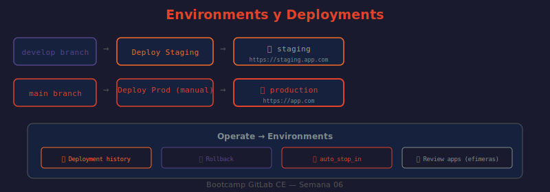

# 📖 04 — Environments y Deployments

## 🎯 Objetivos de aprendizaje

- ✅ Comprender qué es un environment en GitLab y para qué sirve el historial de deployments
- ✅ Configurar environments de staging y production con URLs y acciones de rollback
- ✅ Implementar review apps para merge requests con auto-destrucción
- ✅ Proteger environments sensibles y configurar deployment freezes
- ✅ Distinguir los patrones de deploy: rolling, blue-green, canary

---

## 🤔 ¿Qué es un Environment?

Un **environment** en GitLab es el destino de un despliegue: un servidor, un cluster, una plataforma cloud. No es solo una etiqueta — GitLab rastrea activamente qué versión está desplegada en cada environment.

**Sin environments:**
```
Pipeline → "el deploy terminó" → ¿a dónde? ¿qué versión? ¿quién deployó? nadie sabe
```

**Con environments:**
```
Operate → Environments → staging
  ● Versión: a1b2c3d4 (feat: add login endpoint)
  ● Deployada: hace 2 horas por Ana García
  ● URL: https://staging.mi-app.com  [abrir ↗]
  ● [Rollback a commit anterior]
  ● Historial: 47 deployments, último hace 2h
```

**Analogía:** Los environments son como los "registros de entradas" de un edificio. No solo sabes que alguien entró — sabes quién, cuándo, a qué piso, y puedes ver el historial completo.

---

## 📐 Configuración Básica

```yaml
deploy-staging:
  stage: deploy
  script:
    - echo "Deploying to staging..."
    - ./deploy.sh ${CI_ENVIRONMENT_NAME}
  environment:
    name: staging                           # ← Identificador del environment
    url: https://staging.mi-app.example.com # ← URL clickeable desde la UI
  rules:
    - if: $CI_COMMIT_BRANCH == "develop"

deploy-production:
  stage: deploy
  script:
    - echo "Deploying to production..."
    - ./deploy.sh production
  environment:
    name: production
    url: https://mi-app.example.com
  rules:
    - if: $CI_COMMIT_BRANCH == "main"
      when: manual        # ← Requiere click manual — gate de seguridad
      allow_failure: false
```

**Resultado en la UI (`Operate → Environments`):**

En `Operate → Environments` aparece un listado de los environments activos con el estado de su último deployment, la URL clickeable, el commit y el usuario que deployó. Cada environment tiene disponible un botón de rollback al deployment anterior.

| Environment | URL | Último deployment |
|-------------|-----|-------------------|
| production | https://mi-app.example.com | ✅ `a1b2c3d4` — feat: add auth — hace 3 días — Ana G. |
| staging | https://staging.mi-app.example.com | ✅ `f9e8d7c6` — fix: login bug — hace 2 horas — Pedro M. |

---

## 🔄 Historial de Deployments

GitLab guarda un registro de cada deployment, accesible desde `Operate → Environments → [nombre] → Deployments`.

Cada entrada muestra:
- Commit SHA y mensaje
- Quien disparó el deployment (pipeline o usuario)
- Fecha y duración
- Estado: Success / Failed / Running / Canceled

**Rollback con un click:** GitLab puede re-ejecutar el job de deploy del commit anterior, efectivamente haciendo un rollback.

```yaml
# Variables predefinidas disponibles en un deployment
deploy:
  environment:
    name: staging
  script:
    - echo "Environment: ${CI_ENVIRONMENT_NAME}"   # "staging"
    - echo "URL: ${CI_ENVIRONMENT_URL}"             # "https://staging.example.com"
    - echo "Slug: ${CI_ENVIRONMENT_SLUG}"           # "staging" (URL-safe)
    - echo "Deploy ID: ${CI_DEPLOY_USER}"           # usuario que aprobó
```

---

## 🛑 Acciones de Environment

### `action: stop` — Destruir un environment

```yaml
# Job que hace el deploy
deploy-staging:
  stage: deploy
  script: ./deploy.sh start
  environment:
    name: staging
    url: https://staging.example.com
    on_stop: stop-staging    # ← define qué job destruye este environment

# Job que destruye el environment
stop-staging:
  stage: deploy
  script: ./deploy.sh stop
  environment:
    name: staging
    action: stop             # ← acción de parada
  rules:
    - if: $CI_COMMIT_BRANCH == "main"
      when: manual
  allow_failure: true
```

---

## 🔀 Review Apps — Environments Efímeros

Un **review app** crea un environment único para cada Merge Request, permitiendo revisar los cambios en un entorno real antes del merge:

```
Developer abre MR !42
  → Pipeline crea environment review/42
  → URL: https://review-42.mi-app.example.com
  → Reviewer hace click → ve la feature funcionando
  → MR se mergea o se cierra → environment se destruye automáticamente
```

```yaml
deploy-review:
  stage: deploy
  script:
    # ¿QUÉ HACE?: Crea un entorno efímero para el MR usando su número como identificador
    # ¿POR QUÉ?: Permite al revisor ver los cambios funcionando sin hacer merge
    # ¿PARA QUÉ?: Feedback visual antes del merge, reduce bugs en staging/production
    - helm upgrade --install review-${CI_MERGE_REQUEST_IID} ./charts
      --set image.tag=${CI_COMMIT_SHORT_SHA}
      --set ingress.host=review-${CI_MERGE_REQUEST_IID}.mi-app.com
  environment:
    name: review/$CI_MERGE_REQUEST_IID     # ← ambiente dinámico por MR
    url: https://review-${CI_MERGE_REQUEST_IID}.mi-app.example.com
    on_stop: stop-review                   # ← qué job destruye esto
    auto_stop_in: 1 week                   # ← si no se destruye manualmente
  rules:
    - if: $CI_MERGE_REQUEST_IID           # ← solo en MRs
      when: on_success

stop-review:
  stage: deploy
  script:
    - helm uninstall review-${CI_MERGE_REQUEST_IID}
  environment:
    name: review/$CI_MERGE_REQUEST_IID
    action: stop
  rules:
    - if: $CI_MERGE_REQUEST_IID
      when: manual
  allow_failure: true
```

---

## 🔒 Protected Environments

Los **protected environments** requieren aprobación de personas específicas antes de que un deployment pueda ejecutarse:

```
Settings → CI/CD → Protected Environments → [production]
  Allow deployments from: Maintainers
  Required approvals: 2
  Approval rules:
    - Security Team: 1 approval
    - DevOps Team: 1 approval
```

```yaml
# Con un protected environment, aunque el job esté configurado con when: on_success,
# el deployment espera aprobación humana antes de ejecutarse
deploy-production:
  stage: deploy
  script: ./deploy.sh
  environment:
    name: production   # ← está protegido → espera aprobaciones
```

---

## ❄️ Deployment Freeze

Un **deployment freeze** bloquea deployments a ciertos environments durante períodos específicos (vacaciones, black friday, post-release freeze):

```
Settings → CI/CD → Deploy freezes → Add freeze period
  Freeze period: Dec 24 00:00 → Jan 2 09:00 (America/Mexico_City)
  Environment scope: production
```

Durante el freeze, los jobs con `environment: production` fallan automáticamente con:
```
GitLab: This deployment is not allowed due to an active deploy freeze period.
```

---

## 🚀 Patrones de Deploy

### Rolling Deploy

```yaml
deploy-rolling:
  stage: deploy
  script:
    # Despliega instancia por instancia, sin downtime
    - for server in server1 server2 server3; do
        ssh $server "docker pull $CI_REGISTRY_IMAGE:$CI_COMMIT_SHORT_SHA"
        ssh $server "docker stop app && docker run -d --name app $CI_REGISTRY_IMAGE:$CI_COMMIT_SHORT_SHA"
      done
  environment:
    name: production
```

### Blue-Green Deploy

```yaml
# Despliega en el entorno "inactivo" y luego hace el switch
deploy-blue-green:
  stage: deploy
  script:
    # Determinar cuál está activo (blue o green)
    - ACTIVE=$(curl -s https://lb.example.com/active)
    - INACTIVE=$([ "$ACTIVE" = "blue" ] && echo "green" || echo "blue")
    # Desplegar en el inactivo
    - ./deploy.sh ${INACTIVE}
    # Verificar que funciona
    - ./healthcheck.sh https://${INACTIVE}.example.com
    # Hacer el switch del load balancer
    - ./lb-switch.sh ${INACTIVE}
  environment:
    name: production
    url: https://mi-app.example.com
```

### Canary Deploy

```yaml
# Despliega al 10% primero, luego espera confirmación
canary-10:
  stage: deploy
  script:
    - kubectl set image deployment/app app=$CI_REGISTRY_IMAGE:$CI_COMMIT_SHORT_SHA
    - kubectl scale deployment/app-canary --replicas=1  # 1 de 10 pods = 10%
  environment:
    name: production/canary
  rules:
    - if: $CI_COMMIT_BRANCH == "main"

promote-canary:
  stage: deploy
  script:
    - kubectl scale deployment/app-canary --replicas=10   # 100%
    - kubectl scale deployment/app --replicas=0           # retire old
  environment:
    name: production
  rules:
    - if: $CI_COMMIT_BRANCH == "main"
      when: manual
      allow_failure: false
```

---

## 🖼️ Diagrama: Pipeline con Environments



> **Diagrama:** Muestra el flujo completo: rama feature → MR abierto → review app creada. Rama develop → staging. Tag v1.x → job manual → production. También muestra el panel `Operate → Environments` con el historial de deployments y el botón de rollback.

---

## 🤔 Preguntas de reflexión

1. Un deployment a producción falla. ¿Cómo harías rollback en GitLab usando environments? ¿Qué exactamente hace GitLab cuando haces rollback — re-ejecuta el job de deploy o deshace los cambios en el servidor?

2. Las review apps son environments efímeros por MR. Si tienes 20 MRs abiertos en paralelo, cada uno con su propio ambiente en Kubernetes, ¿qué consideraciones de recursos (CPU, memoria, namespaces) tendrías que tener?

3. `auto_stop_in: 1 week` en un review app significa que se destruye después de una semana si no se destruye manualmente. ¿Qué job de GitLab se ejecuta para ese auto-stop? ¿Cómo aseguras que funcione correctamente?

4. Un **protected environment** requiere 2 aprobaciones antes del deploy. ¿Qué pasa si uno de los dos aprobadores está de vacaciones? ¿Existe algún mecanismo de bypass de emergencia?

5. La diferencia entre blue-green y canary es que en blue-green el switch es 0% o 100%, mientras que en canary es gradual. ¿Qué métricas monitorearías durante un canary deploy para decidir si promover o rollback?

---

## 📚 Recursos adicionales

- [Environments and Deployments](https://docs.gitlab.com/ee/ci/environments/)
- [Review Apps](https://docs.gitlab.com/ee/ci/review_apps/)
- [Protected Environments](https://docs.gitlab.com/ee/ci/environments/protected_environments.html)
- [Deploy Freezes](https://docs.gitlab.com/ee/ci/environments/deployment_safety.html#prevent-deployments-during-deploy-freeze-windows)
- [Deployment Strategies](https://docs.gitlab.com/ee/ci/environments/deployment_safety.html)

---

⬅️ **Lección anterior:** [03 — Include y Modularización](./03-include-y-modularizacion.md)
➡️ **Siguiente lección:** [05 — Triggers y Pipelines Multi-Proyecto](./05-triggers-y-pipelines-multi-proyecto.md)
