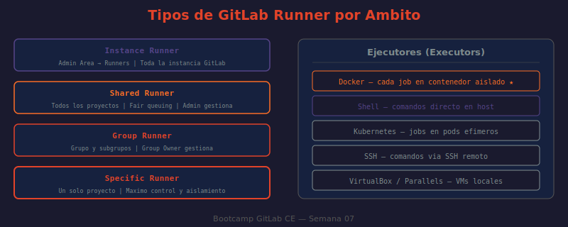

# 📖 01 — Tipos de GitLab Runner

## 🎯 Objetivos de aprendizaje

- ✅ Distinguir los cuatro ámbitos de runner: shared, group, specific e instance
- ✅ Comprender cuándo usar cada tipo según el contexto organizacional
- ✅ Entender el ciclo de vida de un runner: registro, autenticación y estados
- ✅ Administrar runners desde la UI y via API de GitLab
- ✅ Tomar decisiones de arquitectura de runners para un equipo real

---

## 🤔 ¿Por Qué Importa el Tipo de Runner?

Un runner es el agente que ejecuta el trabajo real del pipeline. Sin runners, los jobs quedan en estado `pending` indefinidamente. Pero no todos los runners son iguales — su **ámbito** determina quién puede usarlos, quién los administra y cuánto aislamiento ofrecen.

**Analogía:** Los runners son como impresoras en una oficina. Una impresora en el pasillo central (shared runner) sirve a todos pero puede estar ocupada. Una impresora por departamento (group runner) sirve a un equipo. Una impresora personal en tu escritorio (specific runner) tiene máximo control pero solo la usas tú.

| Ámbito | Costo de administración | Nivel de aislamiento | Quién administra |
|--------|------------------------|----------------------|-----------------|
| **Shared** | Bajo (centralizado) | Bajo | Admin de instancia |
| **Group** | Medio | Medio | Owner del grupo |
| **Specific** | Alto (por proyecto) | Alto | Maintainer del proyecto |

---

## 📐 Shared Runner

Un shared runner está disponible para **todos los proyectos** de la instancia GitLab. Solo los administradores de la instancia pueden crearlos y gestionarlos.

**Dónde configurar:** `Admin Area → CI/CD → Runners`

**Fair queuing:** GitLab distribuye los jobs entre todos los shared runners disponibles de forma equitativa. Si un proyecto monopoliza los runners, GitLab prioriza proyectos con menos uso reciente.

**Cuándo usar:**
- Equipos pequeños donde la administración de runners es overhead innecesario
- Proyectos con cargas impredecibles que se benefician del pool compartido
- Primeras etapas de adopción de CI/CD en la organización

**Cuándo NO usar:**
- Proyectos que necesitan hardware especial (GPU, ARM, macOS)
- Jobs de deploy a producción que usan secretos sensibles
- Proyectos con cargas muy pesadas que afectarían a otros equipos

---

## 👥 Group Runner

Un group runner está disponible para **todos los proyectos dentro de un grupo y sus subgrupos**. Los owners del grupo pueden administrarlos.

**Dónde configurar:** `Group → Settings → CI/CD → Runners`

```
mi-empresa (Group)
  Group Runner "enterprise-docker" — disponible para:
    ├── frontend/ (Subgroup)
    │   ├── webapp/        ← puede usar el group runner
    │   └── mobile/        ← puede usar el group runner
    └── backend/ (Subgroup)
        └── api-server/    ← puede usar el group runner
```

**Cuándo usar:**
- Equipos que comparten el mismo stack tecnológico (mismo runner con Node.js)
- Separar carga entre equipos sin administrar runners proyecto a proyecto
- Entornos de testing compartidos entre proyectos relacionados

---

## 🎯 Specific Runner (Project Runner)

Un specific runner está asignado **exclusivamente a un proyecto**. Los maintainers del proyecto pueden registrar y gestionar sus propios runners.

**Dónde configurar:** `Project → Settings → CI/CD → Runners`

**Cuándo usar:**
- Proyectos con requisitos especiales de hardware (GPU, ARM, macOS)
- Proyectos de producción donde el runner tiene acceso a secretos sensibles
- Compliance que requiere aislamiento total (runner no compartido con nadie)
- Builds de iOS/macOS que requieren un Mac dedicado

```yaml
# Pipeline que necesita GPU — solo corre en el runner específico del proyecto
ml-training:
  stage: train
  tags:
    - gpu
    - cuda12
  script:
    - nvidia-smi
    - python train.py --epochs 100
```

---

## 🏢 Instance Runner

Término moderno (GitLab 14.x+) para runners administrados a nivel de instancia en GitLab.com o GitLab EE. En GitLab.com, los instance runners son los que GitLab ofrece con cada plan.

| Plan GitLab.com | Minutos/mes | Runners |
|----------------|-------------|---------|
| Free | 400 | SaaS runners de GitLab |
| Premium | 10,000 | SaaS runners + prioridad |
| Ultimate | 50,000 | SaaS runners + prioridad máxima |

---

## 🔄 Ciclo de Vida de un Runner

El proceso completo desde la instalación hasta la ejecución de jobs:

1. **Instalación** — `gitlab-runner install` (binario) o `docker run` (contenedor)
2. **Registro** — `gitlab-runner register` → presenta registration token → recibe runner token único
3. **Conexión** — el runner hace polling a GitLab cada `check_interval` segundos buscando jobs
4. **Ejecución** — GitLab asigna job → runner descarga código → ejecuta → reporta resultado
5. **Gestión** — pausa / reactiva / actualiza versión / da de baja

---

## 🚦 Estados de un Runner

| Estado | Indicador UI | Significado |
|--------|-------------|-------------|
| **Active** | ● verde | Conectado, disponible para recibir jobs |
| **Paused** | ⏸ amarillo | Conectado pero no acepta nuevos jobs (termina los actuales) |
| **Offline** | ● gris | No ha respondido en los últimos minutos |
| **Locked** | 🔒 | Specific runner bloqueado a un proyecto (no se puede reasignar) |

```bash
# ¿QUÉ HACE?: Consulta todos los runners de la instancia via API
# ¿POR QUÉ?: La UI filtra por proyecto; la API muestra la flota completa
# ¿PARA QUÉ?: Auditar el estado de los runners antes de un deploy crítico

curl --silent --header "PRIVATE-TOKEN: $GITLAB_TOKEN" \
  "http://localhost/api/v4/runners?per_page=50" \
  | python3 -c "
import sys, json
runners = json.load(sys.stdin)
print(f'{'ID':<5} {'Estado':<10} {'Tipo':<12} {'Nombre':<25} {'Tags'}')
print('-' * 70)
for r in runners:
    status = r.get('status', '?')
    rtype = r.get('runner_type', '?')
    tags = ','.join(r.get('tag_list', []))
    print(f'{r[\"id\"]:<5} {status:<10} {rtype:<12} {r[\"description\"]:<25} {tags}')
"
```

---

## 🔐 Autenticación del Runner

El proceso de registro usa dos tokens distintos:

| Token | Qué es | Cuándo se usa |
|-------|--------|---------------|
| **Registration token** | Token del proyecto/grupo/instancia | Solo durante el registro inicial |
| **Runner token** | Token único asignado al runner tras el registro | En cada comunicación con GitLab |

> **Nota importante:** Desde GitLab 15.6, el registration token está **deprecado** en favor de runner authentication tokens creados via UI o API. El flujo moderno usa `gitlab-runner register --token glrt-XXXXXXXX`. Los registration tokens clásicos siguen funcionando en GitLab CE 16.x pero se eliminan en futuras versiones.

```bash
# ¿QUÉ HACE?: Crea un runner authentication token via API (flujo moderno)
# ¿POR QUÉ?: Los registration tokens son deprecados; este enfoque es más seguro
# ¿PARA QUÉ?: Registrar el runner sin exponer tokens globales de la instancia

curl --silent --request POST \
  --header "PRIVATE-TOKEN: $GITLAB_TOKEN" \
  --header "Content-Type: application/json" \
  --data '{
    "runner_type": "instance_type",
    "description": "bootcamp-docker-runner",
    "tag_list": ["docker","linux","bootcamp"]
  }' \
  "http://localhost/api/v4/user/runners" \
  | python3 -c "
import sys, json
r = json.load(sys.stdin)
if 'token' in r:
    print(f'Runner ID: {r[\"id\"]}')
    print(f'Token: {r[\"token\"]}  ← usar con gitlab-runner register')
else:
    print(f'Error: {r}')
"
```

---

## 🖼️ Diagrama: Tipos de Runner por Ámbito



> **Diagrama:** Muestra los cuatro ámbitos de runner como capas concéntricas: Instance (toda la instalación), Shared (todos los proyectos), Group (proyectos del grupo), Specific (un proyecto). Incluye quién administra cada tipo y en qué sección de la UI se configura.

---

## 🤔 Preguntas de reflexión

1. Una empresa tiene 50 proyectos. El equipo de DevOps administra la infraestructura de runners. ¿Qué tipo de runner usarías para minimizar la carga administrativa? ¿Y si el equipo de seguridad requiere que los deploys a producción nunca pasen por infraestructura compartida?

2. Un proyecto de ML necesita GPUs para entrenamiento. ¿Qué tipo de runner configuras? ¿Quién tiene permisos para administrarlo? ¿Cómo aseguras que solo los jobs de ese proyecto usen las GPUs?

3. Un shared runner tiene `concurrent = 4`. Hay 20 proyectos usando ese runner y todos hacen push simultáneamente. ¿Qué pasa con los jobs que no caben en el pool? ¿Cómo afecta el fair queuing a un proyecto con muchos commits frecuentes?

4. Un runner lleva 2 horas en estado "offline". ¿Cuáles son los pasos de diagnóstico? ¿Qué diferencia hay entre un runner offline y uno paused desde el punto de vista operacional?

5. El registration token de un shared runner se filtra accidentalmente en un log público. ¿Qué impacto tiene? ¿Qué acciones inmediatas tomarías? (Considera que el token ya fue usado para registrar 5 runners.)

---

## 📚 Recursos adicionales

- [GitLab Runner Documentation](https://docs.gitlab.com/runner/)
- [Runner Scope: Shared vs Group vs Specific](https://docs.gitlab.com/ee/ci/runners/runners_scope.html)
- [Runner Authentication Tokens (flujo moderno)](https://docs.gitlab.com/ee/ci/runners/new_creation_workflow.html)
- [Administrar runners via API](https://docs.gitlab.com/ee/api/runners.html)

---

➡️ **Siguiente lección:** [02 — Ejecutores](./02-ejecutores.md)
