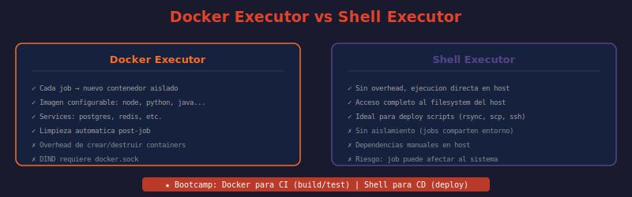

# 📖 02 — Ejecutores (Executors)

## 🎯 Objetivos de aprendizaje

- ✅ Entender qué es un executor y cómo determina el entorno de ejecución del job
- ✅ Comparar Docker Executor vs Shell Executor en términos de aislamiento, seguridad y rendimiento
- ✅ Saber cuándo elegir Kubernetes Executor para cargas de trabajo a escala
- ✅ Configurar correctamente el executor en `config.toml`
- ✅ Evitar los errores más comunes al elegir executor incorrecto para un caso de uso

---

## 🤔 ¿Qué es un Executor?

El executor define **cómo y dónde** se ejecutan los comandos del job. El mismo runner puede ejecutar jobs con Docker, en shell directo, o en Kubernetes — lo que cambia es el executor configurado.

**Analogía:** Si el runner es un cocinero, el executor es la cocina donde trabaja. Docker executor es una cocina individual aislada para cada plato (contenedor). Shell executor es la cocina compartida del restaurante. Kubernetes executor es una cadena de cocinas que escala automáticamente.

---

## 🐳 Docker Executor

El más usado en entornos modernos. Cada job se ejecuta en un **contenedor Docker nuevo y efímero**. Al terminar el job, el contenedor se destruye.

```toml
# config.toml
[[runners]]
  name = "docker-runner"
  executor = "docker"
  [runners.docker]
    image = "alpine:latest"       # imagen por defecto si el job no especifica
    privileged = false            # true solo si necesitas DinD
    volumes = ["/cache"]          # cache persistente entre jobs
    network_mode = "bridge"       # red del contenedor
    pull_policy = ["if-not-present", "always"]  # política de pull de imágenes
```

```yaml
# El job puede especificar su propia imagen
unit-tests:
  image: node:18-alpine          # sobreescribe el default del runner
  services:
    - postgres:15-alpine         # contenedor adicional accesible como "postgres"
  variables:
    POSTGRES_DB: testdb
    POSTGRES_PASSWORD: testpass
  script:
    - npm ci
    - npm test
```

**Ventajas:**
- Aislamiento completo — cada job empieza en un contenedor limpio
- Entorno reproducible — misma imagen = mismo resultado en cualquier runner
- Soporte para `services` (bases de datos, APIs externas)
- Limpieza automática del contenedor al terminar

**Desventajas:**
- Overhead de pull de imagen y arranque del contenedor (~5-30 segundos)
- Docker-in-Docker (DinD) requiere modo `privileged = true` (riesgo de seguridad)
- Requiere Docker instalado en el host del runner

### Docker-in-Docker (DinD)

Para construir imágenes Docker dentro de un job Docker, se necesita DinD:

```yaml
# ¿QUÉ HACE?: Construye una imagen Docker dentro de un job Docker
# ¿POR QUÉ?: El executor Docker no tiene acceso al daemon Docker del host por defecto
# ¿PARA QUÉ?: Pipelines de build de imágenes sin necesitar un runner con shell

build-image:
  image: docker:24-cli
  services:
    - docker:24-dind             # daemon Docker como servicio
  variables:
    DOCKER_HOST: tcp://docker:2376
    DOCKER_TLS_CERTDIR: "/certs"
  script:
    - docker build -t mi-app:latest .
    - docker push $CI_REGISTRY_IMAGE:$CI_COMMIT_SHORT_SHA
```

> **Alternativa más segura a DinD:** [Kaniko](https://github.com/GoogleContainerTools/kaniko) construye imágenes Docker sin necesitar el daemon ni modo privilegiado.

---

## 🖥️ Shell Executor

Ejecuta los comandos del job **directamente en la shell del host** donde corre el runner, sin contenedores.

```toml
[[runners]]
  name = "shell-runner"
  executor = "shell"
```

```yaml
deploy-production:
  tags:
    - shell
    - deploy
  script:
    - ./scripts/deploy.sh          # acceso directo al filesystem del host
    - systemctl restart app.service # puede controlar servicios del sistema
    - ssh user@server "docker pull && docker restart app"
```

**Ventajas:**
- Sin overhead de contenedores — el job empieza inmediatamente
- Acceso directo al filesystem, red y servicios del host
- Útil para deploys que necesitan tools preinstalados o acceso a hardware

**Desventajas:**
- Sin aislamiento — un job mal configurado puede afectar al sistema del runner
- Las dependencias deben instalarse manualmente en el host
- El estado del host puede cambiar entre ejecuciones (no reproducible)
- Riesgo de seguridad si se ejecutan jobs de proyectos no confiables

> **Regla de oro:** El Shell Executor solo debería usarse para runners **dedicados a un proyecto específico** y con acceso controlado. Nunca en shared runners que ejecutan código arbitrario.

---

## ☸️ Kubernetes Executor

Cada job se ejecuta en un **pod de Kubernetes** que se crea al inicio y se destruye al terminar. El runner se ejecuta como un deployment en el cluster.

```toml
[[runners]]
  name = "k8s-runner"
  executor = "kubernetes"
  [runners.kubernetes]
    namespace = "gitlab-runners"
    image = "alpine:latest"
    cpu_request = "500m"
    cpu_limit = "2"
    memory_request = "512Mi"
    memory_limit = "4Gi"
    pull_policy = "if-not-present"
    [runners.kubernetes.node_selector]
      "ci" = "true"              # solo nodos marcados para CI
```

```yaml
heavy-build:
  tags:
    - kubernetes
  image: maven:3.9-eclipse-temurin-17
  script:
    - mvn clean package -DskipTests
  # Kubernetes escala automáticamente si el cluster tiene capacidad
```

**Ventajas:**
- Escalabilidad nativa — el Cluster Autoscaler de K8s crea nodos según demanda
- Aislamiento a nivel de pod — cada job en su propio namespace/pod
- Gestión de recursos con requests y limits
- Integración con secretos de Kubernetes

**Desventajas:**
- Configuración compleja (cluster, RBAC, networking)
- Overhead de scheduling de pods (~10-60 segundos)
- DinD en K8s requiere configuración adicional (SecurityContext)

---

## 📊 Comparación de Ejecutores

| Característica | Docker | Shell | Kubernetes |
|---------------|--------|-------|------------|
| **Aislamiento** | Alto (contenedor) | Ninguno | Alto (pod) |
| **Reproducibilidad** | Alta | Baja | Alta |
| **Overhead de arranque** | 5-30s | ~0s | 10-60s |
| **Escalabilidad** | Manual | Manual | Automática |
| **Dependencias** | Docker daemon | Instaladas en host | Cluster K8s |
| **Privilegios necesarios** | Mínimos | Admin del host | RBAC de K8s |
| **Caso de uso típico** | CI general | Deploy scripts | Alta escala |
| **DinD (build Docker)** | Posible (privileged) | Natural | Complejo |
| **Services (DB, Redis)** | Nativo | Manual | Via pod sidecar |

---

## 🔧 Otros Ejecutores

| Executor | Descripción | Cuándo usar |
|----------|-------------|-------------|
| **VirtualBox** | Jobs en VMs VirtualBox del host | Tests de UI, builds nativos de Windows/macOS |
| **Parallels** | Jobs en VMs Parallels (solo macOS) | Builds nativos de macOS/iOS |
| **SSH** | Ejecuta comandos via SSH en servidor remoto | Acceso a hardware remoto sin instalar runner |
| **Instance** | Para Runner Manager en modo autoscaling | Alta escala con Fleeting plugin |
| **Custom** | Executor personalizado via script | Casos muy específicos no cubiertos por los anteriores |

---

## 🖼️ Diagrama: Docker Executor vs Shell Executor



> **Diagrama:** Panel izquierdo muestra el Docker Executor: cada job arranca un contenedor efímero, usa la imagen especificada, y se destruye al terminar — sin residuos entre jobs. Panel derecho muestra el Shell Executor: los jobs se ejecutan directamente en el host, compartiendo filesystem y entorno. La comparación destaca las ventajas de aislamiento del Docker frente a la velocidad del Shell.

---

## 🤔 Preguntas de reflexión

1. Un equipo de backend tiene tests que tardan 10 minutos. Con Docker Executor, el overhead de pull de imagen añade 2 minutos más. ¿Cómo optimizarías esto sin cambiar a Shell Executor? (Pista: considera `pull_policy` y el cache de imágenes del runner.)

2. Un job con Shell Executor hace `rm -rf /tmp/*` por error. ¿Qué impacto tiene en el runner? ¿Y si el mismo error ocurre en Docker Executor?

3. La diferencia entre `cpu_request` y `cpu_limit` en Kubernetes es que request garantiza recursos y limit es el máximo. ¿Qué pasa si un job de CI excede el `memory_limit` en un pod de K8s?

4. DinD requiere `privileged = true` en el contenedor, lo que da acceso casi completo al host. ¿Qué alternativas a DinD existen para construir imágenes Docker sin ese riesgo?

5. Un pipeline tiene un job que necesita Docker Executor (para tests con PostgreSQL) y otro que necesita Shell Executor (para deploy con acceso a SSH keys del host). ¿Cómo configuras el routing para que cada job vaya al runner correcto?

---

## 📚 Recursos adicionales

- [GitLab Runner Executors](https://docs.gitlab.com/runner/executors/)
- [Docker Executor](https://docs.gitlab.com/runner/executors/docker.html)
- [Shell Executor](https://docs.gitlab.com/runner/executors/shell.html)
- [Kubernetes Executor](https://docs.gitlab.com/runner/executors/kubernetes/)
- [Kaniko — Build Docker without Docker daemon](https://docs.gitlab.com/ee/ci/docker/using_kaniko.html)

---

⬅️ **Lección anterior:** [01 — Tipos de Runners](./01-tipos-de-runners.md)
➡️ **Siguiente lección:** [03 — Registro y Configuración](./03-registro-y-configuracion.md)
