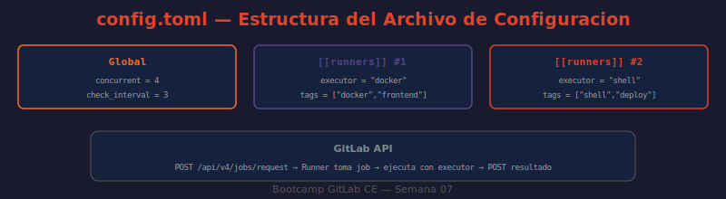

# 📖 03 — Registro y Configuración del Runner

## 🎯 Objetivos de aprendizaje

- ✅ Instalar GitLab Runner via Docker o como binario en Linux
- ✅ Registrar un runner de forma interactiva y no-interactiva (scripted)
- ✅ Entender la estructura de `config.toml` y sus parámetros clave
- ✅ Gestionar múltiples runners desde un mismo `config.toml`
- ✅ Usar los comandos de administración del runner: list, verify, restart, unregister

---

## 🤔 ¿Por Qué el Registro es un Paso Separado?

Instalar el runner binary/contenedor y registrarlo en GitLab son dos pasos distintos por diseño:

- **Instalación** = poner el software en el servidor
- **Registro** = vincular ese software con tu instancia GitLab y obtener credenciales

Esto permite tener un runner instalado pero temporalmente no registrado (por ejemplo, para mantenimiento) sin perder la configuración.

---

## 🚀 Instalación

### Via Docker (recomendado para el bootcamp)

```bash
# ¿QUÉ HACE?: Arranca el runner como contenedor con acceso al Docker socket del host
# ¿POR QUÉ?: El runner necesita el socket para crear contenedores para cada job
# ¿PARA QUÉ?: Ejecutar jobs con Docker executor sin instalar nada en el host directamente

docker run -d \
  --name gitlab-runner \
  --restart always \
  -v /var/run/docker.sock:/var/run/docker.sock \
  -v /srv/gitlab-runner/config:/etc/gitlab-runner \
  gitlab/gitlab-runner:alpine

# Verificar que está corriendo:
docker ps --filter name=gitlab-runner --format "table {{.Names}}\t{{.Status}}"
docker logs gitlab-runner --tail 20
```

### Via binario en Linux (Ubuntu/Debian)

```bash
# ¿QUÉ HACE?: Instala el runner como servicio systemd en el servidor
# ¿POR QUÉ?: Arranque automático con el sistema, sin depender de Docker
# ¿PARA QUÉ?: Entornos bare-metal o servidores sin Docker

curl -L "https://packages.gitlab.com/install/repositories/runner/gitlab-runner/script.deb.sh" \
  | sudo bash
sudo apt-get install -y gitlab-runner

# Verificar:
gitlab-runner --version
sudo systemctl status gitlab-runner
```

---

## 📋 Registro — Interactivo

El modo interactivo guía paso a paso con preguntas:

```bash
# En Docker:
docker run --rm -it \
  -v /srv/gitlab-runner/config:/etc/gitlab-runner \
  gitlab/gitlab-runner:alpine register

# Como binario:
sudo gitlab-runner register
```

El proceso pregunta:

```
Enter the GitLab instance URL:
> http://localhost        ← URL de tu instancia GitLab

Enter the registration token:
> glrt-AbCdEfGhIjKlMnOp  ← token obtenido en Settings → CI/CD → Runners

Enter a description for the runner:
> bootcamp-docker-runner

Enter tags for the runner (comma-separated):
> docker,linux,bootcamp

Enter optional maintenance note:
>                         ← dejar vacío

Enter an executor:
> docker

Enter the default Docker image:
> alpine:latest
```

---

## ⚡ Registro — No Interactivo (scripted)

Para automatización, CI/CD de la propia infra, o Docker:

```bash
# ¿QUÉ HACE?: Registra el runner con todos los parámetros en una línea
# ¿POR QUÉ?: El modo interactivo no funciona en scripts ni en pipelines de infra
# ¿PARA QUÉ?: Registrar runners de forma reproducible y automatizada

docker exec gitlab-runner gitlab-runner register \
  --non-interactive \
  --url "http://localhost" \
  --token "glrt-AbCdEfGhIjKlMnOp" \
  --executor "docker" \
  --docker-image "alpine:latest" \
  --docker-volumes "/var/run/docker.sock:/var/run/docker.sock" \
  --docker-volumes "/cache" \
  --tag-list "docker,linux,bootcamp" \
  --description "bootcamp-docker-runner" \
  --run-untagged="true"
```

Verificar que el runner apareció en GitLab:

```bash
# ¿QUÉ HACE?: Lista los runners online de la instancia via API
# ¿POR QUÉ?: Confirmar que el registro fue exitoso sin depender de la UI
# ¿PARA QUÉ?: Automatizar la verificación post-registro en scripts de infra

curl --silent --header "PRIVATE-TOKEN: $GITLAB_TOKEN" \
  "http://localhost/api/v4/runners?type=instance_type&status=online" \
  | python3 -c "
import sys, json
runners = json.load(sys.stdin)
print(f'Runners online: {len(runners)}')
for r in runners:
    tags = ','.join(r.get('tag_list', []))
    print(f'  #{r[\"id\"]}: {r[\"description\"]} [{tags}]')
"
```

---

## 📄 Archivo `config.toml`

El archivo de configuración principal del runner. Ubicación por defecto:
- Docker: `/srv/gitlab-runner/config/config.toml` (en el host)
- Linux binario: `/etc/gitlab-runner/config.toml`

### Estructura completa comentada

```toml
# ── PARÁMETROS GLOBALES ────────────────────────────────────────────────────
concurrent = 4          # máximo de jobs simultáneos en TODOS los runners
                        # de este archivo. Valor crítico: si = 1, los jobs
                        # se ejecutan de forma secuencial aunque haya runners libres
check_interval = 3      # segundos entre polls a GitLab buscando nuevos jobs
                        # 0 = usar el valor por defecto del servidor (~3s)
log_level = "info"      # debug | info | warn | error | fatal | panic
log_format = "text"     # text | json (útil para integrar con sistemas de log)

[session_server]
  session_timeout = 1800  # timeout de la sesión de debug interactivo (segundos)

# ── RUNNER 1: Docker general ────────────────────────────────────────────────
[[runners]]
  name = "bootcamp-docker-runner"
  url = "http://localhost"
  token = "glrt-xxxxxxxxxxxxxxxxxxxx"   # runner token (no el registration token)
  executor = "docker"
  
  [runners.docker]
    image = "alpine:latest"             # imagen por defecto si el job no especifica
    privileged = false                  # true solo si necesitas DinD
    disable_entrypoint_overwrite = false
    oom_kill_disable = false
    disable_cache = false
    volumes = [
      "/var/run/docker.sock:/var/run/docker.sock",  # acceso al daemon Docker
      "/cache:/cache"                                # cache persistente
    ]
    shm_size = 0                        # shared memory (bytes); 0 = default 64MB
    network_mode = "bridge"             # bridge | host | none | <network_name>
    pull_policy = ["if-not-present"]    # always | never | if-not-present
    
  [runners.cache]
    Type = "local"                      # local | s3 | gcs | azure
    Shared = false

# ── RUNNER 2: Shell para deploy ─────────────────────────────────────────────
[[runners]]
  name = "bootcamp-shell-runner"
  url = "http://localhost"
  token = "glrt-yyyyyyyyyyyyyyyyyy"
  executor = "shell"
  # Sin sección [runners.docker] — el shell no la necesita
```

### Parámetros más importantes

| Parámetro | Scope | Descripción |
|-----------|-------|-------------|
| `concurrent` | Global | Jobs totales simultáneos en todos los runners del archivo |
| `check_interval` | Global | Frecuencia de polling a GitLab (segundos) |
| `executor` | Por runner | `docker`, `shell`, `kubernetes`, etc. |
| `image` | Docker | Imagen Docker por defecto para jobs sin `image:` |
| `privileged` | Docker | Necesario para DinD; riesgo de seguridad |
| `volumes` | Docker | Volúmenes montados en cada contenedor de job |
| `pull_policy` | Docker | Cuándo hacer pull de la imagen |
| `network_mode` | Docker | Red del contenedor del job |

---

## 🛠️ Comandos de Administración

```bash
# ¿QUÉ HACE?: Lista todos los runners configurados en config.toml
gitlab-runner list

# ¿QUÉ HACE?: Verifica la conectividad de cada runner con GitLab
gitlab-runner verify

# ¿QUÉ HACE?: Verifica y elimina runners que no pueden conectarse
gitlab-runner verify --delete

# ¿QUÉ HACE?: Reinicia el servicio del runner (recarga config.toml)
sudo systemctl restart gitlab-runner   # Linux binario
docker restart gitlab-runner           # Docker

# ¿QUÉ HACE?: Da de baja un runner por nombre
gitlab-runner unregister --name "bootcamp-docker-runner"

# ¿QUÉ HACE?: Da de baja todos los runners configurados
gitlab-runner unregister --all-runners

# ¿QUÉ HACE?: Muestra el estado del servicio
gitlab-runner status
sudo systemctl status gitlab-runner

# ¿QUÉ HACE?: Ejecuta el runner en modo debug para ver qué hace
gitlab-runner --debug run
```

---

## 🔄 Aplicar Cambios en `config.toml`

GitLab Runner recarga `config.toml` automáticamente cada `check_interval` segundos — **no es necesario reiniciar** para cambios en la configuración de runners existentes. Sin embargo, para cambios en la sección global (como `concurrent`) sí se recomienda reiniciar.

```bash
# Editar config.toml
sudo nano /srv/gitlab-runner/config/config.toml

# Verificar sintaxis antes de aplicar:
docker exec gitlab-runner gitlab-runner verify

# Reiniciar solo si cambiaste parámetros globales:
docker restart gitlab-runner
```

---

## 🖼️ Diagrama: Estructura de `config.toml`



> **Diagrama:** Muestra la jerarquía del `config.toml`: sección global con `concurrent` y `check_interval` en la parte superior, seguida de bloques `[[runners]]` para cada runner registrado. Cada bloque runner tiene sus subbloques `[runners.docker]`, `[runners.cache]` y `[runners.kubernetes]`. Las flechas indican el flujo: runner → GitLab API → cola de jobs → asignación.

---

## 🤔 Preguntas de reflexión

1. `concurrent = 4` en un archivo con 3 runners significa que en total pueden correr 4 jobs simultáneos, no 4 por runner. Si tienes un runner lento y dos rápidos, ¿cómo afecta esto al throughput total? ¿Cómo cambiarías la configuración para maximizar la utilización?

2. Un runner tiene `pull_policy = ["if-not-present"]`. Un job actualiza una imagen de `node:18` a `node:20` en el `image:` del job, pero el runner sigue usando la vieja imagen. ¿Por qué? ¿Cómo forzarías el pull de la nueva imagen?

3. El `check_interval = 0` (valor por defecto del servidor) vs `check_interval = 3` (explícito). ¿Qué implicaciones tiene reducir este valor a `check_interval = 1`? ¿Y aumentarlo a `check_interval = 30`?

4. Si tienes `volumes = ["/cache"]` en el runner Docker, ¿dónde se almacena físicamente ese cache? ¿Comparten el mismo cache todos los jobs que corren en ese runner?

5. Al dar de baja un runner con `gitlab-runner unregister`, ¿qué pasa con los jobs que están corriendo en ese runner en ese momento? ¿Y con los jobs pendientes que estaban asignados a él?

---

## 📚 Recursos adicionales

- [Install GitLab Runner](https://docs.gitlab.com/runner/install/)
- [Register GitLab Runner](https://docs.gitlab.com/runner/register/)
- [config.toml Reference](https://docs.gitlab.com/runner/configuration/advanced-configuration.html)
- [Docker Executor — Volume Mounts](https://docs.gitlab.com/runner/executors/docker.html#mount-a-host-directory-as-a-data-volume)

---

⬅️ **Lección anterior:** [02 — Ejecutores](./02-ejecutores.md)
➡️ **Siguiente lección:** [04 — Tags y Job Routing](./04-tags-y-job-routing.md)
