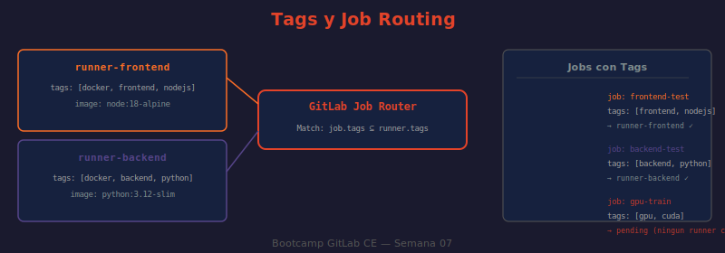

# 📖 04 — Tags y Job Routing

## 🎯 Objetivos de aprendizaje

- ✅ Entender el mecanismo de matching entre tags de jobs y tags de runners
- ✅ Configurar tags en runners al registrar y via `config.toml`
- ✅ Diseñar una estrategia de tags para una organización multi-equipo
- ✅ Comprender el comportamiento de jobs sin tags y la opción `run_untagged`
- ✅ Diagnosticar por qué un job queda en estado `pending`

---

## 🤔 ¿Por Qué Tags?

Sin tags, GitLab asigna cada job al primer runner disponible — sin importar si ese runner tiene las herramientas necesarias. Esto lleva a fallos confusos:

```
Job de Node.js → asignado a runner con Python → falla porque node no existe
Job que necesita GPU → asignado a runner en la nube → falla porque no hay GPU
Job de deploy → asignado a shared runner → falla porque no tiene SSH keys
```

Los tags son el mecanismo para garantizar que **cada job llega al runner correcto**.

**Analogía:** Los tags son como los filtros de un sistema de despacho. Un pedido de pizza fría necesita un camión refrigerado. Un pedido pesado necesita un camión grande. El sistema filtra los camiones disponibles según los requisitos del pedido — no asigna el primer camión que aparece.

---

## 📐 Reglas de Matching

El matching entre job y runner funciona con estas reglas:

| Situación | Resultado |
|-----------|-----------|
| Job sin tags + runner sin tags + `run_untagged: true` | ✅ Puede correr |
| Job sin tags + runner con tags + `run_untagged: true` | ✅ Puede correr |
| Job sin tags + runner con `run_untagged: false` | ❌ No puede correr |
| Job con tags + runner que tiene **todos** esos tags | ✅ Puede correr |
| Job con tags + runner que tiene **algunos** (no todos) | ❌ No puede correr |
| Job con tags que **ningún** runner tiene | ⏳ Job queda `pending` |

**La regla clave:** el runner debe tener **todos** los tags del job (el job puede pedir un subset de los tags del runner).

```yaml
# Runner tiene tags: [docker, linux, nodejs, frontend]

# ✅ Puede correr — runner tiene todos estos tags
build-frontend:
  tags: [docker, nodejs]

# ✅ Puede correr — el runner tiene ambos
test-ui:
  tags: [frontend, linux]

# ❌ NO puede correr — runner no tiene "gpu"
ml-job:
  tags: [docker, gpu]
```

---

## ⚙️ Configurar Tags en el Runner

### Al registrar (una sola vez)

```bash
# Modo interactivo — pregunta los tags durante el registro
gitlab-runner register
# > Enter tags: docker,linux,nodejs,frontend

# Modo no interactivo — pasar tags como argumento
docker exec gitlab-runner gitlab-runner register \
  --non-interactive \
  --url "http://localhost" \
  --token "glrt-XXXX" \
  --executor "docker" \
  --docker-image "node:18-alpine" \
  --tag-list "docker,linux,nodejs,frontend" \
  --run-untagged "false" \      # ← no ejecutar jobs sin tags
  --description "runner-frontend"
```

### En `config.toml` (modificable sin re-registrar)

```toml
[[runners]]
  name = "runner-frontend"
  tags = ["docker", "linux", "nodejs", "frontend"]
  run_untagged = false          # false = solo acepta jobs con tags que coincidan
```

> **Importante:** Modificar tags en `config.toml` tiene efecto inmediato (el runner lo recarga automáticamente). No se necesita re-registrar.

### Via API (sin acceso al servidor del runner)

```bash
# ¿QUÉ HACE?: Actualiza los tags de un runner via API
# ¿POR QUÉ?: Permite administrar runners remotamente sin acceso SSH al servidor
# ¿PARA QUÉ?: Gestión centralizada de la flota de runners

RUNNER_ID=42
curl --silent --request PUT \
  --header "PRIVATE-TOKEN: $GITLAB_TOKEN" \
  --header "Content-Type: application/json" \
  --data '{"tag_list": ["docker","linux","nodejs","frontend"]}' \
  "http://localhost/api/v4/runners/${RUNNER_ID}" \
  | python3 -c "
import sys, json
r = json.load(sys.stdin)
print(f'Runner #{r[\"id\"]} tags: {r.get(\"tag_list\")}')
"
```

---

## 🏗️ Estrategias de Tags Recomendadas

### Por tecnología (stack)

```toml
# Runner para proyectos Node.js
tags = ["docker", "linux", "nodejs"]

# Runner para proyectos Python
tags = ["docker", "linux", "python"]

# Runner para proyectos Java/Maven
tags = ["docker", "linux", "java", "maven"]
```

```yaml
# En .gitlab-ci.yml
frontend-build:
  tags: [nodejs]        # solo necesita especificar la diferencia

backend-test:
  tags: [python]

java-package:
  tags: [java, maven]
```

### Por entorno (staging/production)

```toml
# Runner con acceso a producción (secretos, red interna)
tags = ["shell", "linux", "production", "deploy"]
run_untagged = false

# Runner para staging
tags = ["docker", "linux", "staging"]
```

```yaml
deploy-production:
  tags: [production, deploy]   # solo el runner de producción lo ejecuta
  environment: production
  rules:
    - if: $CI_COMMIT_BRANCH == "main"
      when: manual
```

### Por arquitectura (CPU)

```toml
# Runner en máquina x86_64
tags = ["docker", "linux", "amd64"]

# Runner en máquina ARM (Raspberry Pi, AWS Graviton)
tags = ["docker", "linux", "arm64"]
```

```yaml
build-amd64:
  tags: [amd64]
  script: docker build --platform linux/amd64 -t mi-app:amd64 .

build-arm64:
  tags: [arm64]
  script: docker build --platform linux/arm64 -t mi-app:arm64 .
```

### Por hardware especial

```toml
# Runner con GPU NVIDIA
tags = ["shell", "linux", "gpu", "cuda12", "nvidia"]
```

```yaml
ml-training:
  tags: [gpu, cuda12]
  script:
    - nvidia-smi
    - python train.py
```

---

## 🔍 Diagnosticar Jobs en `pending`

Un job queda `pending` cuando no hay runner disponible. Las causas más comunes:

**Causa 1: Ningún runner tiene todos los tags del job**
```bash
# ¿QUÉ HACE?: Compara los tags del job con los runners disponibles
curl --silent --header "PRIVATE-TOKEN: $GITLAB_TOKEN" \
  "http://localhost/api/v4/runners?status=online" \
  | python3 -c "
import sys, json
runners = json.load(sys.stdin)
job_tags = {'gpu', 'cuda12'}   # ← cambiar por los tags del job pendiente
print('Runners online y sus tags:')
for r in runners:
    rtags = set(r.get('tag_list', []))
    match = job_tags.issubset(rtags)
    status = '✅ COMPATIBLE' if match else '❌ incompleto'
    print(f'  {status}: {r[\"description\"]} → {rtags}')
"
```

**Causa 2: Todos los runners con esos tags están ocupados (concurrent alcanzado)**
```bash
# Verificar cuántos jobs están corriendo vs el concurrent configurado
curl --silent --header "PRIVATE-TOKEN: $GITLAB_TOKEN" \
  "http://localhost/api/v4/jobs?scope=running&per_page=50" \
  | python3 -c "
import sys, json
jobs = json.load(sys.stdin)
print(f'Jobs corriendo actualmente: {len(jobs)}')
for j in jobs:
    print(f'  #{j[\"id\"]}: {j[\"name\"]} — runner: {j.get(\"runner\", {}).get(\"description\", \"?\")}')
"
```

**Causa 3: El runner está paused u offline**
```bash
# Listar runners offline o paused
curl --silent --header "PRIVATE-TOKEN: $GITLAB_TOKEN" \
  "http://localhost/api/v4/runners?status=offline" \
  | python3 -c "
import sys, json
for r in json.load(sys.stdin):
    print(f'  OFFLINE: #{r[\"id\"]} {r[\"description\"]}')
"
```

---

## 🖼️ Diagrama: Tags y Job Routing



> **Diagrama:** Muestra tres runners (frontend, backend, deploy) con sus tags respectivos. Tres jobs llegan con diferentes tag requirements. Las líneas verdes muestran qué jobs pueden correr en qué runner. Un job con tags `[gpu, cuda12]` queda sin flechas (pending) porque ningún runner los tiene. La tabla inferior muestra las reglas de matching.

---

## 🤔 Preguntas de reflexión

1. Tienes un job con `tags: [docker, linux, arm64]` y un runner con tags `[docker, linux, arm64, gpu, cuda12]`. ¿El job puede correr en ese runner? ¿Y si el job tiene `tags: [arm64, gpu]` y el runner tiene `[docker, linux, arm64]`?

2. Un equipo nuevo comienza y quiere usar un runner compartido existente. El runner tiene `run_untagged: false` y el equipo no sabe qué tags usar. ¿Qué pasa con sus jobs? ¿Cómo resolverías esto sin cambiar la configuración del runner?

3. La estrategia "un runner por tecnología" vs "un runner con muchos tags" tiene tradeoffs. Si tienes un runner con tags `[docker, linux, nodejs, python, java, maven]` que "puede hacer todo", ¿cuáles son las desventajas de este enfoque?

4. Un job queda `pending` durante 15 minutos. Los tags del job son `[production, deploy]`. Hay 2 runners con esos tags. ¿Cuáles son todas las posibles causas del pending? ¿Cómo las descartarías una por una?

5. Quieres que un runner de producción **solo** ejecute jobs explícitamente dirigidos a él (con tags), y que los jobs sin tags nunca lleguen a ese runner. ¿Qué parámetros configuras?

---

## 📚 Recursos adicionales

- [Using Tags to Control Which Runner Runs a Job](https://docs.gitlab.com/ee/ci/runners/configure_runners.html#use-tags-to-control-which-jobs-a-runner-can-run)
- [run_untagged Configuration](https://docs.gitlab.com/runner/configuration/advanced-configuration.html#the-runners-section)
- [Runners API](https://docs.gitlab.com/ee/api/runners.html)
- [Pending Jobs — Troubleshooting](https://docs.gitlab.com/ee/ci/jobs/job_troubleshooting.html)

---

⬅️ **Lección anterior:** [03 — Registro y Configuración](./03-registro-y-configuracion.md)
➡️ **Siguiente lección:** [05 — Autoscaling](./05-autoscaling.md)
