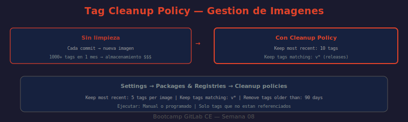

# 📖 04 — Gestión de Versiones de Imágenes

## 🎯 Objetivos de aprendizaje

- ✅ Entender las cuatro estrategias de versionado de imágenes Docker y cuándo usar cada una
- ✅ Implementar una estrategia completa que combine SHA inmutable + branch + SemVer
- ✅ Configurar Tag Cleanup Policies para controlar el crecimiento del registry
- ✅ Ejecutar limpieza manual via API para eliminar tags fuera de política
- ✅ Calcular el impacto en almacenamiento y diseñar una política de retención adecuada

---

## 🤔 El Problema de los Tags Sin Estrategia

Sin una estrategia definida, el registry acumula tags de forma caótica:

```
registry.example.com/mi-app/backend:
  ├── latest          ← ¿de qué commit? nadie lo sabe
  ├── test            ← ¿para qué era esto?
  ├── v1              ← ¿v1.0? ¿v1.1? ¿v1.whatever?
  ├── fix-bug         ← rama borrada hace 3 meses
  ├── carlos-prueba   ← "temporal" de hace 6 meses
  └── ... 847 tags más sin estructura
```

Con una estrategia clara:

```
registry.example.com/mi-app/backend:
  ├── a1b2c3d4        ← SHA inmutable: commit exacto, auditable
  ├── develop         ← último build de develop (movible)
  ├── main            ← último build de main (movible)
  ├── v1.2.3          ← release semántico (inmutable)
  └── latest          ← siempre apunta a main (convención)
```

---

## 🏷️ Las Cuatro Estrategias de Tag

### 1. SHA del Commit (inmutable)

```yaml
script:
  - docker build -t $CI_REGISTRY_IMAGE:$CI_COMMIT_SHORT_SHA .
  # Resultado: registry.example.com/mi-app/backend:a1b2c3d4
```

**Características:**
- Inmutable — una vez publicado, `a1b2c3d4` siempre apunta al mismo código
- Trazable — dado el tag, sabes exactamente qué commit construyó esa imagen
- No semántico — no comunica nada sobre qué versión es o si es estable

**Cuándo usarlo:** Como tag base de referencia en TODOS los builds — siempre incluir el SHA.

### 2. Nombre de Rama (movible)

```yaml
script:
  - docker build -t $CI_REGISTRY_IMAGE:$CI_COMMIT_REF_SLUG .
  # Resultado: registry.example.com/mi-app/backend:feature-login
  # o: registry.example.com/mi-app/backend:develop
  # o: registry.example.com/mi-app/backend:main
```

`CI_COMMIT_REF_SLUG` sanitiza el nombre de rama para que sea válido como Docker tag (`feature/login-123` → `feature-login-123`).

**Características:**
- Movible — cada nuevo commit a la rama sobreescribe este tag
- Comunica el contexto (qué rama/ambiente)
- Útil para deploys a ambientes que corresponden a ramas (develop→staging, main→producción)

### 3. Semantic Versioning (SemVer)

```yaml
script:
  - docker build -t $CI_REGISTRY_IMAGE:$CI_COMMIT_TAG .
  # Solo cuando el pipeline corre por un tag: v1.2.3, v2.0.0, etc.
  # Resultado: registry.example.com/mi-app/backend:v1.2.3
rules:
  - if: $CI_COMMIT_TAG =~ /^v\d+\.\d+\.\d+$/
```

**Características:**
- Inmutable — `v1.2.3` no debería cambiar nunca
- Comunica compatibilidad (MAJOR.MINOR.PATCH según SemVer)
- Identificable por humanos — un developer entiende qué es `v2.0.0`

### 4. `latest` (convención)

```yaml
script:
  - docker tag $CI_REGISTRY_IMAGE:$CI_COMMIT_SHORT_SHA $CI_REGISTRY_IMAGE:latest
  # Solo en la rama principal
rules:
  - if: $CI_COMMIT_BRANCH == "main"
```

**Características:**
- Movible — siempre apunta al último build de la rama principal
- Conveniente para entornos de desarrollo donde "dame lo último" es suficiente
- Nunca usar en producción — necesitas reproducibilidad exacta

---

## 🔗 Estrategia Completa: Todos los Tags en un Job

```yaml
docker-build-and-tag:
  stage: build
  image:
    name: gcr.io/kaniko-project/executor:v1.23.0-debug
    entrypoint: [""]
  script:
    # ¿QUÉ HACE?: Configura credenciales de Kaniko para el registry
    - mkdir -p /kaniko/.docker
    - echo "{\"auths\":{\"$CI_REGISTRY\":{\"username\":\"$CI_REGISTRY_USER\",\"password\":\"$CI_JOB_TOKEN\"}}}" > /kaniko/.docker/config.json

    # ¿QUÉ HACE?: Construye con múltiples destinations según el contexto del pipeline
    # ¿POR QUÉ?: Un solo build puede generar múltiples tags sin re-construir la imagen
    # ¿PARA QUÉ?: Máxima información disponible para cualquier consumidor de la imagen

    # Tag base: siempre el SHA inmutable
    - DESTINATIONS="--destination $CI_REGISTRY_IMAGE:$CI_COMMIT_SHORT_SHA"

    # Tag de rama: siempre en branches
    - |
      if [ -n "$CI_COMMIT_BRANCH" ]; then
        DESTINATIONS="$DESTINATIONS --destination $CI_REGISTRY_IMAGE:$CI_COMMIT_REF_SLUG"
      fi

    # Tag latest: solo en main
    - |
      if [ "$CI_COMMIT_BRANCH" = "main" ]; then
        DESTINATIONS="$DESTINATIONS --destination $CI_REGISTRY_IMAGE:latest"
      fi

    # Tag SemVer: solo cuando es un tag semántico
    - |
      if [ -n "$CI_COMMIT_TAG" ]; then
        DESTINATIONS="$DESTINATIONS --destination $CI_REGISTRY_IMAGE:$CI_COMMIT_TAG"
        # También tagear como latest en release
        DESTINATIONS="$DESTINATIONS --destination $CI_REGISTRY_IMAGE:latest"
      fi

    # Build único, múltiples destinos
    - /kaniko/executor
        --context $CI_PROJECT_DIR
        --dockerfile $CI_PROJECT_DIR/Dockerfile
        --cache=true
        --cache-repo $CI_REGISTRY_IMAGE/cache
        $DESTINATIONS
```

**Resultado según el contexto:**

| Evento | Tags generados |
|--------|---------------|
| Push a `feature/login` | `a1b2c3d4`, `feature-login` |
| Push a `develop` | `a1b2c3d4`, `develop` |
| Push a `main` | `a1b2c3d4`, `main`, `latest` |
| Tag `v1.2.3` | `a1b2c3d4`, `v1.2.3`, `latest` |

---

## 🧹 Tag Cleanup Policy

Sin limpieza, cada push genera un tag nuevo. 10 pushes/día × 30 días = 300 tags por mes. En un equipo de 5 developers: 1,500 tags/mes.

### Configurar via UI

```
Proyecto → Settings → Packages & Registries → Container registry cleanup policies

Parámetros:
  ┌──────────────────────────────────────────────────────────────────┐
  │ Run cleanup: Every month                                         │
  │ Keep the most recent: 10 tags per image name                     │
  │ Keep tags matching: v\d+\.\d+\.\d+   (patrón regex para SemVer) │
  │ Remove tags older than: 90 days                                  │
  │ Remove tags matching: .*              (todo lo que no esté en   │
  │                                        el "keep matching")       │
  └──────────────────────────────────────────────────────────────────┘
```

**Lógica de la política:**
1. NUNCA eliminar tags que coincidan con `keep_tags_regex` (ej: `v*`)
2. NUNCA eliminar los N tags más recientes (ej: 10 por imagen)
3. Eliminar el resto si son más viejos que X días

### Configurar via API

```bash
# ¿QUÉ HACE?: Configura la cleanup policy del proyecto via API
# ¿POR QUÉ?: Automatizar la configuración en proyectos nuevos sin tocar la UI
# ¿PARA QUÉ?: Aplicar política estándar de la organización a todos los proyectos

curl --silent --request PUT \
  --header "PRIVATE-TOKEN: $GITLAB_TOKEN" \
  --header "Content-Type: application/json" \
  --data '{
    "container_expiration_policy_attributes": {
      "cadence": "1month",
      "enabled": true,
      "keep_n": 10,
      "older_than": "90d",
      "name_regex_keep": "v\\d+\\.\\d+\\.\\d+|main|latest",
      "name_regex": ".*"
    }
  }' \
  "http://localhost/api/v4/projects/$GITLAB_PROJECT_ID" \
  | python3 -c "
import sys, json
r = json.load(sys.stdin)
policy = r.get('container_expiration_policy', {})
print(f'Cleanup policy:')
print(f'  Habilitada: {policy.get(\"enabled\")}')
print(f'  Cadencia: {policy.get(\"cadence\")}')
print(f'  Mantener N más recientes: {policy.get(\"keep_n\")}')
print(f'  Mantener tags matching: {policy.get(\"name_regex_keep\")}')
print(f'  Eliminar si más viejos de: {policy.get(\"older_than\")}')
"
```

### Limpieza Manual via API

```bash
# ¿QUÉ HACE?: Lista los tags del registry y elimina los que no son latest ni SemVer
# ¿POR QUÉ?: Limpieza puntual fuera del ciclo de la cleanup policy automática
# ¿PARA QUÉ?: Recuperar espacio en disco rápidamente sin esperar al ciclo mensual

PROJECT_ID=$GITLAB_PROJECT_ID
REPO_ID=1    # obtener de: GET /projects/:id/registry/repositories

# Listar todos los tags
TAGS=$(curl --silent --header "PRIVATE-TOKEN: $GITLAB_TOKEN" \
  "http://localhost/api/v4/projects/$PROJECT_ID/registry/repositories/$REPO_ID/tags?per_page=100" \
  | python3 -c "
import sys, json, re
tags = json.load(sys.stdin)
# Filtrar: mantener latest, main, develop, y SemVer (v1.2.3)
keep_pattern = re.compile(r'^(latest|main|develop|v\d+\.\d+\.\d+)$')
to_delete = [t['name'] for t in tags if not keep_pattern.match(t['name'])]
print(f'Tags a eliminar: {len(to_delete)} de {len(tags)} totales')
for t in to_delete[:10]:
    print(f'  {t}')
if len(to_delete) > 10:
    print(f'  ... y {len(to_delete)-10} más')
")

echo "$TAGS"

# Para eliminar (descomentar con precaución):
# curl --request DELETE --header "PRIVATE-TOKEN: $GITLAB_TOKEN" \
#   "http://localhost/api/v4/projects/$PROJECT_ID/registry/repositories/$REPO_ID/tags/NOMBRE_DEL_TAG"
```

### Limpieza en Pipeline (por schedule)

```yaml
# .gitlab-ci.yml — job que corre por schedule (ej: cada semana)
cleanup-stale-registry-tags:
  stage: cleanup
  image: alpine:latest
  rules:
    - if: $CI_PIPELINE_SOURCE == "schedule"  # solo vía pipeline programado
  script:
    - apk add --no-cache curl python3
    - |
      python3 << 'EOF'
      import subprocess, json, re, sys

      token = "$GITLAB_TOKEN"
      project_id = "$CI_PROJECT_ID"
      base_url = "http://localhost/api/v4"
      headers = f"PRIVATE-TOKEN: {token}"

      # Obtener repos del registry
      result = subprocess.run(
          ["curl", "-s", f"--header", headers,
           f"{base_url}/projects/{project_id}/registry/repositories?per_page=20"],
          capture_output=True, text=True
      )
      repos = json.loads(result.stdout)

      keep_pattern = re.compile(r'^(latest|main|develop|v\d+\.\d+\.\d+)$')
      total_deleted = 0

      for repo in repos:
          repo_id = repo["id"]
          result = subprocess.run(
              ["curl", "-s", "--header", headers,
               f"{base_url}/projects/{project_id}/registry/repositories/{repo_id}/tags?per_page=100"],
              capture_output=True, text=True
          )
          tags = json.loads(result.stdout)
          for tag in tags:
              if not keep_pattern.match(tag["name"]):
                  print(f"Eliminando: {repo['path']}:{tag['name']}")
                  total_deleted += 1

      print(f"\nTotal eliminados: {total_deleted}")
      EOF
```

---

## 🖼️ Diagrama: Tag Cleanup Policy



> **Diagrama:** Muestra el escenario "Sin limpieza" (cada commit genera un nuevo tag, 1000+ tags en un mes, costos de almacenamiento crecientes) vs "Con Cleanup Policy" (se mantienen los N más recientes + los que coinciden con el patrón `v*`, el resto se elimina periódicamente). La sección inferior muestra dónde se configura en la UI: `Settings → Packages & Registries → Cleanup policies`.

---

## 🤔 Preguntas de reflexión

1. Un tag `latest` es movible — apunta a commits distintos en distintos momentos. ¿Qué problema causa esto en producción si el cluster de Kubernetes tiene `imagePullPolicy: IfNotPresent` y `latest` ya está en caché? ¿Cómo lo resuelves?

2. La cleanup policy tiene `name_regex_keep: "v\d+\.\d+\.\d+|main|latest"`. Un developer creó el tag de Docker `v1.0.0-beta.1` (pre-release SemVer). ¿Se mantiene o se elimina? ¿Cómo cambiarías el regex para incluirlo?

3. Tienes 500 tags en el registry del proyecto. La cleanup policy elimina todo excepto los 10 más recientes y los que coinciden con `v*`. Tienes 45 releases SemVer (`v1.0.0` a `v1.4.4`). ¿Cuántos tags quedan después de ejecutar la política?

4. Eliminar un tag Docker no necesariamente libera espacio en disco — solo libera espacio si ningún otro tag referencia los mismos layers. ¿Qué herramienta de GitLab necesitas ejecutar para recuperar el espacio real después de eliminar tags? (Pista: container registry garbage collection.)

5. La estrategia "SHA siempre + branch cuando aplica + SemVer en tags" genera entre 1 y 4 tags por commit. Si tu equipo hace 50 pushes al día, ¿cuántos tags acumulas por mes? Con `keep_n: 10` y `older_than: 30d`, ¿cuántos sobrevivirán la cleanup mensual?

---

## 📚 Recursos adicionales

- [Container Registry Cleanup Policies](https://docs.gitlab.com/ee/user/packages/container_registry/reduce_container_registry_storage.html)
- [Container Registry API — Tags](https://docs.gitlab.com/ee/api/container_registry.html)
- [Garbage Collection del Registry](https://docs.gitlab.com/ee/administration/packages/container_registry.html#container-registry-garbage-collection)
- [Semantic Versioning](https://semver.org/lang/es/)

---

⬅️ **Lección anterior:** [03 — Package Registry](./03-package-registry.md)
➡️ **Siguiente lección:** [05 — Security Scanning](./05-container-scanning.md)
