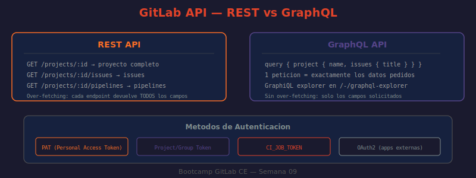

# 02 — GraphQL API de GitLab

A diferencia de la API REST (un endpoint por recurso), GraphQL usa un único endpoint y el cliente especifica exactamente qué campos quiere en la respuesta. Esto elimina el over-fetching (recibir campos que no se necesitan) y el under-fetching (necesitar varias peticiones REST para obtener datos relacionados).



---

## Endpoint

```
http://localhost/api/graphql
```

A diferencia de REST que tiene un endpoint por recurso, GraphQL tiene un único endpoint que acepta queries y mutations como cuerpo de la petición.

---

## GraphiQL Explorer

GitLab incluye un explorador interactivo en `http://localhost/-/graphql-explorer`. Características:
- Autocompletado del esquema (Ctrl+Space)
- Documentación integrada de cada tipo y campo en el panel derecho
- Historial de queries guardadas en el navegador
- Variables GraphQL con panel dedicado

Es el punto de partida recomendado para explorar el esquema antes de escribir scripts.

---

## Autenticación

```bash
# Mismo PAT que REST, pero con header Authorization: Bearer
curl --request POST \
  --header "Authorization: Bearer $GITLAB_TOKEN" \
  --header "Content-Type: application/json" \
  --data '{"query":"{ currentUser { username } }"}' \
  "http://localhost/api/graphql"

# También funciona PRIVATE-TOKEN (compatibilidad)
curl --request POST \
  --header "PRIVATE-TOKEN: $GITLAB_TOKEN" \
  --header "Content-Type: application/json" \
  --data '{"query":"{ currentUser { username } }"}' \
  "http://localhost/api/graphql"
```

---

## Queries — Lectura de datos

### Ejemplo básico: proyecto con sus MRs abiertos

```graphql
query MRsAbiertos($path: ID!) {
  project(fullPath: $path) {
    name
    description
    mergeRequests(state: opened, first: 10) {
      nodes {
        iid
        title
        author { name username }
        createdAt
        labels { nodes { title color } }
      }
      pageInfo {
        hasNextPage
        endCursor
      }
    }
  }
}
```

```bash
# ¿QUÉ HACE?: Ejecuta la query con variables via curl
# ¿POR QUÉ?: Las variables evitan interpolación de strings y permiten reusar la query
# ¿PARA QUÉ?: Obtener MRs abiertos con author y labels en una sola petición

curl --silent --request POST \
  --header "PRIVATE-TOKEN: $GITLAB_TOKEN" \
  --header "Content-Type: application/json" \
  --data "{
    \"query\": \"query { project(fullPath: \\\"mi-grupo/mi-proyecto\\\") { name mergeRequests(state: opened, first: 5) { nodes { iid title author { username } } } } }\"
  }" \
  "http://localhost/api/graphql" \
  | python3 -m json.tool
```

### Ejemplo: Issues de varios proyectos en una sola petición

```graphql
query DashboardIssues {
  proyectoA: project(fullPath: "grupo/proyecto-a") {
    issues(state: opened, first: 5) {
      nodes { iid title }
    }
  }
  proyectoB: project(fullPath: "grupo/proyecto-b") {
    issues(state: opened, first: 5) {
      nodes { iid title }
    }
  }
}
```

> En REST esto requeriría 2 peticiones HTTP. En GraphQL es 1 sola.

---

## Mutations — Modificación de datos

```graphql
mutation CrearIssue($input: CreateIssueInput!) {
  createIssue(input: $input) {
    issue {
      iid
      title
      webUrl
    }
    errors
  }
}
```

Variables de la mutation:
```json
{
  "input": {
    "projectPath": "mi-grupo/mi-proyecto",
    "title": "Bug crítico en autenticación",
    "description": "El login falla con caracteres especiales",
    "labelNames": ["bug", "alta-prioridad"]
  }
}
```

```bash
# Ejecutar mutation via curl
curl --silent --request POST \
  --header "PRIVATE-TOKEN: $GITLAB_TOKEN" \
  --header "Content-Type: application/json" \
  --data '{
    "query": "mutation { createIssue(input: { projectPath: \"mi-grupo/mi-proyecto\", title: \"Test desde GraphQL\" }) { issue { iid title webUrl } errors } }"
  }' \
  "http://localhost/api/graphql" \
  | python3 -c "
import sys, json
r = json.load(sys.stdin)
issue = r.get('data', {}).get('createIssue', {}).get('issue', {})
print(f'Issue creado: #{issue.get(\"iid\")} — {issue.get(\"title\")}')
print(f'URL: {issue.get(\"webUrl\")}')
"
```

---

## Fragments — Reutilización de campos

Los fragments evitan duplicar listas de campos cuando la misma estructura se necesita en varios lugares:

```graphql
fragment CamposIssue on Issue {
  iid
  title
  state
  createdAt
  author { username }
  assignees { nodes { username } }
}

query IssuesMultiProyecto {
  proyectoA: project(fullPath: "grupo/a") {
    issues(state: opened) {
      nodes { ...CamposIssue }
    }
  }
  proyectoB: project(fullPath: "grupo/b") {
    issues(state: opened) {
      nodes { ...CamposIssue }
    }
  }
}
```

---

## Paginación con cursor

GraphQL de GitLab usa paginación basada en cursores (no en números de página):

```graphql
query IssuesPaginados($cursor: String) {
  project(fullPath: "mi-grupo/mi-proyecto") {
    issues(state: opened, first: 20, after: $cursor) {
      nodes { iid title }
      pageInfo {
        hasNextPage
        endCursor
      }
    }
  }
}
```

```python
# ¿QUÉ HACE?: Itera todas las páginas de issues via cursor-based pagination
# ¿POR QUÉ?: La API GraphQL no acepta page/per_page de REST
# ¿PARA QUÉ?: Obtener todos los issues sin límite de 100 items

import requests, json

GITLAB_URL = "http://localhost"
TOKEN = "tu-token"

query = """
query($path: ID!, $cursor: String) {
  project(fullPath: $path) {
    issues(state: opened, first: 20, after: $cursor) {
      nodes { iid title }
      pageInfo { hasNextPage endCursor }
    }
  }
}
"""

cursor = None
all_issues = []

while True:
    resp = requests.post(
        f"{GITLAB_URL}/api/graphql",
        headers={"PRIVATE-TOKEN": TOKEN},
        json={"query": query, "variables": {"path": "mi-grupo/mi-proyecto", "cursor": cursor}}
    )
    data = resp.json()["data"]["project"]["issues"]
    all_issues.extend(data["nodes"])

    page_info = data["pageInfo"]
    if not page_info["hasNextPage"]:
        break
    cursor = page_info["endCursor"]

print(f"Total issues: {len(all_issues)}")
```

---

## Introspección del esquema

```bash
# ¿QUÉ HACE?: Obtiene todos los tipos disponibles en el esquema GraphQL de GitLab
# ¿POR QUÉ?: La introspección permite descubrir qué campos existen sin leer docs
# ¿PARA QUÉ?: Explorar el esquema programáticamente o generar tipos TypeScript

curl --silent --request POST \
  --header "PRIVATE-TOKEN: $GITLAB_TOKEN" \
  --header "Content-Type: application/json" \
  --data '{"query":"{ __schema { types { name kind } } }"}' \
  "http://localhost/api/graphql" \
  | python3 -c "
import sys, json
types = json.load(sys.stdin)['data']['__schema']['types']
# Filtrar solo tipos definidos por GitLab (no los built-in __)
gitlab_types = [t for t in types if not t['name'].startswith('__')]
print(f'Tipos en el esquema: {len(gitlab_types)}')
for t in sorted(gitlab_types, key=lambda x: x['name'])[:20]:
    print(f'  {t[\"kind\"]:<12} {t[\"name\"]}')
"
```

---

## REST vs GraphQL — cuándo usar cada uno

| Criterio | REST | GraphQL |
|----------|------|---------|
| Simplicidad | Más simple, curl directo | Requiere conocer el esquema |
| Campos necesarios | Todos los del recurso (over-fetching) | Solo los pedidos |
| Datos relacionados | N peticiones para N recursos | 1 petición |
| Exploración | Documentación oficial | GraphiQL explorer interactivo |
| Rate limit (autenticado) | 300 req/min | 600 req/min |
| Soporte de herramientas | Universal (curl, python-gitlab) | Requiere cliente GraphQL |
| Uso recomendado | CRUD simple, pipelines | Dashboards, reportes, datos relacionados |

---

## Límites de la API GraphQL

- Complejidad máxima de query: 200 puntos (campos anidados acumulan puntos)
- Profundidad máxima: 10 niveles de anidación
- Rate limit: 600 peticiones/minuto (el doble que REST)
- Si una query supera la complejidad: error `"Query has complexity of X which exceeds the max complexity of 200"`

---

➡️ **Siguiente:** [03 — Personal Access Tokens](./03-personal-access-tokens.md)
