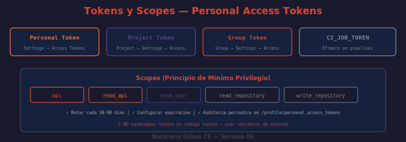

# 03 — Personal Access Tokens y Tipos de Tokens

Los tokens son el mecanismo de autenticación para la API de GitLab. Funcionan como sustitutos de contraseña con scopes (alcances) que limitan qué operaciones puede realizar cada token.



---

## Tipos de tokens

| Tipo | Ámbito | Creación | Caso de uso |
|------|--------|----------|-------------|
| Personal Access Token | Usuario individual | Settings → Access Tokens | Scripts personales, CLI, exploración |
| Project Access Token | Proyecto específico | Project → Settings → Access Tokens | Bots por proyecto, CI sin usuario humano |
| Group Access Token | Grupo y todos sus subproyectos | Group → Settings → Access Tokens | Automatización cross-proyecto a nivel de grupo |
| Impersonation Token | Admin actuando como otro usuario | Admin area → Users → [user] → Impersonation Tokens | Soporte técnico, auditoría |
| CI_JOB_TOKEN | Efímero, dura lo que dura el job | Generado automáticamente | Pipelines — no requiere configuración |

---

## Scopes disponibles

Los scopes determinan qué operaciones puede realizar el token. Usar siempre el mínimo necesario:

| Scope | Permite |
|-------|---------|
| `api` | Acceso completo a la API REST y GraphQL — lectura y escritura |
| `read_api` | Solo lectura via API (no puede modificar recursos) |
| `read_user` | Leer información del usuario autenticado (perfil, email) |
| `create_runner` | Registrar nuevos runners |
| `read_repository` | Clonar repositorios (git clone/pull) |
| `write_repository` | Push al repositorio (git push) |
| `read_registry` | Descargar imágenes del Container Registry |
| `write_registry` | Publicar imágenes en el Container Registry |
| `read_package_registry` | Descargar paquetes del Package Registry |
| `write_package_registry` | Publicar paquetes en el Package Registry |

---

## Crear tokens via UI

### Personal Access Token (PAT)

```
Perfil (avatar) → Edit profile → Access Tokens → Add new token

Campos:
  Token name: "script-automatizacion-prod"
  Expiration date: 90 días máximo recomendado
  Select scopes: ✅ api  (o scopes más restrictivos según el uso)
```

> El token se muestra **una sola vez** al crearlo. Copiarlo inmediatamente.

### Project Access Token

```
Proyecto → Settings → Access Tokens → Add new token

Campos:
  Token name: "ci-bot"
  Role: Developer  (mínimo para disparar pipelines)
  Scopes: ✅ api
```

El token actúa como un "bot member" del proyecto con el rol asignado. No está ligado a ningún usuario humano — si un desarrollador abandona el equipo, el token sigue funcionando.

---

## Crear tokens via API (requiere admin)

```bash
# ¿QUÉ HACE?: Crea un PAT para el usuario con ID 1 via API de administración
# ¿POR QUÉ?: Necesario para automatizar la creación de tokens en onboarding
# ¿PARA QUÉ?: Provisionar tokens sin que el usuario acceda a la UI

curl --silent --request POST \
  --header "PRIVATE-TOKEN: $ADMIN_TOKEN" \
  --header "Content-Type: application/json" \
  --data '{
    "name": "automation-token",
    "scopes": ["api"],
    "expires_at": "2026-12-31",
    "user_id": 1
  }' \
  "http://localhost/api/v4/users/1/personal_access_tokens" \
  | python3 -c "
import sys, json
t = json.load(sys.stdin)
print(f'Token creado: {t[\"name\"]}')
print(f'Token: {t[\"token\"]}')
print(f'Expira: {t[\"expires_at\"]}')
print(f'Scopes: {t[\"scopes\"]}')
"
```

---

## Listar y revocar tokens

```bash
# Listar tokens activos del usuario autenticado
curl --header "PRIVATE-TOKEN: $GITLAB_TOKEN" \
  "http://localhost/api/v4/personal_access_tokens?state=active" \
  | python3 -c "
import sys, json
tokens = json.load(sys.stdin)
print(f'Tokens activos: {len(tokens)}')
for t in tokens:
    expiry = t.get('expires_at') or 'nunca'
    scopes = ','.join(t.get('scopes', []))
    print(f'  ID:{t[\"id\"]} {t[\"name\"]:<30} expira:{expiry:<12} scopes:{scopes}')
"

# Revocar un token por ID
TOKEN_ID=123
curl --request DELETE \
  --header "PRIVATE-TOKEN: $GITLAB_TOKEN" \
  "http://localhost/api/v4/personal_access_tokens/$TOKEN_ID"
echo "Token $TOKEN_ID revocado"

# Rotar un token (genera uno nuevo, invalida el anterior) — GitLab 15.11+
curl --request POST \
  --header "PRIVATE-TOKEN: $GITLAB_TOKEN" \
  "http://localhost/api/v4/personal_access_tokens/$TOKEN_ID/rotate" \
  | python3 -c "
import sys, json
t = json.load(sys.stdin)
print(f'Nuevo token: {t.get(\"token\", \"(no disponible)\")}')
"
```

---

## CI_JOB_TOKEN — características especiales

El `CI_JOB_TOKEN` tiene un comportamiento diferente a los tokens manuales:

- **Efímero:** expira automáticamente cuando el job termina (passed/failed/cancelled)
- **Inyectado:** disponible como variable de entorno en todos los jobs sin configuración
- **Scoped:** por defecto solo tiene acceso al proyecto que contiene el pipeline
- **Allowlist:** para acceder a recursos de otros proyectos, el proyecto destino debe añadir el proyecto fuente en su CI/CD token access allowlist

```yaml
# Uso típico en pipelines:
deploy-job:
  script:
    # Login al Container Registry del proyecto
    - docker login -u $CI_REGISTRY_USER -p $CI_JOB_TOKEN $CI_REGISTRY

    # Instalar paquete npm desde el Package Registry
    - npm install --registry "${CI_API_V4_URL}/projects/${CI_PROJECT_ID}/packages/npm/"

    # Llamar a la API del mismo proyecto
    - curl --header "JOB-TOKEN: $CI_JOB_TOKEN" \
        "${CI_API_V4_URL}/projects/${CI_PROJECT_ID}/deployments"
```

---

## Rotación de tokens — proceso seguro

GitLab no fuerza la rotación automática en CE, pero es buena práctica rotar cada 30-90 días:

1. Crear el nuevo token con los mismos scopes
2. Actualizar las variables de entorno / secretos de CI en todos los sistemas que lo usen
3. Verificar que los sistemas funcionen con el nuevo token
4. Revocar el token antiguo (no deletar — revocar: queda en el historial de auditoría)

```bash
# Script de rotación segura: crea nuevo, verifica, revoca viejo
OLD_TOKEN_ID=123

# 1. Crear nuevo token con mismos scopes
NEW_TOKEN=$(curl --silent --request POST \
  --header "PRIVATE-TOKEN: $GITLAB_TOKEN" \
  --header "Content-Type: application/json" \
  --data '{"name":"automation-rotated-2026","scopes":["api"],"expires_at":"2026-12-31"}' \
  "http://localhost/api/v4/personal_access_tokens" \
  | python3 -c "import sys,json; print(json.load(sys.stdin)['token'])")

echo "Nuevo token generado: ${NEW_TOKEN:0:8}..."

# 2. Verificar que el nuevo token funciona
HTTP=$(curl --silent --output /dev/null --write-out "%{http_code}" \
  --header "PRIVATE-TOKEN: $NEW_TOKEN" \
  "http://localhost/api/v4/user")

if [ "$HTTP" = "200" ]; then
  echo "✅ Nuevo token válido"
  # 3. Revocar el token antiguo
  curl --request DELETE \
    --header "PRIVATE-TOKEN: $NEW_TOKEN" \
    "http://localhost/api/v4/personal_access_tokens/$OLD_TOKEN_ID"
  echo "✅ Token antiguo revocado"
else
  echo "❌ Nuevo token no funciona ($HTTP) — manteniendo token antiguo"
fi
```

---

## Buenas prácticas

- Usar el scope mínimo necesario (principio de mínimo privilegio): `read_api` para consultas, `api` solo si se necesita escritura
- Nunca hardcodear tokens en código fuente — usar variables de entorno o secretos de CI
- Configurar fecha de expiración en todos los tokens (90 días máximo recomendado)
- Usar Project Access Tokens para bots (no dependen de usuarios humanos)
- Auditar tokens activos periódicamente: Settings → Access Tokens (ver la columna "Last used")
- En CI/CD usar `CI_JOB_TOKEN` siempre que sea posible — no requiere gestión ni rotación

---

➡️ **Siguiente:** [04 — Webhooks](./04-webhooks.md)
