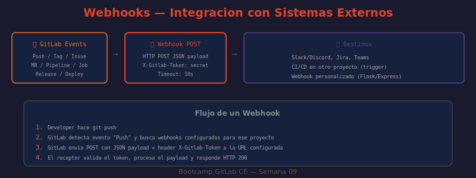

# 04 — Webhooks en GitLab

Los webhooks son el mecanismo inverso a la API REST: en lugar de que el sistema externo pregunte a GitLab ("¿hay cambios?"), GitLab notifica al sistema externo ("ocurrió este evento"). GitLab envía un HTTP POST con un payload JSON cuando ocurre un evento configurado.



---

## Tipos de eventos disponibles

| Evento | Disparador |
|--------|-----------|
| Push events | Push a cualquier rama |
| Tag events | Creación o eliminación de tags |
| Issues events | Creación, actualización, cierre de issues |
| Merge request events | Apertura, actualización, merge, cierre de MR |
| Pipeline events | Inicio, éxito, fallo, cancelación de pipeline |
| Job events | Cambios de estado en jobs individuales |
| Release events | Creación o actualización de releases |
| Wiki page events | Creación o edición de páginas wiki |
| Deployment events | Despliegues a environments |
| Confidential note events | Notas confidenciales en issues o MRs |
| Member events | Adición o eliminación de miembros del proyecto |

---

## Estructura del payload

Todos los eventos comparten una estructura base con campos comunes, más campos específicos del tipo de evento:

```json
{
  "object_kind": "merge_request",
  "event_type": "merge_request",
  "user": {
    "id": 1,
    "name": "Desarrollador Ejemplo",
    "username": "dev-ejemplo"
  },
  "project": {
    "id": 42,
    "name": "mi-proyecto",
    "web_url": "http://localhost/mi-grupo/mi-proyecto",
    "path_with_namespace": "mi-grupo/mi-proyecto"
  },
  "object_attributes": {
    "iid": 5,
    "title": "feat: nueva función de login",
    "state": "opened",
    "action": "open",
    "source_branch": "feature/login",
    "target_branch": "main",
    "url": "http://localhost/mi-grupo/mi-proyecto/-/merge_requests/5"
  }
}
```

Los campos relevantes para routing en el receptor:
- `object_kind` — tipo de objeto: `push`, `merge_request`, `issue`, `pipeline`, `build`
- `object_attributes.action` — acción específica: `open`, `update`, `merge`, `close`
- `object_attributes.state` — estado resultante

---

## Secret Token — validación de autenticidad

Al configurar el webhook, GitLab permite definir un "Secret Token". Este valor se envía en el header `X-Gitlab-Token` en cada petición. El receptor **debe validarlo** para evitar que terceros envíen payloads falsos:

```python
from flask import Flask, request, abort
import hmac, os

app = Flask(__name__)
WEBHOOK_SECRET = os.environ["GITLAB_WEBHOOK_SECRET"]

@app.route("/webhook", methods=["POST"])
def webhook():
    # ¿QUÉ HACE?: Valida que el header X-Gitlab-Token coincide con el secreto configurado
    # ¿POR QUÉ?: Sin validación, cualquiera puede enviar payloads falsos a la URL
    # ¿PARA QUÉ?: Asegurar que solo GitLab puede disparar acciones en el receptor

    received_token = request.headers.get("X-Gitlab-Token", "")

    # Comparación en tiempo constante (evita timing attacks)
    if not hmac.compare_digest(received_token, WEBHOOK_SECRET):
        abort(401, "Token inválido")

    payload = request.json
    event_kind = payload.get("object_kind")
    print(f"Evento recibido: {event_kind}")

    return {"status": "ok"}, 200
```

---

## Configurar webhook via UI

```
Proyecto → Settings → Webhooks → Add new webhook

URL: http://tu-servidor:5000/webhook
Secret token: mi-secreto-seguro-2026
Trigger (seleccionar):
  ✅ Push events
  ✅ Merge request events
  ✅ Pipeline events
  ✅ Issues events
SSL verification: desmarcar si usas HTTP local
```

---

## Configurar webhook via API

```bash
# ¿QUÉ HACE?: Crea un webhook en el proyecto apuntando a un servidor local
# ¿POR QUÉ?: Automatizar la configuración de webhooks sin acceder a la UI
# ¿PARA QUÉ?: Reproducible en scripts de setup y en pipelines de bootstrap

curl --silent --request POST \
  --header "PRIVATE-TOKEN: $GITLAB_TOKEN" \
  --header "Content-Type: application/json" \
  --data '{
    "url": "http://mi-servidor:5000/webhook",
    "token": "mi-secreto-seguro-2026",
    "push_events": true,
    "merge_requests_events": true,
    "pipeline_events": true,
    "issues_events": true,
    "enable_ssl_verification": false
  }' \
  "http://localhost/api/v4/projects/$GITLAB_PROJECT_ID/hooks" \
  | python3 -c "
import sys, json
h = json.load(sys.stdin)
print(f'Webhook ID: {h[\"id\"]}')
print(f'URL: {h[\"url\"]}')
print(f'Push: {h[\"push_events\"]}')
print(f'MR: {h[\"merge_requests_events\"]}')
print(f'Pipeline: {h[\"pipeline_events\"]}')
"

# Listar webhooks configurados
curl --header "PRIVATE-TOKEN: $GITLAB_TOKEN" \
  "http://localhost/api/v4/projects/$GITLAB_PROJECT_ID/hooks" \
  | python3 -c "
import sys, json
hooks = json.load(sys.stdin)
print(f'Webhooks configurados: {len(hooks)}')
for h in hooks:
    print(f'  ID:{h[\"id\"]} → {h[\"url\"]}')
"
```

---

## Receptor webhook con Flask

Para entornos locales, crear un servidor Python simple que reciba los eventos:

```python
#!/usr/bin/env python3
"""Receptor de webhooks de GitLab — servidor de desarrollo."""

from flask import Flask, request, jsonify, abort
import hmac, json, os, logging

logging.basicConfig(level=logging.INFO)
app = Flask(__name__)

WEBHOOK_SECRET = os.environ.get("GITLAB_WEBHOOK_SECRET", "mi-secreto-seguro-2026")


@app.route("/webhook", methods=["POST"])
def receive_webhook():
    # Validar secret token
    token = request.headers.get("X-Gitlab-Token", "")
    if not hmac.compare_digest(token, WEBHOOK_SECRET):
        logging.warning("Token inválido recibido")
        abort(401)

    payload = request.json
    event_kind = payload.get("object_kind", "unknown")
    project = payload.get("project", {}).get("path_with_namespace", "?")

    logging.info(f"Evento: {event_kind} | Proyecto: {project}")

    # Routing por tipo de evento
    if event_kind == "push":
        handle_push(payload)
    elif event_kind == "merge_request":
        handle_mr(payload)
    elif event_kind == "pipeline":
        handle_pipeline(payload)
    elif event_kind == "issue":
        handle_issue(payload)

    return jsonify({"status": "processed", "event": event_kind}), 200


def handle_push(payload):
    ref = payload.get("ref", "")
    commits = payload.get("commits", [])
    logging.info(f"  Push a {ref}: {len(commits)} commit(s)")


def handle_mr(payload):
    attrs = payload.get("object_attributes", {})
    action = attrs.get("action")
    title = attrs.get("title")
    logging.info(f"  MR {action}: '{title}'")


def handle_pipeline(payload):
    attrs = payload.get("object_attributes", {})
    status = attrs.get("status")
    ref = attrs.get("ref")
    logging.info(f"  Pipeline {status} en {ref}")


def handle_issue(payload):
    attrs = payload.get("object_attributes", {})
    action = attrs.get("action")
    title = attrs.get("title")
    logging.info(f"  Issue {action}: '{title}'")


if __name__ == "__main__":
    port = int(os.environ.get("PORT", 5000))
    logging.info(f"Servidor webhook en http://0.0.0.0:{port}/webhook")
    app.run(host="0.0.0.0", port=port, debug=True)
```

---

## Exponer servidor local con ngrok

Para que GitLab (que corre en un contenedor o servidor) pueda alcanzar el servidor de desarrollo local:

```bash
# Instalar ngrok: https://ngrok.com/download (o via snap)
# snap install ngrok

# Exponer el puerto 5000 con un URL público temporal
ngrok http 5000

# ngrok muestra algo como:
# Forwarding  https://abc123.ngrok-free.app → http://localhost:5000

# Usar esa URL como webhook URL en GitLab
# Settings → Webhooks → URL: https://abc123.ngrok-free.app/webhook
```

```bash
# Arrancar el receptor y ngrok en paralelo
python3 webhook_server.py &
ngrok http 5000 &

# Ver el historial de requests en ngrok (UI web)
open http://127.0.0.1:4040   # Inspector de ngrok
```

---

## Pruebas y diagnóstico

### Test desde la UI

```
Settings → Webhooks → [webhook] → Edit → Test → Push events
```

GitLab envía un payload de prueba y muestra la respuesta HTTP recibida.

### Historial de entregas

```
Settings → Webhooks → [webhook] → Edit → ver tabla "Recent Deliveries"

Columnas: evento, código HTTP respuesta, timestamp, botón "Resend"
```

Si el servidor responde 2xx, la entrega se considera exitosa. Si responde 4xx/5xx, GitLab lo marca como fallido y permite reenviar manualmente.

### Via API: test de webhook

```bash
# Enviar evento push de prueba al webhook ID 1
HOOK_ID=1
curl --silent --request POST \
  --header "PRIVATE-TOKEN: $GITLAB_TOKEN" \
  "http://localhost/api/v4/projects/$GITLAB_PROJECT_ID/hooks/$HOOK_ID/test/push_events" \
  | python3 -c "
import sys, json
print(json.dumps(json.load(sys.stdin), indent=2))
"
```

---

## Consideraciones de red y seguridad

- La URL del webhook debe ser alcanzable **desde la instancia GitLab** — no desde el navegador del developer
- Timeout: 10 segundos. Si el receptor tarda más, GitLab marca la entrega como fallida
- El receptor debe responder 2xx rápidamente y procesar el evento de forma asíncrona si es necesario
- Nunca loguear el body completo del webhook en producción (puede contener información sensible)
- Usar HTTPS en producción — validar el certificado activando "Enable SSL verification"
- GitLab no reintenta automáticamente entregas fallidas — solo permite reenvío manual desde la UI

---

➡️ **Siguiente:** [05 — Automatización con Python](./05-automatizacion-python.md)
