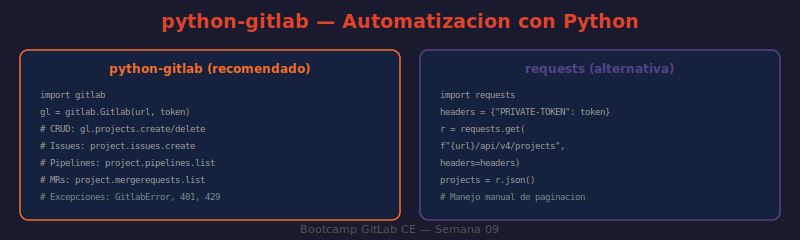

# 05 — Automatización con Python y GitLab

Python es el lenguaje más usado para automatizar tareas en GitLab. Existen dos enfoques: `python-gitlab` (librería de alto nivel) y `requests` (peticiones HTTP directas). La primera es la recomendada para scripts complejos; la segunda sirve para scripts simples o cuando no se pueden instalar dependencias.



---

## Instalación

```bash
pip install python-gitlab python-dotenv requests
```

---

## python-gitlab — configuración inicial

```python
import gitlab
import os

# ¿QUÉ HACE?: Crea el cliente autenticado contra la instancia local
# ¿POR QUÉ?: Centraliza la autenticación — todos los objetos del cliente la heredan
# ¿PARA QUÉ?: Reusar la conexión en todas las operaciones del script

gl = gitlab.Gitlab(
    url=os.environ["GITLAB_URL"],       # "http://localhost"
    private_token=os.environ["GITLAB_TOKEN"],
    retry_transient_errors=True,        # reintenta automáticamente 429 y 5xx
)

# Verificar autenticación
gl.auth()
print(f"Autenticado como: {gl.users.get_current().username}")
```

### Variables de entorno con python-dotenv

```python
# .env
GITLAB_URL=http://localhost
GITLAB_TOKEN=glpat-xxxxxxxxxxxx
GITLAB_PROJECT_ID=42
```

```python
from dotenv import load_dotenv
load_dotenv()

import os, gitlab
gl = gitlab.Gitlab(os.environ["GITLAB_URL"], private_token=os.environ["GITLAB_TOKEN"])
```

---

## CRUD de proyectos

```python
# Listar proyectos del usuario autenticado
proyectos = gl.projects.list(owned=True, per_page=20)
for p in proyectos:
    print(f"[{p.id}] {p.path_with_namespace} — estrellas: {p.star_count}")

# Obtener proyecto por ID o namespace
proyecto = gl.projects.get(os.environ["GITLAB_PROJECT_ID"])
print(f"Proyecto: {proyecto.name} | Visibilidad: {proyecto.visibility}")

# Buscar proyectos por nombre
resultados = gl.projects.list(search="bootcamp", order_by="last_activity_at")

# Crear proyecto
nuevo = gl.projects.create({
    "name": "proyecto-automatizado",
    "description": "Creado via python-gitlab",
    "visibility": "private",
    "initialize_with_readme": True,
})
print(f"Proyecto creado: ID={nuevo.id} URL={nuevo.web_url}")

# Eliminar proyecto
# nuevo.delete()
```

---

## Gestión de Issues

```python
# Listar issues abiertos
issues = proyecto.issues.list(state="opened", order_by="updated_at", per_page=20)
for issue in issues:
    assignee = issue.assignees[0]["username"] if issue.assignees else "sin asignar"
    labels = ", ".join(issue.labels) if issue.labels else "-"
    print(f"  #{issue.iid} [{labels}] {issue.title} → {assignee}")

# Crear issue
nuevo_issue = proyecto.issues.create({
    "title": "Bug en el módulo de autenticación",
    "description": "El login falla con contraseñas que contienen `&`",
    "labels": ["bug", "alta-prioridad"],
    "assignee_ids": [1],
})
print(f"Issue creado: #{nuevo_issue.iid} — {nuevo_issue.web_url}")

# Actualizar issue (añadir label, cambiar assignee)
issue = proyecto.issues.get(nuevo_issue.iid)
issue.labels = issue.labels + ["en-investigacion"]
issue.save()

# Cerrar issue
issue.state_event = "close"
issue.save()
print(f"Issue #{issue.iid} cerrado")

# Añadir comentario (note)
issue.notes.create({"body": "Investigado — fix en PR #23"})
```

---

## Merge Requests

```python
# Listar MRs abiertos
mrs = proyecto.mergerequests.list(state="opened", per_page=10)
for mr in mrs:
    print(f"  !{mr.iid} [{mr.source_branch} → {mr.target_branch}] {mr.title}")
    print(f"       Autor: {mr.author['username']} | Aprobaciones: {mr.approvals_required}")

# Crear MR
mr = proyecto.mergerequests.create({
    "source_branch": "feature/nueva-api",
    "target_branch": "main",
    "title": "feat: nueva API REST para módulo de usuarios",
    "description": "## Cambios\n- Añadir endpoint `/users/search`\n- Closes #15",
    "remove_source_branch": True,
})
print(f"MR creado: !{mr.iid} — {mr.web_url}")

# Obtener diferencias del MR
diffs = mr.diffs.list()
for diff in diffs[:3]:
    print(f"  {diff.new_path}: +{diff.diff.count('+')}-{diff.diff.count('-')}")
```

---

## Pipelines

```python
# ¿QUÉ HACE?: Obtiene los últimos pipelines y clasifica por estado
# ¿POR QUÉ?: Útil para scripts de monitoreo o alertas
# ¿PARA QUÉ?: Dashboard de salud del CI/CD o script de notificación

pipelines = proyecto.pipelines.list(per_page=10, order_by="updated_at")
for p in pipelines:
    print(f"  #{p.id} [{p.status}] {p.ref} — {p.created_at[:10]}")

# Disparar pipeline con variables
pipeline = proyecto.pipelines.create({
    "ref": "main",
    "variables": [
        {"key": "DEPLOY_ENV", "value": "staging"},
        {"key": "SKIP_TESTS", "value": "false"},
    ]
})
print(f"Pipeline disparado: #{pipeline.id}")
print(f"  Estado: {pipeline.status}")
print(f"  URL: {pipeline.web_url}")

# Esperar a que el pipeline termine (polling simple)
import time

while pipeline.status in ("pending", "running", "created"):
    time.sleep(10)
    pipeline = proyecto.pipelines.get(pipeline.id)
    print(f"  Estado: {pipeline.status}")

print(f"Pipeline finalizado: {pipeline.status}")

# Cancelar pipeline
if pipeline.status == "running":
    pipeline.cancel()
```

---

## Paginación automática

`python-gitlab` maneja la paginación automáticamente con `all=True`:

```python
# ¿QUÉ HACE?: Obtiene TODOS los issues del proyecto (sin límite de 100/página)
# ¿POR QUÉ?: .list() solo devuelve una página; all=True itera automáticamente
# ¿PARA QUÉ?: Reportes y análisis completos sin código de paginación manual

todos_los_issues = proyecto.issues.list(state="opened", all=True)
print(f"Total issues abiertos: {len(todos_los_issues)}")

# Para conjuntos muy grandes (>1000 items), usar el generador lazy:
for issue in proyecto.issues.list(state="opened", as_list=False):
    # Procesa un issue a la vez sin cargar todos en memoria
    print(f"  #{issue.iid} {issue.title}")
```

---

## Manejo de errores

Las excepciones de `python-gitlab` heredan de `GitlabError`:

```python
import gitlab
from gitlab.exceptions import (
    GitlabAuthenticationError,   # 401 — token inválido
    GitlabGetError,              # 404 — recurso no encontrado
    GitlabCreateError,           # error al crear
    GitlabUpdateError,           # error al actualizar
    GitlabDeleteError,           # error al eliminar
    GitlabHttpError,             # otros códigos HTTP
)

try:
    proyecto = gl.projects.get(999999)
except GitlabAuthenticationError:
    print("❌ Token inválido o expirado")
except GitlabGetError as e:
    print(f"❌ Proyecto no encontrado: {e.error_message}")
except GitlabHttpError as e:
    print(f"❌ Error HTTP {e.response_code}: {e.error_message}")
```

---

## Retry con backoff exponencial (rate limiting)

Cuando se hacen muchas peticiones, el rate limit (300 req/min) puede alcanzarse. La librería puede reintentar automáticamente, pero en scripts críticos conviene implementar backoff manualmennte:

```python
import time, random

def gitlab_call_with_retry(fn, max_retries=5):
    """
    Ejecuta fn() con reintentos y backoff exponencial ante rate limit.
    """
    for attempt in range(max_retries):
        try:
            return fn()
        except gitlab.exceptions.GitlabHttpError as e:
            if e.response_code == 429:
                # Rate limit: esperar con jitter aleatorio
                wait = (2 ** attempt) + random.uniform(0, 1)
                print(f"Rate limit — esperando {wait:.1f}s (intento {attempt+1}/{max_retries})")
                time.sleep(wait)
            else:
                raise
    raise RuntimeError(f"Agotados {max_retries} reintentos")

# Uso:
issues = gitlab_call_with_retry(
    lambda: proyecto.issues.list(state="opened", all=True)
)
```

---

## requests directo — alternativa sin dependencias

Útil para scripts simples o en entornos donde no se pueden instalar paquetes:

```python
import requests, os

GITLAB_URL = os.environ["GITLAB_URL"]
TOKEN = os.environ["GITLAB_TOKEN"]
PROJECT_ID = os.environ["GITLAB_PROJECT_ID"]

HEADERS = {"PRIVATE-TOKEN": TOKEN}

def get_all_pages(url, params=None):
    """Obtiene todos los resultados paginados de un endpoint."""
    results = []
    page = 1
    while True:
        p = (params or {}) | {"per_page": 100, "page": page}
        resp = requests.get(url, headers=HEADERS, params=p)
        resp.raise_for_status()
        data = resp.json()
        if not data:
            break
        results.extend(data)
        next_page = resp.headers.get("X-Next-Page")
        if not next_page:
            break
        page = int(next_page)
    return results

# Listar todos los proyectos
proyectos = get_all_pages(f"{GITLAB_URL}/api/v4/projects", {"owned": "true"})
print(f"Proyectos: {len(proyectos)}")

# Crear issue via requests
resp = requests.post(
    f"{GITLAB_URL}/api/v4/projects/{PROJECT_ID}/issues",
    headers={**HEADERS, "Content-Type": "application/json"},
    json={"title": "Issue creado via requests", "labels": "automatización"},
)
resp.raise_for_status()
issue = resp.json()
print(f"Issue #{issue['iid']}: {issue['title']}")
```

---

## Comparación python-gitlab vs requests

| Criterio | python-gitlab | requests |
|----------|---------------|----------|
| Paginación | Automática (`all=True`) | Manual |
| Retry en rate limit | Configurable (`retry_transient_errors=True`) | Manual |
| Autocompletado IDE | Excelente (tipado) | Limitado |
| Dependencias | 1 (`python-gitlab`) | 1 (`requests`) |
| Curva de aprendizaje | Media (aprender la API de la librería) | Baja |
| Casos de uso | Scripts complejos, proyectos de automatización | Scripts puntuales, CI/CD jobs |

---

➡️ **Siguiente:** [Prácticas →](../2-practicas/README.md)
